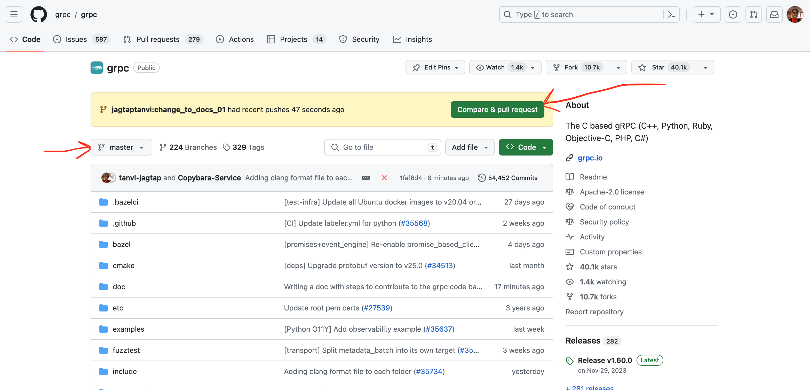
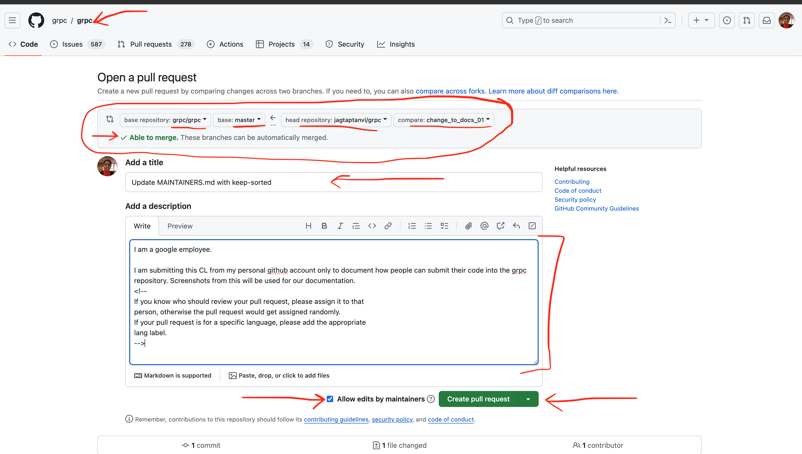
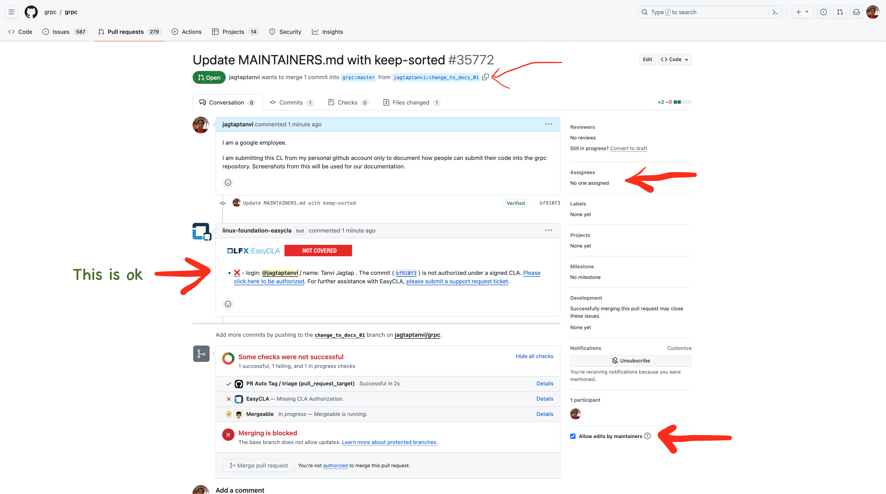
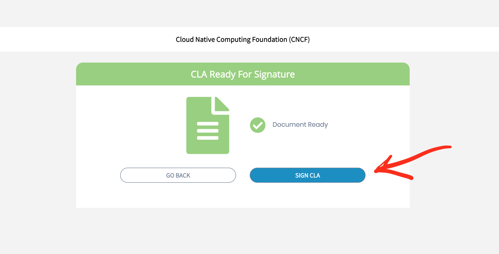

# Contributing to gRPC: A Step-By-Step Guide

Note: This document is not meant for Google employees.

## Prerequisites

To contribute to the gRPC codebase, you need the following:

1.  An
    [active GitHub account](https://docs.github.com/en/get-started/quickstart/creating-an-account-on-github)
1.  [An understanding of Git and GitHub](https://docs.github.com/en/get-started/using-git/about-git)
1.  [Knowledge of how to fork a repository, clone a repository, merge, rebase,
    resolve, push, pull, fetch
    etc.](https://docs.github.com/en/get-started/using-git/about-git)
1.  [git installed and working on your machine](https://github.com/git-guides/install-git)
1.  Knowledge of the language being used, which can be C++, Python, Ruby,
    Objective-C, PHP, or C#.

## Steps to Contribute gRPC C++ Code

The GitHub repository for the C-based gRPC (C++, Python, Ruby, Objective-C, PHP, C#)
is at https://github.com/grpc/grpc.

### Fork and Clone the Repository

If you want to contribute to the gRPC code base, you need to make a fork of the
repository.

1.    Create your
[own fork](https://docs.github.com/en/pull-requests/collaborating-with-pull-requests/working-with-forks/fork-a-repo)
from https://github.com/grpc/grpc.

      

1.   [Clone your fork](https://docs.github.com/en/pull-requests/collaborating-with-pull-requests/working-with-forks/fork-a-repo#cloning-your-forked-repository)
on your local machine.

### Prepare and Push Your Commit

1.  In your cloned repository, create a new branch from `master`.
1.  Then prepare a commit for the files that you want to contribute.
1.  Commit to this branch.
1.  Push the commit to your fork on GitHub.

Take care that your commits are aligned with these
[guidelines](https://github.com/grpc/grpc/blob/master/CONTRIBUTING.md#guidelines-for-pull-requests).

### Prepare a Pull Request

After pushing your commit, visit https://github.com/grpc/grpc . If the
forking, branch creation, commit and push have been successful, you will see
the following message:

Take care to allow edits by maintainers. If there is a specific issue
with your pull request, the maintainer can help if needed. This access to help will reduce
the turnaround time for your submission.

Create a pull request.

### Pull Request Status - Safe Review

Once the pull request is ready, you must wait for a reviewer to be
assigned to your pull request.

If you see *Not Covered* in the EasyCLA screen, as shown in the following image,
click on the mentioned link to start the authorization process.

You will see a series of screens:

1.  Select *Authorize LF-Engineering:

1.  Select your contributor type:

1.  Select *SIGN CLA*:

Some time after you've digitally signed the document, the EasyCLA will appear as
*Covered*.

    After a few hours, you will notice a new "assignee" assigned to the pull request. 

After a reviewer is assigned to you, they will help with the next
steps, which are as follows:

1.  You complete the code review and address the comments.
1.  Your reviewer may add a few labels as needed.

### Pull Request Status - Green

Once you have approval from the reviewer, check if the tests are running. After
the tests are complete, look at the status of all the tests. If
everything is green, everything is good. But usually some failures exist. If
there are failures, select each failure. The selection will take you to a page
that has error details. Try to fix the issue.

### Pull Request Approval

For pull requests that are non-trivial, there is a thorough code review process.
You can read more about the process and requirements
[here](https://github.com/grpc/grpc/blob/master/CONTRIBUTING.md#guidelines-for-pull-requests).

After you fix the code review, you will finally get an approval. After getting
approval, you can submit the pull request.

### Submission

You **cannot** do submission or merge of a pull request through Github.

After you have approval from a reviewer, a Google employee will trigger
the submission process. When the submission happens:

1.  A commit with your changes, along with a few additional formatting changes, will
    be committed to the `grpc/master` branch.

1.  The pull request you originally created will be closed.

