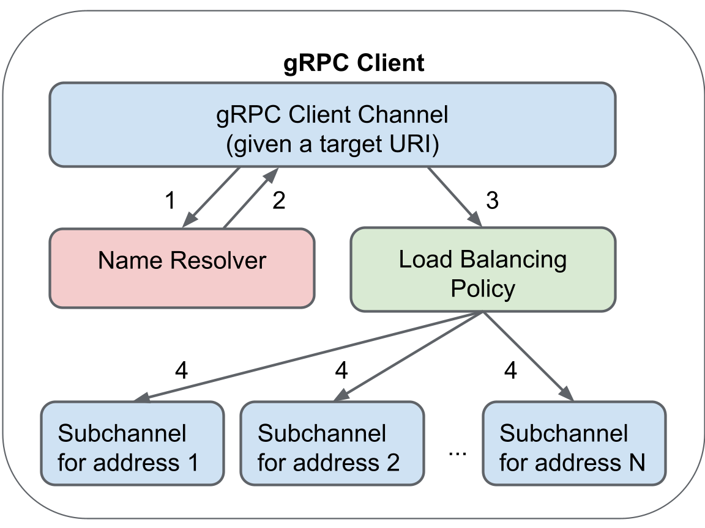

gRPC Client Channel Specification
----

This document specifies the architecture, API, and expected behavior of
the gRPC client channel.  It also specifies the components within the
client channel and how they interact with the channel.  This document
is intended to be language-agnostic.

# Overview and Public API

From the perspective of an application, a gRPC client channel is an
abstraction representing a connection to a particular server name,
which we refer to as a **target**, specified in URI form (see [Target
Names](#target-name) below).  The channel is designed to transparently
handle all of the details of name resolution, connection management,
and load balancing, so that the application does not need to handle
those details.  Applications can simply create a channel and start
sending RPCs on it.

This section describes the public API of the channel.

## Channel Creation

The gRPC API in each language will have a way for the application to
create a channel to a particular target.  Channel creation will take
the following parameters:

* [Target Name](#target-name)  
* [Channel Credentials](#channel-creds)  
* Options to control the channel's behavior (optional)

Applications should generally create a channel for a given target once
when they first need it and keep it around as long as they need it.
It is considered an anti-pattern for the application to create a separate
channel for each RPC.

### Target Names {#target-name}

The target name is expressed in URI syntax as defined in [RFC
3986](https://tools.ietf.org/html/rfc3986).  The scheme of the
URI indicates which [Name Resolver](#name-resolver) to use to
convert that name into a set of addresses and an optional [Service
Config](#service-config).

As a convenient shorthand, if the target name does not parse as a URI or
there is no resolver registered for that URI, the channel will prepend
`dns:///` to the target name and try again.  This allows applications
to use something like `server.example.com` as a target name instead of
`dns:///server.example.com`.

### Channel Credentials {#channel-creds}

Channel credentials are used to configure transport-level security.  gRPC
provides several channel credential types, including InsecureCredentials,
which supports plaintext connections, and TlsCredentials, which supports
TLS encryption.

## Service Config {#service-config}

The service config allows the behavior of a channel to be customized to
talk to a particular [target name](#target-name).  It allows setting
parameters like the [Load Balancing Policy](#load-balancing-policy)
or per-method default [deadline](#deadline).  The service config is
typically maintained by the target owner.

The service config format is defined by
[service\_config.proto](https://github.com/grpc/grpc-proto/blob/master/grpc/service_config/service_config.proto).
However, to avoid taking a hard dependency on the
protobuf library, gRPC actually takes the config in JSON
form, as per the normal [protobuf-to-JSON conversion
rules](https://developers.google.com/protocol-buffers/docs/proto3#json).

The recommended way to distribute a service config to clients is to do
so dynamically via the [resolver](#name-resolver) plugin, so that target
owners can change the config without having to touch each individual
client.  (As an example, the [DNS resolver](#dns-resolver) supports
fetching the service config from a DNS TXT record, as described in [gRFC
A2](https://github.com/grpc/proposal/blob/master/A2-service-configs-in-dns.md).)
However, the channel also provides two related options via the client API:

* A string option to set the default service config for the channel in JSON
  form.  If not set, defaults to `{}` (an empty config).  The default config
  is used when the resolver does not return any service config.  
* A boolean option to tell the resolver not to fetch the service config.  By
  default, resolvers will fetch the service config if supported.

## Sending RPCs

The primary use of the channel is for the application to send RPCs to
the service.

### deadline {#deadline}

The application can optionally set a deadline on the RPC, which is an
absolute time by which the RPC must be finished.

In addition to the application-specified deadline, the [Service
Config](#service-config) may specify a default timeout for individual
methods.  If it does, then the actual deadline used for the RPC is the
earlier of the two deadlines (the one from the service config and the
one specified by the application, if any).

If the RPC has not completed (either successfully or unsuccessfully)
by the specified time, it will be cancelled and complete with a
DEADLINE\_EXCEEDED error.

If an RPC has no deadline set, it will not complete until it either
encounters an error or finishes successfully.

### wait\_for\_ready {#wait_for_ready}

Each RPC has a boolean attribute called wait\_for\_ready that controls
the behavior in the following connectivity failure scenarios:

* The RPC is waiting for the initial name resolution result, and the
  resolver fails, thus causing the channel to report connectivity state
  TRANSIENT\_FAILURE.  (See [Starting Name
  Resolution](#starting-name-resolution).)  
* The RPC is waiting for a load balancing decision, and the load balancing
  policy reports a failure, such as when it has not been able to establish
  a connection to any server address and reports connectivity state
  TRANSIENT\_FAILURE.  (See [Aggregated Connectivity
  States](#aggregated-connectivity-states).)

In these cases, when wait\_for\_ready is set to false (the default),
the RPC will fail immediately.  However, when set to true, the RPC will
instead remain queued in the channel while the channel retries the failed
operation (e.g., re-resolves the name or re-establishes the connection
to the server).

Note that wait\_for\_ready applies only to the connectivity scenarios
described above.  RPCs can still fail on the client side for unrelated
reasons, and they can also be failed by the server or by a network
failure while the RPC is in flight.

### Status Codes

Every RPC completes with a status.  For a comprehensive
list of gRPC status codes, see the [Status Codes](statuscodes.md) doc.

### Retries {#retries}

The gRPC channel supports retries for RPCs, as described in [gRFC
A6](https://github.com/grpc/proposal/blob/master/A6-client-retries.md).
This includes both transparent retries, which happen automatically
when gRPC knows it is safe to retry because the server has not seen
the request.  It also includes configurable retries, enabled via the
[Service Config](#service-config), which control which RPCs are retried,
how many times they can be retried, backoff behavior, etc.

Each retry attempt goes through load balancing independently.

## Connectivity State API {#connectivity-state-api}

The channel API provides a way for the application to be informed of
the current connectivity state of the channel.  The connectivity state
is expressed as an enum with the following values:

| State | Description |
| ----- | ----- |
| **IDLE** | No connection exists.  This is the initial state.  A connection attempt can be triggered either explicitly or by sending an RPC on the channel. |
| **CONNECTING** | The channel is performing name resolution or attempting to establish a connection.  RPCs sent on the channel will generally be queued until a connection has been established. |
| **READY** | A connection has been successfully established.  RPCs sent on the channel will generally be able to be sent immediately. |
| **TRANSIENT\_FAILURE** | The channel has failed to establish a connection.  RPCs sent on the channel will generally fail immediately, unless they have enabled [wait\_for\_ready](#wait_for_ready). |

Note that connectivity state changes can be rapid and can race with the
notification returned to the application.  As a result, applications must
be aware that the reported state may already be inaccurate by the time
it is seen.  So, for example, while it may be reasonable behavior for
an application to wait for the channel to report READY before finishing
its startup, it must be aware that connectivity failures may still occur
as soon as it starts sending RPCs.

The API for getting the current connectivity state also has a way for
the application to explicitly request that the channel start connecting.

See [Starting Name Resolution](#starting-name-resolution) and [Aggregated
Connectivity States](#aggregated-connectivity-states) below for more
details on how the channel's connectivity state is determined.

# Architecture

## Main Components

The main components of the client channel are:

* The [Name Resolver](#name-resolver), which is responsible for resolving
  the channel's target name and returning a list of endpoint addresses and
  an optional [Service Config](#service-config).  
* [Subchannels](#subchannels), each of which represents a potential or
  established connection to a particular endpoint address.  
* The [Load Balancing Policy](#load-balancing-policy), which is
  responsible for creating subchannels, managing their connectivity states,
  and determining which RPCs are sent on which subchannels.

To understand how these components fit together, it's useful to step
through the process that the channel uses to establish connections,
as shown in the following diagram:



1. The channel instantiates the name resolver and asks it to resolve the
   target URI.  
2. The resolver returns a list of addresses and an optional service config.  
3. The channel chooses the LB policy based on the service config.  It
   instantiates the LB policy and gives it the list of addresses and its
   config from the service config.  
4. The LB policy creates a subchannel for each address and asks those
   subchannels to establish connections.

Then, as each RPC is sent on the channel, the channel asks the LB policy
which subchannel to send the RPC on.

## Name Resolvers {#name-resolver}

As described under [Target Names](#target-name) above, the URI scheme
of the target name indicates which resolver implementation to use.
gRPC has a registry of resolver factories, registered by URI scheme.
Only one resolver can be registered for a given scheme.  When a channel
is created, it looks up the scheme in the registry and uses the resulting
factory to instantiate a new resolver for the specified target URI.

The URI authority is interpreted in a scheme-specific manner.
Some schemes may not support any authority.

The URI path indicates the name to be resolved.  In most schemes, the
leading slash character (`/`) is ignored.

The resolver factory will provide a method to get the default authority to
use for a given target URI.  By default, the authority will be the path
part of the URI without the leading `/`, and it will be percent-encoded.
However, individual resolver factories may override that behavior.

### Starting Name Resolution {#starting-name-resolution}

When a channel is first created, it is in IDLE state, and it will not yet
have started name resolution or establishing connections to endpoints.
It will leave IDLE state when the application does one of two things:

* Sends the first RPC on the channel.  
* Uses the [connectivity state API](#connectivity-state-api) to request
  that the channel start to connect.

When either of those things happen, the channel will start name resolution
and will then transition to state CONNECTING.  The resolver is expected to
return an initial [result](#resolver-result) shortly after being started.

If name resolution fails (i.e., the initial result indicates an error for
the service config), the channel will report TRANSIENT\_FAILURE state.
It will stay in that state until name resolution succeeds.  Note that RPCs
sent on the channel in this state will be failed unless they have enabled
[wait\_for\_ready](#wait_for_ready).

Once name resolution succeeds, the channel will create the LB policy
indicated by the service config returned by the resolver.  The channel
will send an update to the LB policy indicating the addresses returned
by the resolver, and the LB policy will create subchannels to those
addresses and request connections on those subchannels as appropriate.
At that point, the LB policy is responsible for determining
the channel's connectivity state (see [Aggregated Connectivity
State](#aggregated-connectivity-states) below).

Applications may configure an idle timeout for the channel.  If
configured, the channel will go back into IDLE state from CONNECTING,
READY, or TRANSIENT\_FAILURE if the application has had no pending RPCs
within the specified timeout period.  When this happens, the channel
will drop all subchannel connections and stop name resolution, returning
itself to its initial state.

### Resolver Results {#resolver-results}

The resolver returns results that include the following information:

* Endpoints: Either an error, or a list of endpoints, each of which has:  
  * A list of one or more addresses.  
  * A set of attributes (key/value pairs).  
* A set of top-level attributes (key/value pairs).  
* Service config: Either an error, a [service config](#service-config), or
  nothing (if there is no service config to return).  
* A resolution note string, which is used to provide context to be included
  in RPC failure status messages generated by LB policies.  
* A health result callback, to be invoked by the channel to indicate to the
  resolver whether the LB policy has accepted the result.

Note that both the list of endpoints and the list of addresses within
each endpoint are ordered lists, and the order of the elements may be
significant to the [Load Balancing Policy](#load-balancing-policy).
For example, the [pick\_first](#pick_first) LB policy will attempt
to connect to the addresses in the order in which they are listed.
Thus, resolvers wishing to spread client load across servers may wish
to randomize the order of the addresses before returning them to gRPC
(unless the randomization already occurs in the name service from which
the data was obtained, as is often the case with DNS).

The attributes in the resolver result (both at the top level and
per-endpoint) provide a mechanism to pass information between the resolver
and the LB policy.  The exact semantics for these attributes vary across
gRPC implementations and are not currently defined by this specification,
although future work may add that to this specification.

The channel provides an API for the resolver to parse and validate a
service config from JSON form.  That API will either return an error
indicating that the service config was invalid, or it will return
an object that contains the parsed service config.  Either way,
the resolver is expected to return this value as part of its result.
However, a resolver that does not support returning service configs can
instead leave that field unset in its results.

Note that if a resolver returns an error for the service config and it
has not previously returned a valid result to the channel, the channel
will be placed into TRANSIENT\_FAILURE state, and RPCs that are not
[wait\_for\_ready](#wait_for_ready) will fail with that status.  However,
the set of allowed status codes is constrained, as described in [gRFC
A54](https://github.com/grpc/proposal/blob/master/A54-restrict-control-plane-status-codes.md).

The channel does not directly use the list of endpoints returned by the
resolver; it only passes that list on to the LB policy.  If the resolver
returns an error for the list of addresses, the LB policy is responsible
for determining how to handle that error.

### Channel Handling of Resolver Result

The channel's handling of the resolver result is captured in the following
pseudo code:

```
health_status = OK;

service_config = null;
if (result.service_config.IsError()) {
  if (channel.service_config != null) {
    // We have a valid service config from a previous resolver result,
    // so keep using it.
    service_config = channel.service_config;
  } else {
    // No previously returned valid config, so we fail.
    self.SetConnectivityState(TRANSIENT_FAILURE);
    health_status = UNAVAILABLE("no valid service config");
  }
} else if (result.service_config.IsEmpty()) {
  // Resolver did not return any service config.
  // Use the channel's default config.
  service_config = channel.default_service_config;
} else {
  // Resolver returned a valid service config, so use it.
  service_config = result.service_config;
}

if (service_config != null) {
  lb_config = channel.ChooseLbPolicy(service_config);
  health_status =
      channel.CreateOrUpdateLbPolicy(lb_config, result.endpoints);
  if (service_config != channel.service_config) {
    channel.service_config = service_config;
    channel.ReprocessQueuedRpcs();  // Those waiting for a resolver result.
  }
}

if (result.health_callback != null) {
  result.health_callback(health_status);
}
```

The client channel chooses the LB policy as follows:

1. If the service config has its [loadBalancingConfig
   field](https://github.com/grpc/grpc-proto/blob/f64271f4781075327df0a8bbffe8b5b0a84f51bc/grpc/service_config/service_config.proto#L317)
   set, use that policy.
2. If the service config has its [loadBalancingPolicy
   field](https://github.com/grpc/grpc-proto/blob/f64271f4781075327df0a8bbffe8b5b0a84f51bc/grpc/service_config/service_config.proto#L313)
   set, use that policy.  
3. If the client application specified the LB policy to use via the channel
   creation API, use that.  
4. Otherwise, default to [pick\_first](#pick_first).

### Resolver API

The resolver API is designed to support two types of resolvers:

* **Watch-based:** These resolvers operate in a pub/sub manner.  They
  establish a subscription to the data they need when they start up, and
  they will receive updates at any time when the data changes.  The xds
  resolver is an example of a watch-based resolver.  
* **Polling:** These resolvers need to explicitly send a query to get data.
  When a query completes successfully, the resolver does not send another
  query unless explicitly requested to do so by the channel.  The dns
  resolver is an example of a polling resolver.

A resolver may return a new result to the channel at any time.  In a
watch-based resolver, this may happen whenever new data is received;
in a polling resolver, the channel will need to explicitly request
re-resolution.

To support that, the resolver API has a method to request re-resolution.
The channel will typically invoke this method at the request of a
[Load Balancing Policy](#load-balancing-policy), usually when an
existing connection to an endpoint fails.  Note that this method does
not necessarily need to trigger a re-resolution request immediately;
the resolver implementation may perform caching or simply impose a
minimum time between queries to avoid hammering the name service it uses.
This method is a no-op for watch-based resolvers.

### Provided Resolver Implementations

gRPC comes with resolver implementations for the following schemes.

#### dns Resolver {#dns-resolver}

The DNS resolver accepts URIs of the form `dns:\[//authority/\]host\[:port\]`.

* `host` is the host to resolve via DNS.  
* `port` is the port to return for each address. If not specified, 443 is
  used (but some implementations default to 80 for insecure channels).  
* `authority` indicates the DNS server to use, although this is only
  supported by some implementations.

The DNS resolver supports getting [service config](#service-config)
data from TXT records, as described in [gRFC A2: Service Configs in
DNS](https://github.com/grpc/proposal/blob/master/A2-service-configs-in-dns.md).

The DNS resolver is responsible for ensuring that we do not overly
hammer the DNS server with requests.  In cases where the DNS resolution
mechanism has built-in caching, nothing special may need to be done
for this; otherwise, there should be a configurable (via a channel arg)
minimum time between DNS re-resolutions.

#### unix

The unix resolver (Unix systems only) accepts URIs of the form
`unix:path` or `unix:///absolute\_path`.

* `path` indicates the location of the desired socket.  
* In the first form, the path may be relative or absolute; in the
  second form, the path must be absolute (i.e., the last of the three
  slashes is actually part of the path, so the path part of the URI is
  `/absolute_path`).

## Subchannels {#subchannels}

A subchannel represents a potential or established connection to a
particular address.  The channel provides the implementation of a
subchannel, but the [Load Balancing Policy](#load-balancing-policy)
decides when to create subchannels and how to manage their connections.

### Subchannel Connectivity States {#subchannel-connectivity-states}

Subchannels report their connectivity state to the LB policy.
The connectivity state semantics for a subchannel are shown in the
following table:

| State | Description | Possible Next States |
| ----- | ----- | ----- |
| **IDLE** | No connection exists.  This is the initial state.  A connection attempt may be requested by the LB policy. | CONNECTING: If the LB policy requests a connection. |
| **CONNECTING** | A connection attempt is in progress. | READY: If the connection attempt succeeds. TRANSIENT\_FAILURE: If the connection attempt fails. |
| **READY** | A connection has been successfully established.  RPCs may be sent on the subchannel. | IDLE: When the connection terminates. |
| **TRANSIENT\_FAILURE** | A connection attempt has failed and the subchannel is currently in backoff delay.  No connection attempt may be started in this state. | IDLE: When the backoff delay expires, the subchannel will transition to IDLE state to let the LB policy know that it can attempt to establish a connection again. |

See [connection backoff](connection-backoff.md) for details on the
backoff behavior.  Note that the backoff delay dictates the minimum
time between connection attempts starting, not ending; if a connection
attempt lasts as long or longer than the backoff delay, then the next
connection attempt may start immediately after the previous one ended.

### Subchannel Health State {#subchannel-health-state}

Subchannels can also report their health state to the LB policy.
This has similar semantics to the connectivity state, but it
reflects the health of the connection, which may be unhealthy
even when the connectivity state is READY.  In particular,
this takes into account client-side health checking (see [gRFC
A17](https://github.com/grpc/proposal/blob/master/A17-client-side-health-checking.md))
and outlier detection (see [gRFC
A50](https://github.com/grpc/proposal/blob/master/A50-xds-outlier-detection.md)).

This is used only in the [pick\_first](#pick_first) LB
policy, and only when it is acting on behalf of a policy like
[round\_robin](#round_robin) to connect to one of the addresses on
a given endpoint.  The intent is that if a subchannel is unhealthy,
pick\_first will advertise the endpoint as being in connectivity
state TRANSIENT\_FAILURE to its parent policy, which will cause
the parent policy to stop sending traffic to that endpoint.  See [gRFC
A61](https://github.com/grpc/proposal/blob/master/A61-IPv4-IPv6-dualstack-backends.md)
for details.

### Subchannel API

The subchannel interface that is exposed to LB policies provides APIs
to do the following:

* Start and stop [connectivity state](#subchannel-connectivity-states) watch.
  LB policies will generally start a watch as soon as the subchannel is
  created and not stop it until they unref the subchannel.  In some
  implementations, the watch may be an inherent part of creating the
  subchannel.  
* Start and stop [health state](#subchannel-health-state) watch.  
* Request that the subchannel initiate a connection attempt.  This may be
  called only when the subchannel is reporting connectivity state IDLE.

In addition, the subchannel will have a private interface, accessible
to the channel but not to LB policies, that returns a reference to the
underlying connection.  When the picker returns a complete pick with a
subchannel, the channel will use this interface to get the underlying
connection for the subchannel, which it can use to send the RPC.  Note
that there is a race condition here: the subchannel may have lost its
connection but the LB policy may not yet have returned a new picker that
stops using that subchannel, so the channel may find that the subchannel
chosen by the picker does not actually have a connection.  In this case,
the channel will queue the pick and try again when it receives the next
picker from the LB policy.

### Subchannel Pool

Some gRPC implementations support a subchannel pool.  This is essentially
a map within the channel that tracks the existing set of subchannels by
address and options.  When an LB policy requests that the channel create
a subchannel for a particular address, the channel looks in the pool to
see if the subchannel already exists, and if so, it returns a new ref
to the existing subchannel rather than returning a whole new subchannel.

This approach means that when an LB policy receives an updated address
list from the resolver, it does not need to compare the addresses in
the new list against the list of subchannels it has already created to
determine which ones to keep.  Instead, it simply asks the channel to
"create" a subchannel for each address in the new list before throwing
away the old list of subchannels, knowing that it will automatically
retain any subchannels that already existed.

This approach also allows for sharing subchannels between channels
(by having multiple channels share the same subchannel pool), which can
reduce the number of connections being maintained to a given target.

## Load Balancing Policies {#load-balancing-policy}

A load balancing policy is responsible for the following channel-level
behavior:

* Decides what [subchannels](#subchannels) to create based on the list of
  addresses returned by the resolver.  
* Decides when to attempt to reconnect to each subchannel.  
* Decides when to request re-resolution from the [name
  resolver](#name-resolver).  
* Sets the channel's [connectivity state](#connectivity-state-api).

Then, on a per-RPC basis, the LB policy decides which subchannel to use
for each RPC sent on the channel.  Note that this per-RPC functionality
is performance-sensitive and is split out into a separate object called a
[picker](#picker-api), which is created by the LB policy.

### LB Policy Registry

LB policies are registered by name.  Only one LB policy can be registered
for a given name.  The entry for a given LB policy will be a factory
for that LB policy.  The factory has two methods:

* **ParseLoadBalancingPolicyConfig()**: This method parses the LB policy
  config in JSON form and returns a parsed LB policy config.  This is called
  as part of service config parsing, typically called from the resolver.  
* **CreateLoadBalancingPolicy()**: This method creates a new LB policy.  It
  takes as input the [helper](#helper-api) object that the policy will use
  to communicate with its parent.

### Helper API {#helper-api}

When an LB policy is created, its parent must pass in a helper object,
which the policy will use to communicate with its parent.  The helper
provides at least the following methods:

* **CreateSubchannel()**: Called by the LB policy to create a subchannel for
  a particular address.
* **UpdateState()**: Called by the LB policy to set the channel's connectivity
  state and return a new [picker](#picker-api).  
* **RequestReresolution()**: Called by the LB policy when it wants to trigger
  a new name resolution request on a polling resolver.  This is typically done
  when a subchannel's connection fails or when a connection attempt fails.

### LB Policy API

The LB policy object itself provides the following methods:

* **Update()**: Used to pass a resolver update to the LB policy.  The update
  includes the parsed LB policy config returned by the factory's
  `ParseLoadBalancingPolicyConfig()` method.  It also includes the list of
  endpoint addresses, the resolution note, and any attributes returned
  by the resolver.  The LB policy is expected to create any necessary
  subchannels and then call the helper's `UpdateState()` method to report
  its connectivity state and a new picker that can be used to route RPCs.
* **ExitIdle()**: Used to request that the LB policy exit IDLE state and
  start trying to connect.  For most policies, this is a no-op, but it is
  used by policies that connect lazily like [pick\_first](#pick_first).

### Picker API {#picker-api}

The picker is the object used to actually decide which subchannel to
use for each RPC sent on the channel.  The picker has only one method,
Pick(), which will synchronously return one of the following results:

* **Complete**: The pick is complete, and a subchannel is returned to use
  for the RPC.  The picker may also return a callback to be invoked when
  the RPC is complete, so that the picker can see the final status and
  trailing metadata of the RPC.  In general, pickers will provide this
  result when the connectivity state is READY.  
* **Queue**: The LB policy does not currently have any subchannel with an
  established connection to send the RPC on, but it is still trying to
  connect.  The channel will queue the RPC, and it will try again later when
  the LB policy returns a new picker to the channel.  In general, pickers
  will provide this result when the connectivity state is IDLE or CONNECTING.
* **Fail**: The LB policy has failed to establish connections to all
  subchannels.  The picker will return a status to be used to fail the RPC.
  Note that the RPC may be [retried](#retries).  Note, however, that if the
  RPC is [wait\_for\_ready](#wait_for_ready), then it will be queued instead
  of being failed.  In general, pickers will provide this result when the
  connectivity state is TRANSIENT\_FAILURE.  
* **Drop**: This is similar to Fail, except that the RPC will be failed even
  if it is [wait\_for\_ready](#wait_for_ready).  In some implementations,
  this also inhibits retries.  In general, this is used when a control plane
  signals an overload condition where the client is instructed to drop
  traffic to shed load.

Note that for Fail and Drop results, the status code in
the returned status is constrained as described in [gRFC
A54](https://github.com/grpc/proposal/blob/master/A54-restrict-control-plane-status-codes.md).

Note that while most LB policies' picker behavior maps to the connectivity
state as described above, that behavior is not guaranteed.  For example,
if an LB policy routes based on a property of the individual RPC, it may
report READY state due to having some working subchannel connections but
still return Fail for an individual RPC that it cannot route to any of
those working subchannel connections.

### Aggregated Connectivity States {#aggregated-connectivity-states}

As described under [Starting Name Resolution](#starting-name-resolution)
above, once the LB policy is created, it is responsible for setting the
channel's connectivity state.  It's up to the LB policy how to determine
the connectivity state, but in general this is done by aggregating the
connectivity states of the underlying subchannels.  The normal aggregation
rules (which should be used by all LB policies unless they have a specific
reason to diverge from this) are as follows (first match wins):

1. If there is any subchannel in state READY, report READY.  
2. If there is any subchannel in state CONNECTING, report CONNECTING.  
3. If there is any subchannel in state IDLE, report IDLE.  
4. Otherwise, all children are in state TRANSIENT\_FAILURE, so report
   TRANSIENT\_FAILURE.

Because the LB policy is responsible for determining the channel's
connectivity state, it is not possible to document hard and fast rules
that apply to all channels.  However, the following table shows the
generally expected connectivity state semantics:

| State | Description | Possible Next States |
| ----- | ----- | ----- |
| **IDLE** | Initial state upon channel creation or IDLE timeout.  Name resolution is not running and there are no subchannels. Some LB policies (e.g., pick\_first) may also switch to this state from READY when a working connection to a server is closed.  In this case, name resolution is still running, but there are no subchannels. In this state, the picker will normally trigger a call to the LB policy's ExitIdle() method, and it will queue all picks. | CONNECTING: If the application requests that the channel connects or sends an RPC on the channel. |
| **CONNECTING** | The channel is attempting to establish connection(s) to the server.  It may be attempting to resolve the server name or establishing connection(s) on subchannel(s). In this state, the picker will normally queue all picks. | READY: If the LB policy is able to establish a connection on at least one subchannel. TRANSIENT\_FAILURE: If name resolution fails or if the LB policy is unable to establish a connection on any subchannel. IDLE: If the channel's idle timeout occurs. |
| **READY** | The LB policy has successfully established a connection on at least one subchannel.  RPCs may be sent on the channel. In this state, the picker will normally be able to complete all picks. | IDLE: In some LB policies, when the connection terminates.  Also happens when the channel's idle timeout occurs. |
| **TRANSIENT\_FAILURE** | The channel is temporarily unable to establish a connection, either because name resolution failed or because the LB policy was unable to establish a connection on any subchannel. In this state, the picker will normally fail all picks. | READY: When the problem is resolved and connectivity is established. Note: In general, a channel will not report CONNECTING between TRANSIENT\_FAILURE and READY, but there are some cases in which this will happen. IDLE: If the channel's idle timeout occurs. |

### Gracefully Switching LB Policies

When the service config changes, the channel may need to select
a different LB policy than the one it had been previously using.
The channel should do this in a way that avoids causing unnecessary
delays for RPCs being sent on the channel.

In particular, this means that when the channel gets a new update from
the resolver, it does the following:

* Whenever a service config update comes in, the channel determines which
  LB policy it should be using based on the new service config data.  
* If the new policy name is the same as the LB policy the channel had already
  been using, the LB policy does not need to change.  Instead, the channel
  will simply pass an update to the existing LB policy instance containing
  the new address information from the resolver.  
* Otherwise, if the new policy name is *not* the same as the LB policy that
  the channel had already been using, the channel will construct a new LB
  policy.  
* If the channel is currently in a state other than READY, the new policy
  will be swapped into place immediately.  Otherwise, the channel will
  continue using the old LB policy until either the new policy reports READY
  or TRANSIENT\_FAILURE or the old policy reports a state other than READY
  (whichever happens first), at which point it will be swapped into place.

### Provided LB Policy Implementations

This document does not cover every LB policy provided by gRPC, but it
does cover the two most basic ones: pick\_first and round\_robin.

#### pick\_first {#pick_first}

The pick\_first policy establishes a connection on one subchannel and
then uses that same subchannel for all picks until the connection fails
or is closed by the server.

To establish a connection, the pick\_first policy flattens out the
endpoint address list by concatenating the lists of addresses from each
endpoint into a single, flat list.  It then applies the Happy Eyeballs
algorithm described in [RFC-8305](https://www.rfc-editor.org/rfc/rfc8305),
which involves interleaving the addresses based on address family and
then attempting to connect to each one in order, with a bit of staggered
parallelization to speed up establishing a connection if one of the
connection attempts does not complete quickly.  For details, see [gRFC
A61](https://github.com/grpc/proposal/blob/master/A61-IPv4-IPv6-dualstack-backends.md).

As soon as pick\_first receives the first resolver update, it will
start the connecting process described above.  When this happens, it
will report CONNECTING state with a picker that queues all picks.

As soon as one of the subchannels becomes connected, pick\_first will
report READY with a picker that always returns complete picks with that
subchannel.  It will unref all of the other subchannels.  (But note that
if pick\_first is reporting [health state](#subchannel-health-state)
to a parent policy like round\_robin, it may instead report
TRANSIENT\_FAILURE.)

It will stay in READY state until either the connection fails or it
receives a resolver update that does not include the address of the
subchannel it is connected to.  In either case, it will unref the
subchannel and report IDLE with a picker that calls the LB policy's
`ExitIdle()` method when it receives the first pick and then queues
all picks.

In IDLE state, when `ExitIdle()` is called, pick\_first will create a new
list of subchannels using the last address list it saw from the resolver
and start connecting to them, exactly as it does when it is first created.
It will therefore report CONNECTING state with a picker that queues picks.

If pick\_first fails to connect to all subchannels, it will report
TRANSIENT\_FAILURE state with a picker that fails picks.  The RPC
status that is used to fail the picks should include the error from the
most recent subchannel connection failure.  It will then keep trying to
connect to all subchannels indefinitely, remaining in TRANSIENT\_FAILURE
state until it succeeds in establishing a connection, at which point
it transitions to READY state.  In particular, note that it will not
transition to CONNECTING in between TRANSIENT\_FAILURE and READY, even
though the underlying subchannels do so.

The policy will request re-resolution via the helper when it initially
reports TRANSIENT\_FAILURE, and then again every time it counts a number
of connection attempt failures equal to the number of subchannels.
It will also request re-resolution when a selected subchannel transitions
from READY to IDLE.

If pick\_first receives a resolver update with an empty address list,
it will report TRANSIENT\_FAILURE and return an error telling its parent
that it rejected the update.  The channel will pass this error back to
the resolver with the health status callback.  For polling resolvers,
this will cause the resolver to re-resolve with appropriate backoff.

This is the default LB policy if no policy is set via the channel
API or the [service config](#service-config).  It is also used
as the universal leaf policy for dualstack support, as per [gRFC
A61](https://github.com/grpc/proposal/blob/master/A61-IPv4-IPv6-dualstack-backends.md)
-- i.e., policies like [round\_robin](#round_robin) that balance across
endpoints will delegate to a pick\_first child policy to choose an
address within each endpoint.

#### round\_robin {#round_robin}

The round\_robin policy spreads load across a set of endpoints by
simply sending one RPC to each endpoint in order, wrapping around to
the beginning of the list when it hits the end.

For each endpoint, the round\_robin policy creates a
[pick\_first](#pick_first) child policy, which will connect to one of
the addresses for that endpoint.  When the round\_robin picker wants to
send an RPC to a particular endpoint, it delegates to the picker from
the pick\_first child policy for that endpoint.

The policy attempts to maintain a connection to every endpoint at all
times.  When it receives the initial resolver update, it will create
the pick\_first child policy for each endpoint, and the pick\_first
child will immediately start to connect.  If at any point a pick\_first
child reports IDLE state, round\_robin will immediately call the child's
ExitIdle() method, thus triggering it to attempt to reconnect.

The round\_robin policy determines what connectivity state to report
to its parent by aggregating the connectivity states of the endpoints
(i.e., the states reported by the pick\_first child policies),
using the normal aggregation rules described in [Channel Connectivity
States](#aggregated-connectivity-states) below.  However, note that for
the purposes of this aggregation, endpoints reporting IDLE are treated as
if they had reported CONNECTING, because round\_robin always immediately
triggers a connection attempt on the child in that state anyway.
Specifically (first match wins):

* If there is at least one child in state READY, report READY.  In this case,
  the picker will round-robin over all subchannels in READY state.  Note that
  whenever a new picker is returned, it will start from a random index in the
  list of endpoints.  The picker will need appropriate synchronization to
  maintain the index as it processes picks.  
* If there is at least one child in state CONNECTING (or IDLE, as mentioned
  above), report CONNECTING.  In this case, the picker will queue picks.  
* Otherwise, all subchannels are in TRANSIENT\_FAILURE state, so report
  TRANSIENT\_FAILURE state.  In this case, the picker will fail all picks
  with an RPC status that includes the error from the most recent subchannel
  connection failure.

If round\_robin receives a resolver update with an empty address list,
it will report TRANSIENT\_FAILURE and return an error telling its parent
that it rejected the update.  The channel will pass this error back to
the resolver with the health status callback.  For polling resolvers,
this will cause the resolver to re-resolve with appropriate backoff.

Whenever an endpoint reports TRANSIENT\_FAILURE or IDLE, round\_robin
requests re-resolution via the helper.
