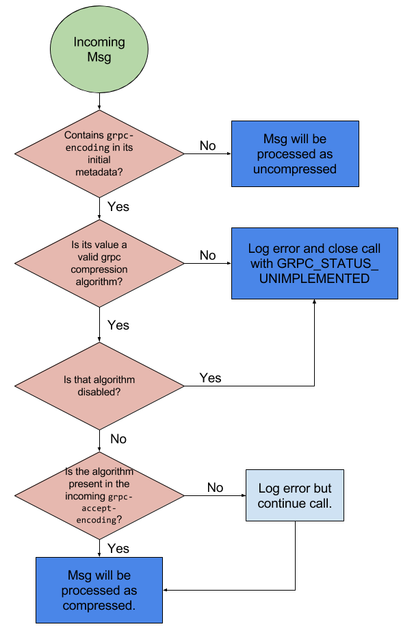
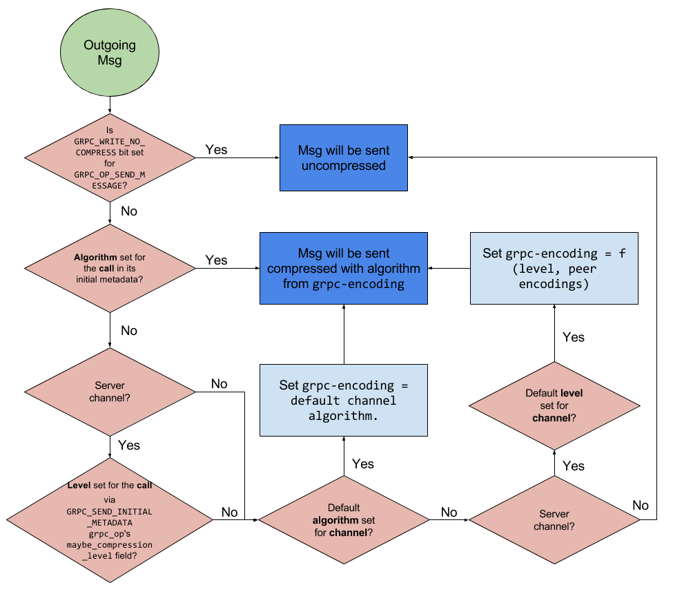

# gRPC (Core) Compression Cookbook

## Introduction

This document describes compression as implemented by the gRPC C core. See [the
full compression specification](compression.md) for details.

### Intended Audience

Wrapped languages developers, for the purposes of supporting compression by
interacting with the C core.

## Criteria for GA readiness

1. Be able to set compression at [channel](#per-channel-settings),
   [call](#per-call-settings) and [message](#per-message-settings) level.
   In principle this API should be based on _compression levels_ as opposed to
   algorithms. See the discussion [below](#level-vs-algorithms).
1. Have unit tests covering [the cases from the
   spec](https://github.com/grpc/grpc/blob/master/doc/compression.md#test-cases).
1. Interop tests implemented and passing on Jenkins. The two relevant interop
   test cases are
   [large_compressed_unary](https://github.com/grpc/grpc/blob/master/doc/interop-test-descriptions.md#large_compressed_unary)
   and
   [server_compressed_streaming](https://github.com/grpc/grpc/blob/master/doc/interop-test-descriptions.md#server_compressed_streaming).

## Summary Flowcharts

The following flowcharts depict the evolution of a message, both _incoming_ and
_outgoing_, irrespective of the client/server character of the call. Aspects
still not symmetric between clients and servers (e.g. the [use of compression
levels](https://github.com/grpc/grpc/blob/master/doc/compression.md#compression-levels-and-algorithms))
are explicitly marked. The in-detail textual description for the different
scenarios is described in subsequent sections.

## Incoming Messages

## Outgoing Messages

## Levels vs Algorithms

As mentioned in [the relevant discussion on the spec
document](https://github.com/grpc/grpc/blob/master/doc/compression.md#compression-levels-and-algorithms),
compression _levels_ are the primary mechanism for compression selection _at the
server side_. In the future, it'll also be at the client side. The use of levels
abstracts away the intricacies of selecting a concrete algorithm supported by a
peer, on top of removing the burden of choice from the developer.
As of this writing (Q2 2016), clients can only specify compression _algorithms_.
Clients will support levels as soon as an automatic retry/negotiation mechanism
is in place.

## Per Channel Settings

Compression may be configured at channel creation. This is a convenience to
avoid having to repeatedly configure compression for every call. Note that any
compression setting on individual [calls](#per-call-settings) or
[messages](#per-message-settings) overrides channel settings.

The following aspects can be configured at channel-creation time via channel arguments:

#### Disable Compression _Algorithms_

Use the channel argument key
`GRPC_COMPRESSION_CHANNEL_ENABLED_ALGORITHMS_BITSET` (from
[`grpc/impl/codegen/compression_types.h`](https://github.com/grpc/grpc/blob/master/include/grpc/impl/codegen/compression_types.h)),
takes a 32 bit bitset value. A set bit means the algorithm with that enum value
according to `grpc_compression_algorithm` is _enabled_.
For example, `GRPC_COMPRESS_GZIP` currently has a numeric value of 2. To
enable/disable GZIP for a channel, one would set/clear the 3rd LSB (eg, 0b100 =
0x4). Note that setting/clearing 0th position, that corresponding to
`GRPC_COMPRESS_NONE`, has no effect, as no-compression (a.k.a. _identity_) is
always supported.
Incoming messages compressed (ie, encoded) with a disabled algorithm will result
in the call being closed with `GRPC_STATUS_UNIMPLEMENTED`.

#### Default Compression _Level_

**(currently, Q2 2016, only applicable for server side channels. It's ignored
for clients.)**
Use the channel argument key `GRPC_COMPRESSION_CHANNEL_DEFAULT_LEVEL` (from
[`grpc/impl/codegen/compression_types.h`](https://github.com/grpc/grpc/blob/master/include/grpc/impl/codegen/compression_types.h)),
valued by an integer corresponding to a value from the `grpc_compression_level`
enum.

#### Default Compression _Algorithm_

Use the channel argument key `GRPC_COMPRESSION_CHANNEL_DEFAULT_ALGORITHM` (from
[`grpc/impl/codegen/compression_types.h`](https://github.com/grpc/grpc/blob/master/include/grpc/impl/codegen/compression_types.h)),
valued by an integer corresponding to a value from the `grpc_compression_level`
enum.

## Per Call Settings

### Compression **Level** in Call Responses

The server requests a compression level via initial metadata. The
`send_initial_metadata` `grpc_op` contains a `maybe_compression_level` field
with two fields, `is_set` and `compression_level`. The former must be set when
actively choosing a level to disambiguate the default value of zero (no
compression) from the proactive selection of no compression.

The core will receive the request for the compression level and automatically
choose a compression algorithm based on its knowledge about the peer
(communicated by the client via the `grpc-accept-encoding` header. Note that the
absence of this header means no compression is supported by the client/peer).

### Compression **Algorithm** in Call Responses

**Server should avoid setting the compression algorithm directly**. Prefer
setting compression levels unless there's a _very_ compelling reason to choose
specific algorithms (benchmarking, testing).

Selection of concrete compression algorithms is performed by adding a
`(GRPC_COMPRESS_REQUEST_ALGORITHM_KEY, <algorithm-name>)` key-value pair to the
initial metadata, where `GRPC_COMPRESS_REQUEST_ALGORITHM_KEY` is defined in
[`grpc/impl/codegen/compression_types.h`](https://github.com/grpc/grpc/blob/master/include/grpc/impl/codegen/compression_types.h)),
and `<algorithm-name>` is the human readable name of the algorithm as given in
[the HTTP2 spec](https://github.com/grpc/grpc/blob/master/doc/PROTOCOL-HTTP2.md)
for `Message-Encoding` (e.g. gzip, identity, etc.). See
[`grpc_compression_algorithm_name`](https://github.com/grpc/grpc/blob/master/src/core/lib/compression/compression.c)
for the mapping between the `grpc_compression_algorithm` enum values and their
textual representation.

## Per Message Settings

To disable compression for a specific message, the `flags` field of `grpc_op`
instances of type `GRPC_OP_SEND_MESSAGE` must have its `GRPC_WRITE_NO_COMPRESS`
bit set. Refer to
[`grpc/impl/codegen/compression_types.h`](https://github.com/grpc/grpc/blob/master/include/grpc/impl/codegen/compression_types.h)),
