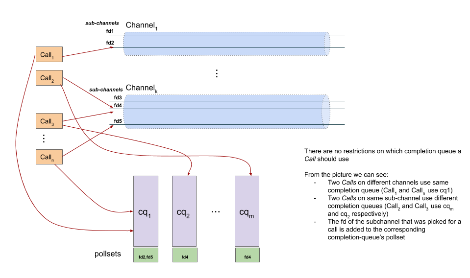
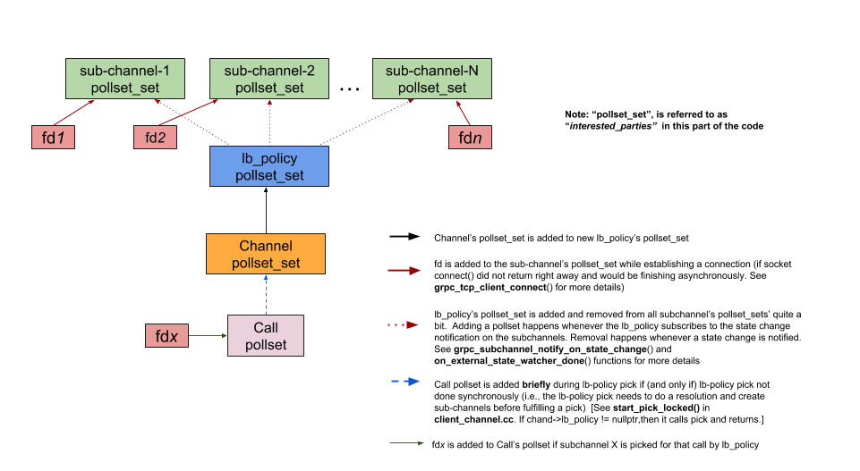
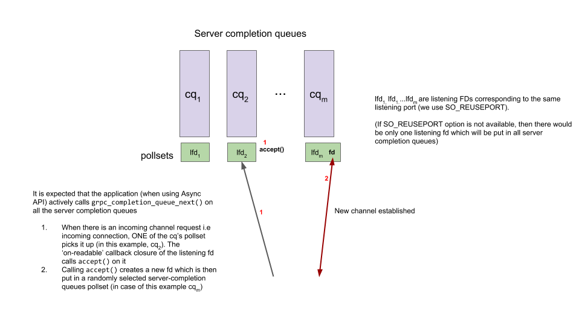

# Polling Engine Usage on gRPC client and Server

_Author: Sree Kuchibhotla (@sreecha) - Sep 2018_

This document talks about how polling engine is used in gRPC core (both on client and server code paths).

## gRPC client

### Relation between Call, Channel (sub-channels), Completion queue, `grpc_pollset`
- A gRPC Call is tied to a channel (more specifically a sub-channel) and a completion queue for the lifetime of the call.
- Once a _sub-channel_ is picked for the call, the file-descriptor (socket fd in case of TCP channels) is added to the pollset corresponding to call's completion queue. (Recall that as per [grpc-cq](grpc-cq.md), a completion queue has a pollset by default)

### Making progress on Async `connect()` on sub-channels  (`grpc_pollset_set` usecase)
- A gRPC channel is created between a client and a 'target'. The 'target' may resolve in to one or more backend servers.
- A sub-channel is the 'connection' from a client to the backend server
- While establishing sub-channels (i.e connections) to the backends, gRPC issues async [`connect()`](https://github.com/grpc/grpc/blob/v1.15.1/src/core/lib/iomgr/tcp_client_posix.cc#L296) calls which may not complete right away.  When the `connect()` eventually succeeds, the socket fd is make 'writable'
  - This means that the polling engine must be monitoring all these sub-channel `fd`s for writable events and we need to make sure there is a polling thread that monitors all these fds
  - To accomplish this, the `grpc_pollset_set` is used the following way (see picture below)

## gRPC server

- The listening fd (i.e., the socket fd corresponding to the server listening port) is added to each of the server completion queues. Note that in gRPC we use SO_REUSEPORT option and create multiple listening fds but all of them map to the same listening port
- A new incoming channel is assigned to some server completion queue picked randomly (note that we currently [round-robin](https://github.com/grpc/grpc/blob/v1.15.1/src/core/lib/iomgr/tcp_server_posix.cc#L231) over the server completion queues)

