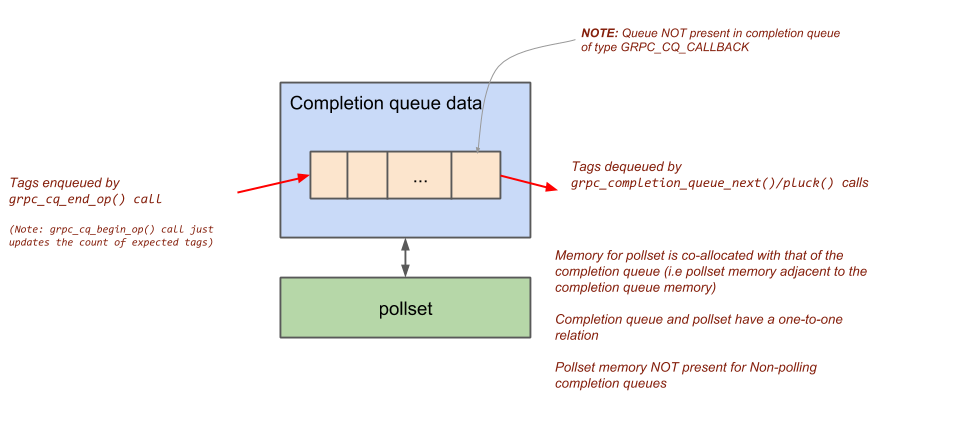

# gRPC Completion Queue

_Author: Sree Kuchibhotla (@sreecha) - Sep 2018_

Code: [completion_queue.cc](https://github.com/grpc/grpc/blob/v1.15.1/src/core/lib/surface/completion_queue.cc)

This document gives an overview of completion queue architecture and focuses mainly on the interaction between completion queue and the Polling engine layer.

## Completion queue attributes
Completion queue has two attributes

  - Completion_type:
    - GRPC_CQ_NEXT: grpc_completion_queue_next() can be called (but not grpc_completion_queue_pluck())
    - GRPC_CQ_PLUCK: grpc_completion_queue_pluck() can be called (but not grpc_completion_queue_next())
    - GRPC_CQ_CALLBACK: The tags in the queue are function pointers to callbacks. Also, neither next() nor pluck() can be called on this

  - Polling_type:
    - GRPC_CQ_NON_POLLING: Threads calling completion_queue_next/pluck do not do any polling
    - GRPC_CQ_DEFAULT_POLLING: Threads calling completion_queue_next/pluck do polling
    - GRPC_CQ_NON_LISTENING:  Functionally similar to default polling except for a boolean attribute that states that the cq is non-listening. This is used by the grpc-server code to not associate any listening sockets with this completion-queue’s pollset


## Details




### **grpc\_completion\_queue\_next()** & **grpc_completion_queue_pluck()** APIS


``` C++
grpc_completion_queue_next(cq, deadline)/pluck(cq, deadline, tag) {
  while(true) {
    \\ 1. If an event is queued in the completion queue, dequeue and return
    \\    (in case of pluck() dequeue only if the tag is the one we are interested in)

    \\ 2. If completion queue shutdown return

    \\ 3. In case of pluck, add (tag, worker) pair to the tag<->worker map on the cq

    \\ 4.  Call grpc_pollset_work(cq’s-pollset, deadline) to do polling
    \\     Note that if this function found some fds to be readable/writable/error,
    \\     it would have scheduled those closures (which may queue completion events
    \\    on SOME completion queue - not necessarily this one)
  }
}
```

### Queuing a completion event (i.e., "tag")

``` C++
grpc_cq_end_op(cq, tag) {
  \\ 1. Queue the tag in the event queue

  \\ 2. Find the pollset corresponding to the completion queue
  \\     (i)  If the cq is of type GRPC_CQ_NEXT, then KICK ANY worker
  \\          i.e., call grpc_pollset_kick(pollset, nullptr)
  \\     (ii) If the cq is of type GRPC_CQ_PLUCK, then search the tag<->worker
  \\          map on the completion queue to find the worker. Then specifically
  \\          kick that worker i.e  call grpc_pollset_kick(pollset, worker)
}

```

