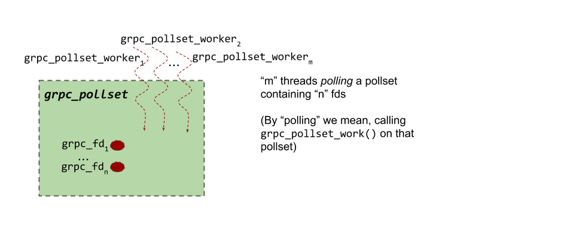
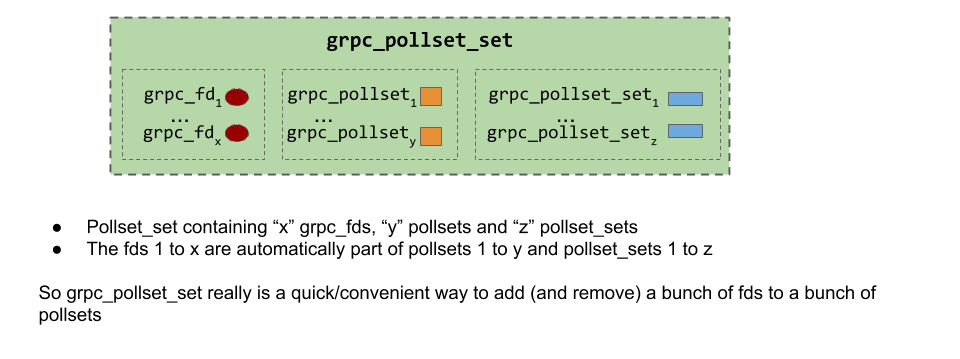
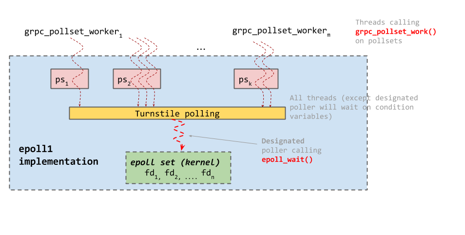

# Polling Engines

_Author: Sree Kuchibhotla (@sreecha) - Sep 2018_

## Why do we need a 'polling engine' ?

Polling engine component was created for the following reasons:

- gRPC code deals with a bunch of file descriptors on which events like descriptor being readable/writable/error have to be monitored
- gRPC code knows the actions to perform when such events happen
  -  For example:
    - `grpc_endpoint` code calls `recvmsg` call when the fd is readable and `sendmsg` call when the fd is writable
    - ` tcp_client` connect code issues async `connect` and finishes creating the client once the fd is writable (i.e when the `connect` actually finished)
- gRPC needed some component that can "efficiently" do the above operations __using the threads provided by the applications (i.e., not create any new threads)__.  Also by "efficiently" we mean optimized for latency and throughput

## Polling Engine Implementations in gRPC
There are multiple polling engine implementations depending on the OS and the OS version.  Fortunately all of them expose the same interface

- Linux:

  - `epoll1` (If glibc version >= 2.9)
  - `poll` (If kernel does not have epoll support)
- Mac: **`poll`** (default)
- Windows: (no name)

## Polling Engine Interface

### Opaque Structures exposed by the polling engine
The following are the **Opaque** structures exposed by Polling Engine interface (NOTE: Different polling engine implementations have different definitions of these structures)

- **grpc_fd:** Structure representing a file descriptor
- **grpc_pollset:** A set of one or more grpc_fds that are ‘polled’ for readable/writable/error events. One grpc_fd can be in multiple `grpc_pollset`s
- **grpc_pollset_worker:** Structure representing a ‘polling thread’ - more specifically, the thread that calls `grpc_pollset_work()` API
- **grpc_pollset_set:** A group of `grpc_fd`s, `grpc_pollset`s and `grpc_pollset_set`s (yes, a `grpc_pollset_set` can contain other `grpc_pollset_set`s)

### Polling engine API

#### grpc_fd
- **grpc\_fd\_notify\_on\_[read|write|error]**
  - Signature: `grpc_fd_notify_on_(grpc_fd* fd, grpc_closure* closure)`
  - Register a [closure](https://github.com/grpc/grpc/blob/v1.15.1/src/core/lib/iomgr/closure.h#L67) to be called when the fd becomes readable/writable or has an error (In grpc parlance, we refer to this act as “arming the fd”)
  - The closure is called exactly once per event. I.e once the fd becomes readable (or writable or error), the closure is fired and the fd is ‘unarmed’. To be notified again, the fd has to be armed again.

- **grpc_fd_shutdown**
  - Signature: `grpc_fd_shutdown(grpc_fd* fd)`
  - Any current (or future) closures registered for readable/writable/error events are scheduled immediately with an error

- **grpc_fd_orphan**
  - Signature: `grpc_fd_orphan(grpc_fd* fd, grpc_closure* on_done, int* release_fd, char* reason)`
  - Release the `grpc_fd` structure and call `on_done` closure when the operation is complete
  - If `release_fd` is set to `nullptr`, then `close()` the underlying fd as well. If not, put the underlying fd in `release_fd` (and do not call `close()`)
    - `release_fd` set to non-null in cases where the underlying fd is NOT owned by grpc core (like for example the fds used by C-Ares DNS resolver )

#### grpc_pollset

- **grpc_pollset_add_fd**
  - Signature: `grpc_pollset_add_fd(grpc_pollset* ps, grpc_fd *fd)`
  - Add fd to pollset
    > **NOTE**: There is no `grpc_pollset_remove_fd`. This is because calling `grpc_fd_orphan()` will effectively remove the fd from all the pollsets it’s a part of

- **grpc_pollset_work**
  - Signature: `grpc_pollset_work(grpc_pollset* ps, grpc_pollset_worker** worker, grpc_core::Timestamp deadline)`
    > **NOTE**: `grpc_pollset_work()` requires the pollset mutex to be locked before calling it. Shortly after calling `grpc_pollset_work()`, the function populates the `*worker` pointer (among other things) and releases the mutex. Once `grpc_pollset_work()` returns, the `*worker` pointer is **invalid** and should not be used anymore. See the code in `completion_queue.cc` to see how this is used.
  - Poll the fds in the pollset for events AND return when ANY of the following is true:
    - Deadline expired
    - Some fds in the pollset were found to be readable/writable/error and those associated closures were ‘scheduled’ (but not necessarily executed)
    - worker is “kicked” (see `grpc_pollset_kick` for more details)

- **grpc_pollset_kick**
  - Signature: `grpc_pollset_kick(grpc_pollset* ps, grpc_pollset_worker* worker)`
  - “Kick the worker” i.e Force the worker to return from grpc_pollset_work()
  - If `worker == nullptr`, kick ANY worker active on that pollset

#### grpc_pollset_set

- **grpc\_pollset\_set\_[add|del]\_fd**
  - Signature: `grpc_pollset_set_[add|del]_fd(grpc_pollset_set* pss, grpc_fd *fd)`
  - Add/Remove fd to the `grpc_pollset_set`

- **grpc\_pollset\_set_[add|del]\_pollset**
  - Signature: `grpc_pollset_set_[add|del]_pollset(grpc_pollset_set* pss, grpc_pollset* ps)`
  - What does adding a pollset to a pollset_set mean ?
    - It means that calling `grpc_pollset_work()` on the pollset will also poll all the fds in the pollset_set i.e semantically, it is similar to adding all the fds inside pollset_set to the pollset.
    - This guarantee is no longer true once the pollset is removed from the pollset_set

- **grpc\_pollset\_set_[add|del]\_pollset\_set**
  - Signature: `grpc_pollset_set_[add|del]_pollset_set(grpc_pollset_set* bag, grpc_pollset_set* item)`
  - Semantically, this is similar to adding all the fds in the ‘bag’ pollset_set to the ‘item’ pollset_set

#### Recap:

__Relation between grpc_pollset_worker, grpc_pollset and grpc_fd:__

__grpc_pollset_set__

## Polling Engine Implementations

### epoll1

Code at `src/core/lib/iomgr/ev_epoll1_posix.cc`

- The logic to choose a designated poller is quite complicated. Pollsets are internally sharded into what are called `pollset_neighborhood` (a structure internal to `epoll1` polling engine implementation). `grpc_pollset_workers` that call `grpc_pollset_work` on a given pollset are all queued in a linked-list against the `grpc_pollset`. The head of the linked list is called "root worker"

- There are as many neighborhoods as the number of cores. A pollset is put in a neighborhood based on the CPU core of the root worker thread. When picking the next designated poller, we always try to find another worker on the current pollset. If there are no more workers in the current pollset, a `pollset_neighborhood` listed is scanned to pick the next pollset and worker that could be the new designated poller.
  - NOTE: There is room to tune this implementation. All we really need is good way to maintain a list of `grpc_pollset_workers` with a way to group them per-pollset (needed to implement `grpc_pollset_kick` semantics) and a way randomly select a new designated poller

- See [`begin_worker()`](https://github.com/grpc/grpc/blob/v1.15.1/src/core/lib/iomgr/ev_epoll1_linux.cc#L729) function to see how a designated poller is chosen. Similarly [`end_worker()`](https://github.com/grpc/grpc/blob/v1.15.1/src/core/lib/iomgr/ev_epoll1_linux.cc#L916) function is called by the worker that was just out of `epoll_wait()` and will have to choose a new designated poller)

### Other polling engine implementations (poll and windows polling engine)
- **poll** polling engine: gRPC's `poll` polling engine is quite complicated. It uses the `poll()` function to do the polling (and hence it is for platforms like osx where epoll is not available)
  - The implementation is further complicated by the fact that poll() is level triggered (just keep this in mind in case you wonder why the code at `src/core/lib/iomgr/ev_poll_posix.cc` is written a certain/seemingly complicated way :))

- **Polling engine on Windows**: Windows polling engine looks nothing like other polling engines
  - Unlike the grpc polling engines for Unix systems (epoll1 and poll) Windows endpoint implementation and polling engine implementations are very closely tied together
  - Windows endpoint read/write API implementations use the Windows IO API which require specifying an [I/O completion port](https://docs.microsoft.com/en-us/windows/desktop/fileio/i-o-completion-ports)
  - In Windows polling engine’s grpc_pollset_work() implementation, ONE of the threads is chosen to wait on the I/O completion port while other threads wait on a condition variable (much like the turnstile polling in epoll1)

