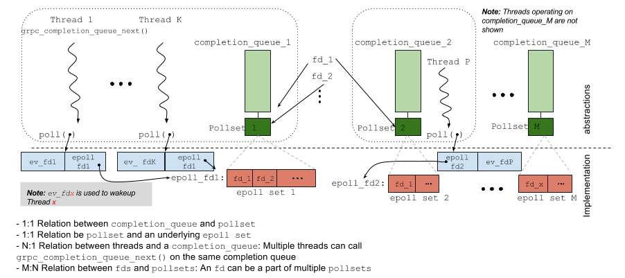
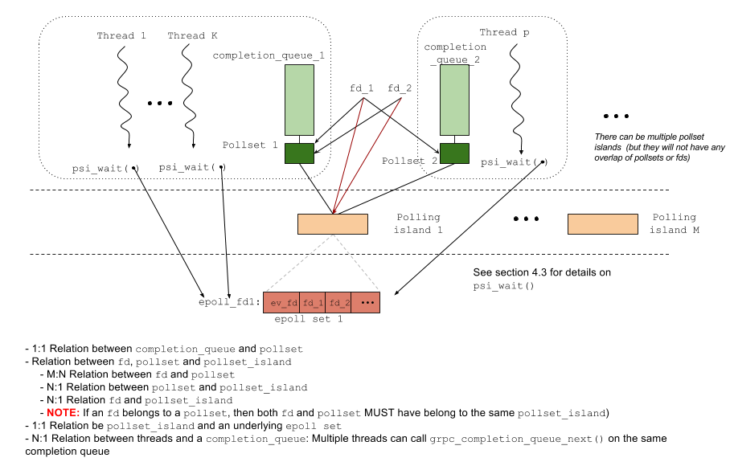

# `epoll`-based pollset implementation in gRPC

Sree Kuchibhotla (sreek@) [May - 2016]
(Design input from Craig Tiller and David Klempner)

> Status: As of June 2016, this change is implemented and merged.

> * The bulk of the functionality is in: [ev_epollsig_linux.c](https://github.com/grpc/grpc/blob/master/src/core/lib/iomgr/ev_epollsig_linux.c)
> * Pull request: https://github.com/grpc/grpc/pull/6803

## 1. Introduction
The document talks about the proposed changes to `epoll`-based implementation of pollsets in gRPC. Section-2 gives an overview of the current implementation, Section-3 talks about the problems in the current implementation and finally Section-4 talks about the proposed changes.

## 2. Current `epoll`-based implementation in gRPC



**Figure 1: Current implementation**

A gRPC client or a server can have more than one completion queue. Each completion queue creates a pollset.

The gRPC core library does not create any threads[^1] on its own and relies on the application using the gRPC core library to provide the threads. A thread starts to poll for events by calling the gRPC core surface APIs `grpc_completion_queue_next()` or `grpc_completion_queue_pluck()`. More than one thread can call `grpc_completion_queue_next()`on the same completion queue[^2].

A file descriptor can be in more than one completion queue. There are examples in the next section that show how this can happen.

When an event of interest happens in a pollset, multiple threads are woken up and there are no guarantees on which thread actually ends up performing the work i.e executing the callbacks associated with that event. The thread that performs the work finally queues a completion event `grpc_cq_completion` on the appropriate completion queue and "kicks" (i.e wakes ups) the thread that is actually interested in that event (which can be itself - in which case there is no thread hop)

For example, in **Figure 1**, if `fd1` becomes readable, any one of the threads i.e *Threads 1* to *Threads K* or *Thread P*, might be woken up. Let's say *Thread P* was calling a `grpc_completion_queue_pluck()` and was actually interested in the event on `fd1` but *Thread 1* woke up. In this case, *Thread 1* executes the callbacks and finally kicks *Thread P* by signalling `event_fd_P`. *Thread P* wakes up, realizes that there is a new completion event for it and returns from `grpc_completion_queue_pluck()` to its caller.

## 3. Issues in the current architecture

### _Thundering Herds_

If multiple threads concurrently call `epoll_wait()`, we are guaranteed that only one thread is woken up if one of the `fds` in the set becomes readable/writable. However, in our current implementation, the threads do not directly call a blocking `epoll_wait()`[^3]. Instead, they call `poll()` on the set containing `[event_fd`[^4]`, epoll_fd]`. **(see Figure 1)**

Considering the fact that an `fd` can be in multiple `pollsets` and that each `pollset` might have multiple poller threads, it means that whenever an `fd` becomes readable/writable, all the threads in all the `pollsets` (in which that `fd` is present) are woken up.

The performance impact of this would be more conspicuous on the server side. Here are a two examples of thundering herds on the server side.

Example 1: Listening fds on server

* A gRPC server can have multiple server completion queues (i.e completion queues which are used to listen for incoming channels).
* A gRPC server can also listen on more than one TCP-port.
* A listening socket is created for each port the gRPC server would be listening on.
* Every listening socket's fd is added to all the server completion queues' pollsets. (Currently we do not do any sharding of the listening fds across these pollsets).

This means that for every incoming new channel, all the threads waiting on all the pollsets are woken up.

Example 2: New Incoming-channel fds on server

* Currently, every new incoming channel's `fd` (i.e the socket `fd` that is returned by doing an `accept()` on the new incoming channel) is added to all the server completion queues' pollsets [^5]).
* Clearly, this would also cause all thundering herd problem for every read onthat fd

There are other scenarios especially on the client side where an fd can end up being on multiple pollsets which would cause thundering herds on the clients.


## 4. Proposed changes to the current `epoll`-based polling implementation:

The main idea in this proposal is to group 'related' `fds` into a single epoll-based set. This would ensure that only one thread wakes up in case of an event on one of the `fds` in the epoll set.

To accomplish this, we introduce a new abstraction called `polling_island` which will have an epoll set underneath (See **Figure 2** below).  A `polling_island` contains the following:

* `epoll_fd`: The file descriptor of the underlying epoll set
* `fd_set`: The set of 'fds' in the pollset island i.e in the epoll set (The pollset island merging operation described later requires the list of fds in the pollset island and currently there is no API available to enumerate all the fds in an epoll set)
* `event_fd`: A level triggered _event fd_ that is used to wake up all the threads waiting on this epoll set (Note: This `event_fd` is added to the underlying epoll set during pollset island creation. This is useful in the pollset island merging operation described later)
* `merged_to`:  The polling island into which this one merged. See section 4.2 (case 2) for more details on this. Also note that if `merged_to` is set, all the other fields in this polling island are not used anymore

In this new model, only one thread wakes up whenever an event of interest happens in an epoll set.



**Figure 2: Proposed changes**

### 4.1 Relation between `fd`, `pollset` and `polling_island:`

* An `fd` may belong to multiple `pollsets` but belongs to exactly one `polling_island`
* A `pollset` belongs to exactly one `polling_island`
* An `fd` and the `pollset(s`) it belongs to, have same `polling_island`

### 4.2 Algorithm to add an `fd` to a `pollset`

There are two cases to check here:

* **Case 1:** Both `fd` and `pollset` already belong to the same `polling_island`
    * This is straightforward and nothing really needs to be done here
* **Case 2:** The `fd `and `pollset` point to different `polling_islands`: In this case we _merge_ both the polling islands i.e:
    * Add all the `fds` from the smaller `polling_island `to the larger `polling_island` and update the `merged_to` pointer on the smaller island to point to the larger island.
    * Wake up all the threads waiting on the smaller `polling_island`'s `epoll_fd` (by signalling the `event_fd` on that island) and make them now wait on the larger `polling_island`'s `epoll_fd`
    * Update `fd` and `pollset` to now point to the larger `polling_island`

### 4.3 Directed wakeups:

The new implementation, just like the current implementation, does not provide us any guarantees that the thread that is woken up is the thread that is actually interested in the event.  So the thread that woke up executes the callbacks and finally has to 'kick' the appropriate polling thread interested in the event.

In the current implementation, every polling thread also had a `event_fd` on which it was listening to and hence waking it up was as simple as signalling that `event_fd`. However, using an `event_fd` also meant that every thread has to use a `poll()` (on `event_fd` and `epoll_fd`) instead of doing an `epoll_wait()` and this resulted in the thundering herd problems described above.

The proposal here is to use signals and kicking a thread would just be sending a signal to that thread. Unfortunately there are only a few signals available on posix systems and most of them have pre-determined behavior leaving only a few signals `SIGUSR1`, `SIGUSR2` and `SIGRTx (SIGRTMIN to SIGRTMAX)` for custom use.

The calling application might have registered other signal handlers for these signals. `We will provide a new API where the applications can "give a signal number" to gRPC library to use for this purpose.

```
void grpc_use_signal(int signal_num)
```

If the calling application does not provide a signal number, then the gRPC library will relegate to using a model similar to the current implementation (where every thread does a blocking `poll()` on its `wakeup_fd` and the `epoll_fd`).  The function` psi_wait() `in figure 2 implements this logic.

**>> **(**NOTE**: Or alternatively, we can implement a turnstile polling (i.e having only one thread calling `epoll_wait()` on the epoll set at any time - which all other threads call poll on their `wakeup_fds`) 
in case of not getting a signal number from the applications.


## Notes

[^1]: Only exception is in case of name-resolution

[^2]: However, a `grpc_completion_queue_next()` and `grpc_completion_queue_pluck()` must not be called in parallel on the same completion queue

[^3]: The threads first do a blocking` poll()` with `[wakeup_fd, epoll_fd]`.  If the `poll()` returns due to an event of interest in the epoll set, they then call a non-blocking i.e a zero-timeout `epoll_wait()` on the `epoll_fd`

[^4]: `event_fd` is the linux platform specific implementation of `grpc_wakeup_fd`.  A `wakeup_fd` is used to wake up polling threads typically when the event for which the polling thread is waiting is already completed by some other thread.  It is also used to wake up the polling threads in case of shutdowns or to re-evaluate the poller's interest in the fds to poll (the last scenario is only in case of `poll`-based (not `epoll`-based) implementation of `pollsets`).

[^5]: See more details about the issue here https://github.com/grpc/grpc/issues/5470 and for a proposed fix here: https://github.com/grpc/grpc/pull/6149
