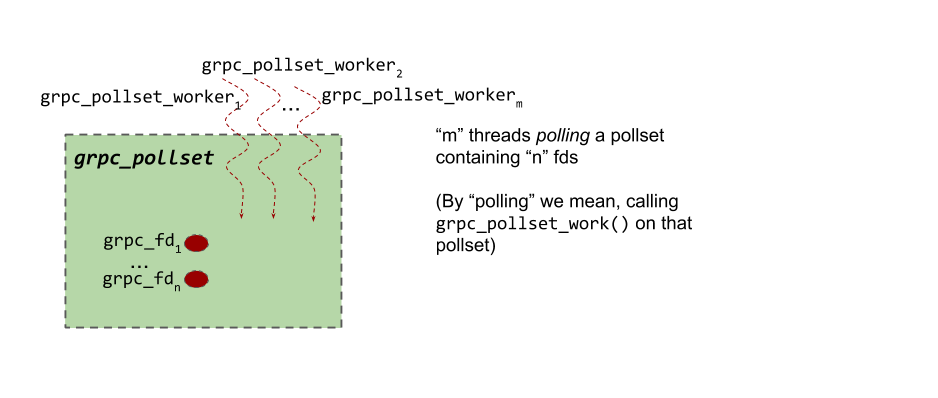
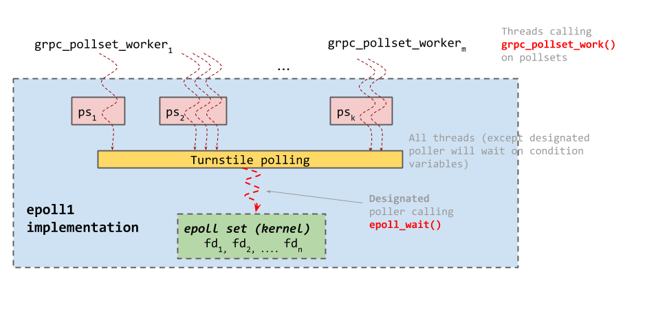
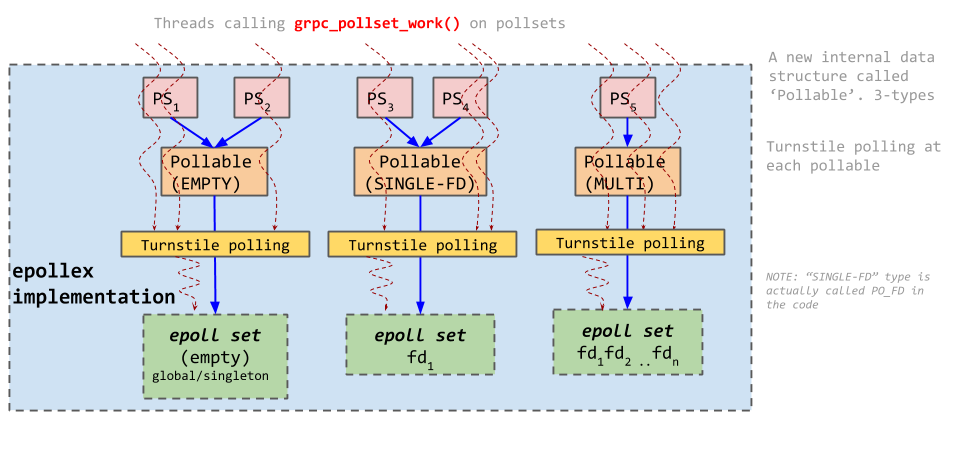

# Polling Engines

_Author: Sree Kuchibhotla (@sreecha) - Sep 2018_

## Why do we need a 'polling engine' ?

Polling engine component was created for the following reasons:

- gRPC code deals with a bunch of file descriptors on which events like descriptor being readable/writable/error have to be monitored
- gRPC code knows the actions to perform when such events happen
  -  For example:
    - `grpc_endpoint` code calls recvmsg call when the fd is readable and sendmsg call when the fd is writable
    - ` tcp_client` connect code issues async connect and finishes creating the client once the fd is writable (i.e when the connect actually finished)
- gRPC needed some component that can "efficiently" to the above operations __using the threads provided by the applications (i.e not create any new threads)__.  Also by "efficiently" we mean optimized for latency and throughput

## Polling Engine Implementations in gRPC
There are multiple polling engine implementations depending on the OS and the OS version.  Fortunately all of them expose the same interface

- Linux:

  - **epollex** (default but requires kernel version >= 4.5),
  - epoll1 (If epollex is not available and glibc version >= 2.9)
  - epollsig (if epollex, epoll1 are unavailable AND Kernel has epoll support)
  - poll (if kernel NOT have epoll support)
- Mac: **poll** (default), poll-cv
- Windows: (no name)
- One-off polling engines:
  - AppEngine platform: poll-cv (default)
  - NodeJS : libuv polling engine implementation (requires different compile # defs)

## Polling Engine Interface

### Opaque Structures exposed by the polling engine
The following are the **Opaque** structures exposed by Polling Engine interface (NOTE: Different polling engine implementations have different definitions of these structures)

- **grpc_fd:** Structure representing a file descriptor
- **grpc_pollset:** A set of one or more grpc_fds that are ‘polled’ for readable/writable/error events. One grpc_fd can be in multiple grpc_pollsets
- **grpc_pollset_worker:** Structure representing a ‘polling thread’ - more specifically, the thread that calls grpc_pollset_work() API 
- **grpc_pollset_set:** A group of `grpc_fds`, `grpc_pollsets` and `grpc_pollset_sets` (yes, a `grpc_pollset_set` can contain other `grpc_pollset_sets`)

### Polling engine API

#### grpc_fd
- **grpc\_fd\_notify\_on\_[read|write|error]**
  - Signature: `grpc_fd_notify_on_(grpc_fd* fd, grpc_closure* closure)`
  - Register a closure to be called when the fd becomes readable/writable or has an error (In grpc parlance, we refer to this act as “arming the fd”)
  - The closure is called exactly once per event. I.e once the fd becomes readable (or writable or error), the closure is fired and the fd is ‘unarmed’. To be notified again, the fd has to be armed again.

- **grpc_fd_shutdown**
  - Signature: `grpc_fd_shutdown(grpc_fd* fd)`
  - Any current (or future) closures registered for readable/writable/error events are scheduled immediately with an error

- **grpc_fd_orphan**
  - Signature: `grpc_fd_orphan(grpc_fd* fd, grpc_closure* on_done, int* release_fd, char* reason)`
  - Release the `grpc_fd` structure and call `on_done` closure when the operation is complete
  - If `release_fd` is set to `nullptr`, then `close()` the underlying fd as well. If not, put the underlying fd in `release_fd` (and do not call `close()`)
    - release_fd set to non-null in cases where the underlying fd is NOT owned by grpc core (like for example the fds used by C-Ares DNS resolver )

#### grpc_pollset

- **grpc_pollset_add_fd **
  - Signature: `grpc_pollset_add_fd(grpc_pollset* ps, grpc_fd *fd)`
  - Add fd to pollset
    > **NOTE**: There is no `grpc_pollset_remove_fd`. This is because calling `grpc_fd_orphan()` will effectively remove the fd from all the pollsets it’s a part of

- ** grpc_pollset_work **
  - Signature: `grpc_pollset_work(grpc_pollset* ps, grpc_pollset_worker** worker, grpc_millis deadline)`
    > **NOTE**: `grpc_pollset_work()` requires the pollset mutex to be locked before calling it. Shortly after calling `grpc_pollset_work()`, the function populates the `*worker` pointer (among other things) and releases the mutex. Once `grpc_pollset_work()` returns, the `*worker` pointer is **invalid** and should not be used anymore. See the code in `completion_queue.cc` to see how this is used.
  - Poll the fds in the pollset for events AND return when ONE of the following is true:
    - Deadline expired
    - Some fds in the pollset were found to be readable/writable/error and those associated closures were ‘scheduled’ (but not necessarily executed)
    - worker is “kicked” (see grpc_pollset_kick for more details)

- **grpc_pollset_kick**
 - Signature: `grpc_pollset_kick(grpc_pollset* ps, grpc_pollset_worker* worker)`
 - “Kick the worker” i.e Force the worker to return from grpc_pollset_work()
 - If `worker == nullptr`, kick ANY worker active on that pollset

#### grpc_pollset_set

- **grpc\_pollset\_set\_[add|del]\_fd**
  - Signature: `grpc_pollset_set_[add|del]_fd(grpc_pollset_set* pss, grpc_fd *fd)`
Add/Remove fd to the pollset_set

- **grpc\_pollset\_set_[add|del]\_pollset**
  - Signature: `grpc_pollset_set_[add|del]_pollset(grpc_pollset_set* pss, grpc_pollset* ps)`
  - What does adding a pollset to a pollset_set mean ?
    - It means that calling `grpc_pollset_work()` on the pollset will also poll all the fds in the pollset_set i.e semantically, it is similar to adding all the fds inside pollset_set to the pollset. 
    - This guarantee is no longer true once the pollset is removed from the pollset_set

- **grpc\_pollset\_set_[add|del]\_pollset\_set**
  - Signature: `grpc_pollset_set_[add|del]_pollset_set(grpc_pollset_set* bag, grpc_pollset_set* item)`
  - Semantically, this is similar to adding all the fds in the ‘bag’ pollset_set to the ‘item’ pollset_set

#### Recap:

__Relation between grpc_pollset_worker, grpc_pollset and grpc_fd:__

__grpc_pollset_set__

## Polling Engine Implementations

### epoll1

Code at `src/core/lib/iomgr/ev_epoll1_posix.cc`

- The logic to choose a designated poller is quite complicated. Pollsets are internally sharded into what are called `pollset_neighborhood` (a structure internal to `epoll1` polling engine implementation). `grpc_pollset_workers` that call `grpc_pollset_work` on a given pollset are all queued in a linked-list against the `grpc_pollset`.

- There are as many neighborhoods as the number of cores. A pollset is put in a neighborhood based on the CPU core, the root worker thread (i.e the head of the linked-list of workers queued against the pollset). The whole idea here is that when choosing the next designated poller, we make a best-effort attempt to pick a worker that is NOT running on the same core. This way, we reduce the probability of the current thread being pre-empted by the CPU scheduler.

- See `begin_worker()` function in `src/core/lib/iomgr/ev_epoll1_posix.cc` to see how a designated poller is chosen. Similarly `end_worker()` function is called by the worker that was just out of epoll_wait() and will have to choose a new designated poller)

### epollex

Code at `src/core/lib/iomgr/ev_epollex_posix.cc`

- FDs are added to multiple epollsets with EPOLLEXCLUSIVE flag. This prevents multiple worker threads from waking up from polling whenever the fd is readable/writable

- A few conclusions:

  - If multiple pollsets are pointing to the same Pollable, then the pollable MUST be either empty or of type PO_FD (i.e single-fd)
  - A multi-pollable has one-and-only-one incoming link from a Pollset 
  - The same FD can be in multiple pollables (even if one of the pollables is of type PO_FD)
  - There cannot be two Pollables of type PO_FD for the same fd

- Why do we need Pollalbe of type PO_FD and Empty pollable ?
  - The main reason is the Sync client API
    - We create one completion queue per call (therefore one pollset per call). If we didn’t have PO_EMPTY and PO_FD type pollables, then every call on a given channel will effectively have to create a pollable (and hence an epollset). Thats a lot of epoll fd create/delete calls
    - With these new types of pollables, all pollsets (corresponding to the new per-call completion queue) will initially point to PO_EMPTY global epollset. Then once the sub-channel fd is added to the pollset, the pollset will point to the Pollable of type PO_FD containing just that fd (i.e 

### Other polling engine implementations (poll and windows polling engine)
- **poll** polling engine: gRPC's `poll` polling engine is quite complicated. It uses the `poll()` function to do the polling (and hence it is for platforms like osx where epoll is not available)
  - The implementation is further complicated by the fact that poll() is level triggered (just keep this in mind in case you wonder why the code at `src/core/lib/iomgr/ev_poll_posix.cc` is written a certain/seemingly complicated way :))

- **Polling engine on Windows**: Windows polling engine looks nothing like other polling engines
  - Unlike the grpc polling engines for Unix systems (epollex, epoll1 and poll) Windows endpoint implementation and polling engine implementations are very closely tied together
  - Windows endpoint read/write API implementations use the Windows IO API which require specifying an [I/O completion port](https://docs.microsoft.com/en-us/windows/desktop/fileio/i-o-completion-ports)
  - In Windows polling engine’s grpc_pollset_work() implementation, ONE of the threads is chosen to wait on the I/O completion port while other threads wait on a condition variable (much like the turnstile polling in epollex/epoll1)

