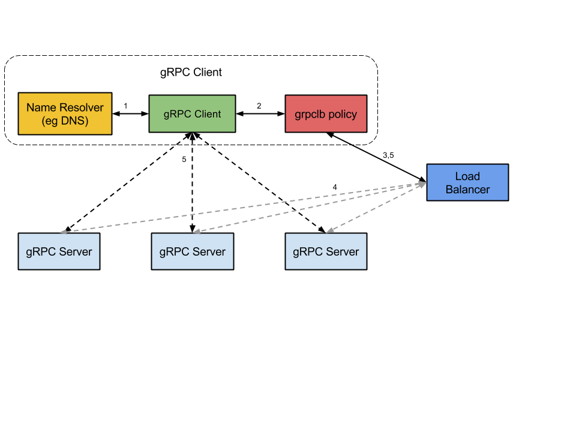

Load Balancing in gRPC
======================

# Scope

This document explains the design for load balancing within gRPC.

# Background

Load-balancing within gRPC happens on a per-call basis, not a
per-connection basis.  In other words, even if all requests come from a
single client, we still want them to be load-balanced across all servers.

# Architecture

## Overview

The gRPC client supports an API that allows load balancing policies to
be implemented and plugged into gRPC.  An LB policy is responsible for:
- receiving updated configuration and list of server addresses from the
  resolver
- creating subchannels for the server addresses and managing their
  connectivity behavior
- setting the overall [connectivity state](connectivity-semantics-and-api.md)
  (usually computed by aggregating the connectivity states of its subchannels)
  of the channel
- for each RPC sent on the channel, determining which subchannel to send
  the RPC on

There are a number of LB policies provided with gRPC.  The most
notable ones are `pick_first` (the default), `round_robin`, and
`grpclb`.  There are also a number of additional LB policies to support
[xDS](grpc_xds_features.md), although they are not currently configurable
directly.

## Workflow

Load-balancing policies fit into the gRPC client workflow in between
name resolution and the connection to the server.  Here's how it all
works:

1. On startup, the gRPC client issues a [name resolution](naming.md) request
   for the server name.  The name will resolve to a list of IP addresses,
   a [service config](service_config.md) that indicates which client-side
   load-balancing policy to use (e.g., `round_robin` or `grpclb`) and
   provides a configuration for that policy, and a set of attributes
   (channel args in C-core).
2. The client instantiates the load balancing policy and passes it its
   configuration from the service config, the list of IP addresses, and
   the attributes.
3. The load balancing policy creates a set of subchannels for the IP
   addresses of the servers (which might be different from the IP
   addresses returned by the resolver; see below).  It also watches the
   subchannels' connectivity states and decides when each subchannel
   should attempt to connect.
4. For each RPC sent, the load balancing policy decides which
   subchannel (i.e., which server) the RPC should be sent to.

See below for more information on `grpclb`.

## Load Balancing Policies

### `pick_first`

This is the default LB policy if the service config does not specify any
LB policy.  It does not require any configuration.

The `pick_first` policy takes a list of addresses from the resolver.  It
attempts to connect to those addresses one at a time, in order, until it
finds one that is reachable.  If none of the addresses are reachable, it
sets the channel's state to TRANSIENT_FAILURE while it attempts to
reconnect.  Appropriate [backoff](connection-backoff.md) is applied for
repeated connection attempts.

If it is able to connect to one of the addresses, it sets the channel's
state to READY, and then all RPCs sent on the channel will be sent to
that address.  If the connection to that address is later broken,
the `pick_first` policy will put the channel into state IDLE, and it
will not attempt to reconnect until the application requests that it
does so (either via the channel's connectivity state API or by sending
an RPC).

### `round_robin`

This LB policy is selected via the service config.  It does not require
any configuration.

This policy takes a list of addresses from the resolver.  It creates a
subchannel for each of those addresses and constantly monitors the
connectivity state of the subchannels.  Whenever a subchannel becomes
disconnected, the `round_robin` policy will ask it to reconnect, with
appropriate connection [backoff](connection-backoff.md).

The policy sets the channel's connectivity state by aggregating the
states of the subchannels:
- If any one subchannel is in READY state, the channel's state is READY.
- Otherwise, if there is any subchannel in state CONNECTING, the channel's
  state is CONNECTING.
- Otherwise, if there is any subchannel in state IDLE, the channel's state is
  IDLE.
- Otherwise, if all subchannels are in state TRANSIENT_FAILURE, the channel's
  state is TRANSIENT_FAILURE.

Note that when a given subchannel reports TRANSIENT_FAILURE, it is
considered to still be in TRANSIENT_FAILURE until it successfully
reconnects and reports READY.  In particular, we ignore the transition
from TRANSIENT_FAILURE to CONNECTING.

When an RPC is sent on the channel, the `round_robin` policy will
iterate over all subchannels that are currently in READY state, sending
each successive RPC to the next successive subchannel in the list,
wrapping around to the start of the list when needed.

### `grpclb`

(This policy is deprecated.  We recommend using [xDS](grpc_xds_features.md)
instead.)

This LB policy was originally intended as gRPC's primary extensibility
mechanism for load balancing.  The intent was that instead of adding new
LB policies directly in the client, the client could implement only
simple algorithms like `round_robin`, and any more complex algorithms
would be provided by a look-aside load balancer.

The client relies on the load balancer to provide _load balancing
configuration_ and _the list of server addresses_ to which the client should
send requests. The balancer updates the server list as needed to balance
the load as well as handle server unavailability or health issues. The
load balancer will make any necessary complex decisions and inform the
client. The load balancer may communicate with the backend servers to
collect load and health information.

The `grpclb` policy uses the addresses returned by the resolver (if any)
as fallback addresses, which are used when it loses contact with the
balancers.

The `grpclb` policy gets the list of addresses of the balancers to talk to
via an attribute returned by the resolver.
