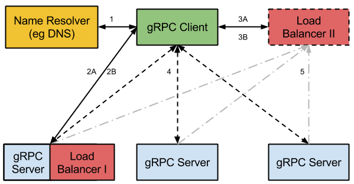

Load Balancing in gRPC
=======================

# Objective

To design a load balancing API between a gRPC client and a Load Balancer to
instruct the client how to send load to multiple backend servers.

# Background

Prior to any gRPC specifics, we explore some usual ways to approach load
balancing.

### Proxy Model

Using a proxy provides a solid trustable client that can report load to the load
balancing system. Proxies typically require more resources to operate since they
have temporary copies of the RPC request and response. This model also increases
latency to the RPCs.

The proxy model was deemed inefficient when considering request heavy services
like storage.

### Balancing-aware Client

This thicker client places more of the load balancing logic in the client. For
example, the client could contain many load balancing policies (Round Robin,
Random, etc) used to select servers from a list. In this model, a list of
servers would be either statically configured in the client, provided by the
name resolution system, an external load balancer, etc. In any case, the client
is responsible for choosing the preferred server from the list.

One of the drawbacks of this approach is writing and maintaining the load
balancing policies in multiple languages and/or versions of the clients. These
policies can be fairly complicated. Some of the algorithms also require client
to server communication so the client would need to get thicker to support
additional RPCs to get health or load information in addition to sending RPCs
for user requests.

It would also significantly complicate the client's code: the new design hides
the load balancing complexity of multiple layers and presents it as a simple
list of servers to the client.

### External Load Balancing Service

The client load balancing code is kept simple and portable, implementing
well-known algorithms (ie, Round Robin) for server selection.
Complex load balancing algorithms are instead provided by the load balancer. The
client relies on the load balancer to provide _load balancing configuration_ and
_the list of servers_ to which the client should send requests. The balancer
updates the server list as needed to balance the load as well as handle server
unavailability or health issues. The load balancer will make any necessary
complex decisions and inform the client. The load balancer may communicate with
the backend servers to collect load and health information.

## Requirements

#### Simple API and client

The gRPC client load balancing code must be simple and portable. The client
should only contain simple algorithms (ie Round Robin) for server selection. For
complex algorithms, the client should rely on a load balancer to provide load
balancing configuration and the list of servers to which the client should send
requests. The balancer will update the server list as needed to balance the load
as well as handle server unavailability or health issues. The load balancer will
make any necessary complex decisions and inform the client. The load balancer
may communicate with the backend servers to collect load and health information.

#### Security

The load balancer may be separate from the actual server backends and a
compromise of the load balancer should only lead to a compromise of the
loadbalancing functionality. In other words, a compromised load balancer should
not be able to cause a client to trust a (potentially malicious) backend server
any more than in a comparable situation without loadbalancing.

# Proposed Architecture

The gRPC load balancing implements the external load balancing server approach:
an external load balancer provides simple clients with an up-to-date list of
servers.

1. On startup, the gRPC client issues a name resolution request for the service.
   The name will resolve to one or more IP addresses to gRPC servers, a hint on
   whether the IP address(es) point to a load balancer or not, and also return a
   client config.
2. The gRPC client connects to a gRPC Server.
   1. If the name resolution has hinted that the endpoint is a load balancer,
      the client's gRPC LB policy will attempt to open a stream to the load
      balancer service. The server may respond in only one of the following
      ways.
      1. `status::UNIMPLEMENTED`. There is no loadbalancing in use. The client
         call will fail.
      2. "I am a Load Balancer and here is the server list." (Goto Step 4.)
      3. "Please contact Load Balancer X" (See Step 3.) The client will close
         this connection and cancel the stream.
      4. If the server fails to respond, the client will wait for some timeout
         and then re-resolve the name (process to Step 1 above).
   2. If the name resolution has not hinted that the endpoint is a load
      balancer, the client connects directly to the service it wants to talk to.
3. The gRPC client's gRPC LB policy opens a separate connection to the Load
   Balancer. If this fails, it will go back to step 1 and try another address.
   1. During channel initialization to the Load Balancer, the client will
      attempt to open a stream to the Load Balancer service.
   2. The Load Balancer will return a server list to the gRPC client. If the
      server list is empty, the call will wait until a non-empty one is
      received. Optional: The Load Balancer will also open channels to the gRPC
      servers if load reporting is needed.
4. The gRPC client will send RPCs to the gRPC servers contained in the server
   list from the Load Balancer.
5. Optional: The gRPC servers may periodically report load to the Load Balancer.

## Client

When establishing a gRPC _stream_ to the balancer, the client will send an initial
request to the load balancer (via a regular gRPC message). The load balancer
will respond with client config (including, for example, settings for flow
control, RPC deadlines, etc.) or a redirect to another load balancer. If the
balancer did not redirect the client, it will then send a list of servers to the
client. The client will contain simple load balancing logic for choosing the
next server when it needs to send a request.

## Load Balancer

The Load Balancer is responsible for providing the client with a list of servers
and client RPC parameters. The balancer chooses when to update the list of
servers and can decide whether to provide a complete list, a subset, or a
specific list of “picked” servers in a particular order. The balancer can
optionally provide an expiration interval after which the server list should no
longer be trusted and should be updated by the balancer.

The load balancer may open reporting streams to each server contained in the
server list. These streams are primarily used for load reporting. For example,
Weighted Round Robin requires that the servers report utilization to the load
balancer in order to compute the next list of servers.

## Server

The gRPC Server is responsible for answering RPC requests and providing
responses to the client. The server will also report load to the load balancer
if a reporting stream was opened for this purpose.
