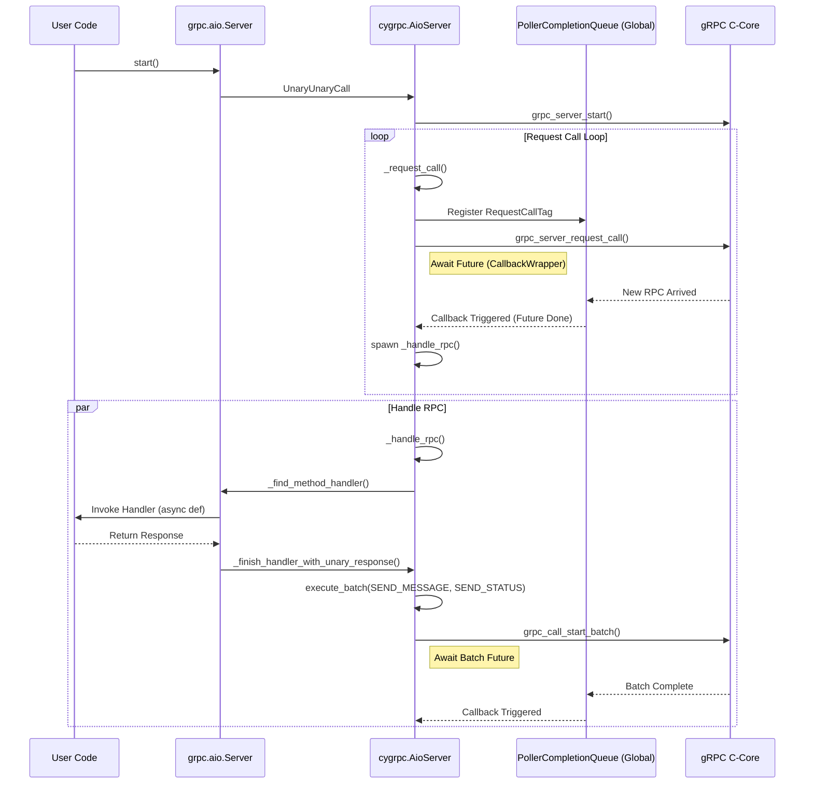
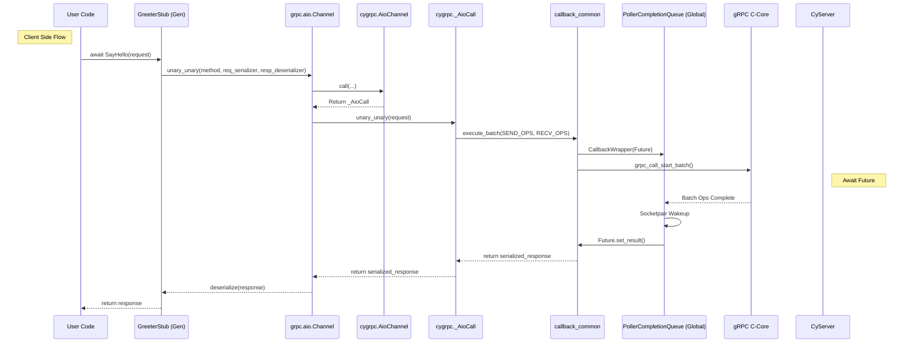
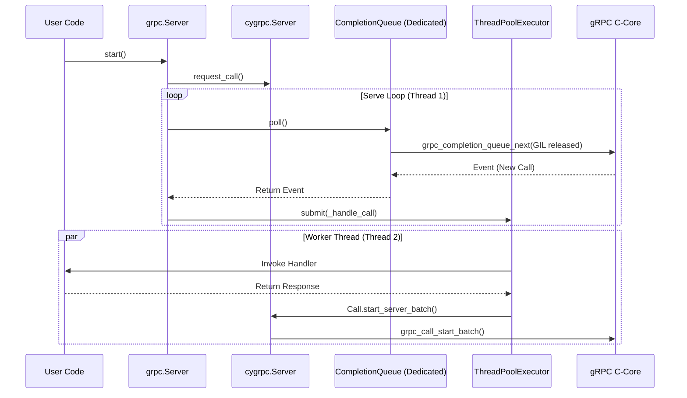
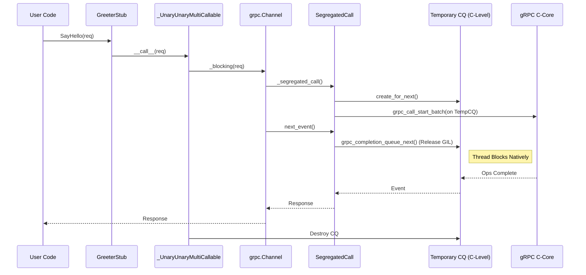

# gRPC Python Architecture

This document details the architecture and code flows for gRPC Python's AIO (AsyncIO) and Sync stacks, covering both Server and Client.
It dives into the Cython implementation details to reveal how the Python layer interacts with the underlying C-Core.

## 1. AIO Server

The AIO Server is fully asynchronous and leverages `asyncio` for event loop integration. It uses a **Process-Global** `PollerCompletionQueue`.

* **Process-Global**: This CQ is a singleton **shared** by all AIO components (Channels, Servers) running within the **same Python process**.
* **Clarification on "Sharing"**: This sharing is strictly between objects *in memory* within the same process.
* It does **not** mean shared across the network. The remote Client and Server are in different processes and have their own separate CQs.

### Architecture
*   **Global CQ**: A single `PollerCompletionQueue` (singleton) bridges C-Core events to `asyncio` via a socketpair.
    *   **Poller Thread**: A dedicated background thread (`poller_thread`) constantly polls `grpc_completion_queue_next` (Cython loop).
    *   **Notification**: When an event occurs, the **Poller Thread** (not C-Core) writes to the socketpair.
    *   **Event Loop**: `asyncio` loop (Main Thread) watching the read-end of the socketpair wakes up and dispatches callbacks.
*   **Request Loop**: `cygrpc.AioServer` keeps requesting new calls in a loop (`_request_call`) to ensure C-Core always has a buffer for incoming RPCs.
*   **Dispatch**: Each new RPC spawns a `_handle_rpc` task in the event loop.

### Sequence Diagram

### Detailed Flow
1.  **Initialization**: `grpc.aio.server()` creates `Server` (Python) -> `AioServer` (Cython). `init_grpc_aio()` ensures the global `PollerCompletionQueue` exists.
    *   **Wait**: `_request_call` creates a `Future`, wraps it in a `CallbackWrapper`, and calls `grpc_server_request_call`. It then `await`s the Future.
    *   **Event**: When a new RPC arrives, `grpc_completion_queue_next` returns the event tag to the **Poller Thread**.
    *   **Wakeup**: The **Poller Thread** writes to the socketpair to wake up the `asyncio` loop.
    *   **Callback**: The `asyncio` loop calls `_handle_events`, which executes `CallbackWrapper.functor_run`.
    *   **Resumption**: `functor_run` sets the result of the `Future`.
    *   **Spawn**: The `_request_call` await returns. The loop in `_server_main_loop` proceeds to call `_handle_rpc` with the new call.
3.  **Handler Execution**: `_handle_rpc` reads initial metadata, finds the handler via `_find_method_handler`, and awaits it.
4.  **Server Response**:
    *   **Sending Data**: Helpers like `_finish_handler_with_unary_response` or `servicer_context.write` use `execute_batch` to send `SEND_MESSAGE` and `SEND_INITIAL_METADATA` ops.
    *   **Status**: Finally, `SEND_STATUS_FROM_SERVER` is sent via `execute_batch`.
    *   **Mechanism**: Unlike `_request_call` (which directly calls C-Core), these response methods leverage the standard `execute_batch` -> `grpc_call_start_batch` engine described below.

**Code Pointers**:
*   `grpc/aio/_server.py`: `Server` class.
*   `grpc/_cython/_cygrpc/aio/server.pyx.pxi`: `AioServer` class, `_request_call` loop, `_handle_rpc`.
*   `grpc/_cython/_cygrpc/aio/callback_common.pyx.pxi`: `CallbackWrapper`, `execute_batch`.

### The "Glue": `grpc_server_request_call`
It acts as the **Server-Side Registration Hook**.
1.  **Registration**: `_request_call` invokes `grpc_server_request_call` with a `CallbackWrapper`.
    *   This tells C-Core: "I am ready for the next RPC. Call this functor when it arrives."
2.  **Bridging**: The `CallbackWrapper` holds a `Future`.
3.  **Activation**: When C-Core triggers the callback (via Poller Thread -> Socketpair -> Main Loop -> `_handle_events` -> `functor_run`), the `Future` is completed.
4.  **Handoff**: The completion of the `Future` allows `_request_call` to return the `rpc_state` to `_server_main_loop`, which immediately spawns `_handle_rpc`.

### AIO Server Streaming (Unary-Stream / Stream-Stream)
*   **Infrastructure**: Uses `_finish_handler_with_stream_responses`.
*   **Flow**:
    1.  User handler yields response messages (`async yield` or `yield`).
    2.  `_finish_handler_with_stream_responses` iterates the generator.
    3.  For each item, it calls `servicer_context.write(msg)`.
    4.  `write` invokes `execute_batch(SEND_MESSAGE)`.
    5.  Finally sends `SEND_STATUS` after simple iteration.

---

## 2. AIO Client

The AIO Client uses the same **Process-Global** `PollerCompletionQueue` mechanism described above.

### Architecture
*   **Global CQ**: Shared singleton `PollerCompletionQueue`.
*   **Call Object**: `_AioCall` (Cython) manages the C-Core `grpc_call` lifecycle.
*   **Futures**: Each batch of operations (`execute_batch`) returns a `Future` that completes when C-Core finishes the ops.
*   **Cancellation**: `asyncio.CancelledError` is propagated to C-Core via `grpc_call_cancel`.

### Sequence Diagram (Unary-Unary)

### Detailed Flow
1.  **Generated Code**: `GreeterStub.SayHello` (in `helloworld_pb2_grpc.py`) calls `self.channel.unary_unary('/helloworld.Greeter/SayHello', ...)`
2.  **Channel**: `grpc.aio.Channel.unary_unary` creates a `UnaryUnaryCall` object.
3.  **Invocation**: `UnaryUnaryCall._invoke` calls `self._cython_call.unary_unary`.
4.  **Batch Execution**: `_AioCall` prepares the batch and calls `execute_batch` (in `callback_common.pyx.pxi`).
5.  **Completion**: The `execute_batch` awaits a Future tied to the global `PollerCompletionQueue`.

**Code Pointers**:
*   `grpc/aio/_call.py`: `UnaryUnaryCall._invoke`.
*   `grpc/_cython/_cygrpc/aio/call.pyx.pxi`: `_AioCall.unary_unary`.
*   `grpc/_cython/_cygrpc/aio/call.pyx.pxi`: `_AioCall.unary_unary`.
*   `grpc/_cython/_cygrpc/aio/callback_common.pyx.pxi`: `execute_batch` (Central point for all AIO ops).

### The Engine: `execute_batch` & `grpc_call_start_batch`
This pair of functions drives all AIO operations.

1.  **`execute_batch(operations, loop)`**:
    *   **Preparation**: Converts Python `Operation` objects (e.g., `SendMessageOperation`) into a C-level `_BatchOperationTag`.
    *   **Future**: Creates an `asyncio.Future` to track completion.
    *   **Wrapper**: Wraps the Future in a `CallbackWrapper`.
    *   **Submission**: Calls `grpc_call_start_batch`.
    *   **Suspension**: `await future` yields control to the event loop.

2.  **`grpc_call_start_batch(call, ops, nops, tag, reserved)`**:
    *   **C-Core API**: This is the low-level C function that submits the batch to the gRPC Core.
    *   **Non-Blocking**: It returns immediately (usually `GRPC_CALL_OK`).
    *   **Tag**. The `tag` argument is the `CallbackWrapper`'s functor.
    *   **Completion**: When C-Core finishes the ops (e.g., data sent), it posts a completion event with this `tag` to the CQ.

This mechanism ensures that Python `await`s while C-Core performs the I/O asynchronously.

### AIO Streaming Client Flows

#### Unary-Stream (`stub.Method(req)`)
1.  **Call Creation**: Returns `UnaryStreamCall`.
2.  **Request Sending**: Spawns `_send_unary_request_task` -> `_cython_call.initiate_unary_stream`.
    *   Sends `SEND_INITIAL_METADATA`, `SEND_MESSAGE`, `SEND_CLOSE_FROM_CLIENT`.
3.  **Response Reading**: User uses `async for` -> `__aiter__` -> `_fetch_stream_responses`.
    *   Calls `receive_serialized_message` (Cython) loop.
    *   Each call invokes `execute_batch(RECV_MESSAGE)`.

#### Stream-Unary (`stub.Method(req_iterator)`)
1.  **Call Creation**: Returns `StreamUnaryCall`.
2.  **Request Sending**: Spawns `_consume_request_iterator` task.
    *   Iterates user provided iterator.
    *   Calls `write(request)` -> `_cython_call.send_serialized_message` -> `execute_batch(SEND_MESSAGE)`.
    *   Finishes with `done_writing()` -> `send_receive_close`.
3.  **Response Reading**: `await call` -> `_conduct_rpc` -> `_cython_call.stream_unary`.
    *    waits for `RECV_MESSAGE` (the single response) and `RECV_STATUS`.

#### Stream-Stream (`stub.Method(req_iterator)`)
1.  **Call Creation**: Returns `StreamStreamCall`.
2.  **Preparation**: Spawns `_initializer` -> `initiate_stream_stream` (Sends initial metadata).
3.  **Bidirectional**:
    *   **Writes**: `_consume_request_iterator` (same as Stream-Unary).
    *   **Reads**: User `async for` (same as Unary-Stream).
    *   These run concurrently on the same `_AioCall` object.

---

## 3. Sync Server

The Sync Server uses a threaded concurrency model with a dedicated Completion Queue.

### Architecture
*   **Dedicated CQ**: Uses a `grpc_completion_queue` created via `grpc_completion_queue_create_for_next`.
    *   **Creation**: Instantiated in `_Server.__init__` (`grpc/_server.py`).
    *   **Cython**: `cygrpc.CompletionQueue()` calls `grpc_completion_queue_create_for_next(NULL)`.
*   **Polling Thread**: A single python thread running `_serve` constantly calls `cq.poll()`.
*   **Worker Pool**: `ThreadPoolExecutor` (default max_workers) executes user handlers.
*   **Events**:
    *   `REQUEST_CALL`: New RPC arrived.
    *   `OP_COMPLETE`: Send/Recv operation finished.

### Sequence Diagram

### Request Handling Loop
1.  **Bootstrap**: `server.start()` -> `_start` calls `_request_call` (and registered variants) **before** starting the polling thread.
    *   This ensures C-Core has pending `request_call` ops ready to accept incoming RPCs.
2.  **Serve Loop**: `_serve` (Python) runs in a dedicated daemon thread.
    *   It calls `state.completion_queue.poll()`.
2.  **Polling**: `CompletionQueue.poll()` (Cython) calls `_internal_poll` -> `_next`.
    *   `_next` (in `completion_queue.pyx.pxi`) calls `grpc_completion_queue_next` with the **GIL released** (`with nogil`).
    *   It blocks until an event occurs (new call or tag completion).
    *   It periodically re-acquires GIL to check for Python signals (`PyErr_CheckSignals`) if on the main thread.
3.  **Dispatch & Re-arming**:
    *   On `REQUEST_CALL` event, `poll` returns an event object to Python.
    *   `_process_event_and_continue` handles the event and **immediately calls `_request_call` again** to re-arm the server for the next RPC.
    *   It then submits `_handle_call` to the `ThreadPoolExecutor`.
4.  **User Handler**: `_handle_call` (Python) runs the user's implementation.
5.  **Response**:
    *   User calls `context.send_initial_metadata` or returns response.
    *   Python calls `cygrpc.Call.start_server_batch` (in `_cygrpc/call.pyx.pxi`).
    *   Cython calls `grpc_call_start_batch` directly.
    *   Cython calls `grpc_call_start_batch` directly.
    *   The completion tag is handled back in the `poll` loop.

### The "Glue": `grpc_server_request_call` (Sync Version)
Just like AIO, the Sync Server uses `grpc_server_request_call`.
1.  **Registration**: `request_call` (Cython) wraps the string tag `"request_call"` in a `_RequestCallTag` object.
    *   It passes this object's address to C-Core via `grpc_server_request_call`, registering it on the **Dedicated CQ**.
    *   **Why is this needed?**: gRPC C-Core is **proactive, not passive**. You must explicitly "ask" to accept an RPC by providing a buffer (call struct) *before* `poll` can return it. `poll` only reports completions of requested operations.
2.  **Blocking**: The dedicated **Serving Thread** (spawned by `server.start()`) blocks on `cq.poll()`.
    *   **Loop**: This thread runs the `_serve` function (in `grpc/_server.py`).
    *   **Mechanism**: `_serve` has a `while True` loop that repeatedly calls `state.completion_queue.poll()`.
    *   **Under the hood**: `poll()` eventually calls `grpc_completion_queue_next` with the GIL released.
3.  **Activation**: When C-Core receives an RPC, it pushes a completion event to the CQ with the stored tag address.
4.  **Handoff**: `poll()` receives the event, unwraps the `_RequestCallTag` back to a `RequestCallEvent` containing the original string tag.
5.  **Dispatch**: Python `_serve` matches `event.tag` (the string) and submits `_handle_call` to the ThreadPool.

**Code Pointers**:
*   `grpc/_server.py`: `_serve` function (main loop), `_handle_call`.
*   `grpc/_cython/_cygrpc/server.pyx.pxi`: `Server` class, `request_call` (calls `grpc_server_request_call`).
*   `grpc/_cython/_cygrpc/completion_queue.pyx.pxi`: `CompletionQueue.poll`, `_next` (the blocking GIL-release loop).

---

## 4. Sync Client

The Sync Client (Blocking) implementation emphasizes **Segregation** to avoid thread contention and GIL issues.

### Architecture
*   **Segregated Call**: Each blocking RPC creates its own **temporary** `grpc_completion_queue`.
*   **Thread Isolation**: The calling thread is the *only* thread polling this temporary CQ.
*   **Blocking**: The thread releases the GIL and blocks natively on `grpc_completion_queue_next`.
*   **No Global Poller**: Unlike AIO, there is no shared poller thread for blocking calls.

### Sequence Diagram

### Blocking Call Lifecycle (Segregated)
1.  **Invocation**: `stub.Method(req)` -> `_UnaryUnaryMultiCallable.__call__`.
2.  **Blocking**: Calls `self._blocking(...)` in `grpc/_channel.py`.
3.  **Segregation**: It calls `channel.segregated_call(...)` -> `_segregated_call` (Cython).
    *   `_segregated_call` creates a **fresh** `grpc_completion_queue` via `grpc_completion_queue_create_for_next(NULL)`.
    *   This CQ is dedicated *solely* to this RPC call.
4.  **Wait**:
    *   **Direct Call**: Python `_blocking` (in `_channel.py`) calls `call.next_event()` directly on the `SegregatedCall` object.
    *   **Cython**: `SegregatedCall.next_event` (in `channel.pyx.pxi`) calls `_next_call_event`.
    *   **Blocking**: `_next_call_event` calls `_latent_event` -> `_internal_latent_event` -> `_next` (in `completion_queue.pyx.pxi`).
    *   **Crucial**: `_next` releases the GIL (`with nogil`) and calls `grpc_completion_queue_next` on the private CQ. The thread blocks natively until C-Core has an event.
5.  **Cleanup**:
    *   When the event returns (response received), `_blocking` returns.
    *   The `SegregatedCall` goes out of scope.
    *   `SegregatedCall.__dealloc__` (or explicit cleanup) calls `grpc_completion_queue_shutdown` and `grpc_completion_queue_destroy` on the private CQ.

**Code Pointers**:
*   `grpc/_channel.py`: `_UnaryUnaryMultiCallable`, `_blocking`.
*   `grpc/_cython/_cygrpc/channel.pyx.pxi`: `_segregated_call`, `SegregatedCall` class, `_next_call_event`.
*   `grpc/_cython/_cygrpc/completion_queue.pyx.pxi`: `_next` (shared blocking logic used by both Server and Client).
