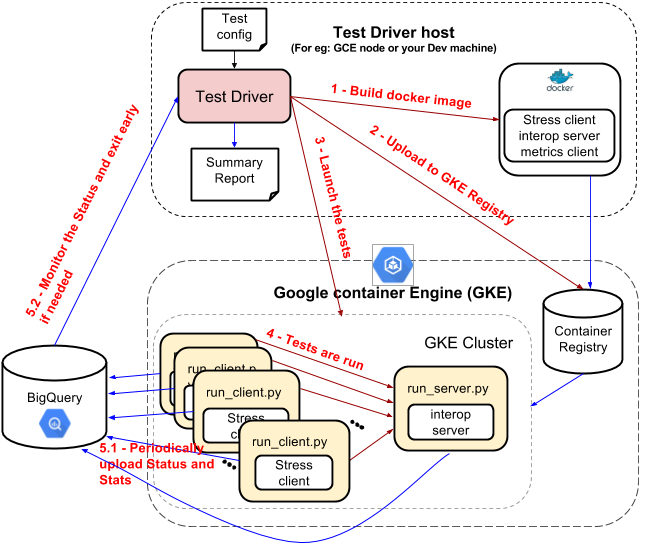

# Stress Test framework for gRPC

(Sree Kuchibhotla - sreek@)

Status: This is implemented. More details at [README.md](https://github.com/grpc/grpc/blob/master/tools/run_tests/stress_test/README.md)

**I. GOALS**

1) Build a stress test suite for gRPC:

* Build a stress test suite that can Identify bugs by testing the system (gRPC server/client) under extreme conditions:
  * High load
  * High concurrency
  * Limited resources 
  * Intermittent failures
* Should be integrated with Jenkins CI

2) Make it generic enough (i.e build a generic test framework) that can be used for:

* Executing M instances of a client against N instances of a server with an arbitrarily defined connection matrix
   * Execute heterogenous test configurations - for example: Java stress test clients against C++ servers or Node clients against Python servers or TSAN C++ clients vs ASAN C++ Servers etc.
   * Easy and Flexible enough that Devs can use it to recreate complex test scenarios

The implementation effort is divided into two parts:

* Building a "Stress Test Framework" to run the stress test suites- More details in **Section II** (The idea is that the Stress Test framework is generic enough that it would be easier to modify it to run other suites like interop-tests or custom test scenarios)
* Building a 'Stress test suite' - More details in **section III**

**Terminology:**

GCE - Google compute engine
GKE - Google Container engine
Kubernetes - Google's open source service scheduler / orchestrator.

**Note:** The terms GKE and Kubernetes are used interchangeably in this document

# II. STRESS TEST FRAMEWORK

(The details of each step are explained below))

**Figure 1**

### Step 1 Read the test config, generate base docker images

**_Test Config:_** The test configuration contains the following information:

* _GKE info:_ GKE project and cluster info
* _Docker images:_ Instructions to build docker images
* _Client templates:_ One or more client templates each containing the following information:
    * Which docker image to use
    * Path to the client program to launch (within the docker image)
    * Parameters to the client program
* _Server templates:_ Similar to Client templates - except that these are for servers
* Test matrix containing the following:
    * _Server groups:_ One or more groups of servers containing the following info for each group
        * Which server template to use
        * How many instances to launch
    * _Client groups:_ One or more groups of clients containing the following (for each group):
        * Which client template to use
        * How many instances to launch
        * Which server group to talk to (all clients in this group will talk to all servers in the server group)

The first step is to read the test config and build the docker images

**_Stress server docker image:_** The following are the main files in the server docker images

* _Interop_server:_ The server program
* `run_server.py`: This is a python script which is the entry point of the docker image (i.e this is the script that is called when the docker image is run in GKE).  This script launches the interop server and also updates the status in BigQuery.  If the interop_server fails for whatever reason, the script launch_server.py logs that status in BigQuery

**_Stress client docker image:_**

* Stress client: The stress test client.  In addition to talking to the interop_server, the stress client also exports metrics (which can be queried by the metrics_client described below)
* Metrics client: Metrics client connects to the stress_client to get the current qps metrics.
* `run_client.py`: This is a python script which is the entry point of the docker image (i.e this is the script that is called when the docker image is run in GKE). This script launches the stress client and also updates the status in BigQuery.  The script then periodically launches metrics client to query the qps from the stress client and then uploads the qps to BigQuery.

### Step 2) Upload the docker images to GKE
The docker images are uploaded to the GKE registry

### Step 3) Launch the tests in GKE
The test driver reads the test matrix (described in step 1) and creates the necessary server and client pods in GKE.

### Step 4) Tests are run in GKE
GKE starts running the tests by calling the entry points in *each* docker image (i.e `run_server.py` or `run_client.py` depending on whcih docker image it is)

### Step 5) Upload the status to GKE and Monitor the status in GKE
* 5.1 The tests periodically update their status in BigQuery
* 5.2 The test driver periodically checks the status in Bigquery to see if any tests failed.  If any tests failed, the driver immediately stops the tests.  If not, the driver continues to run the tests for a configurable amount of time.

### Step 6) Create a summary report
The test driver creates a final summary report containing details about any test failures and information about how to connect the failed pods in GKE for debugging.

