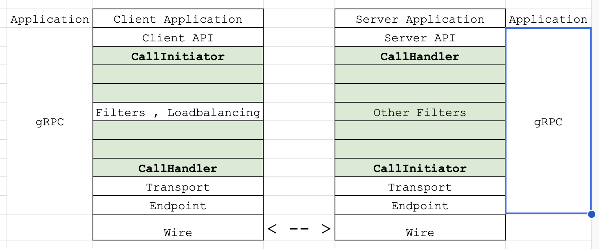

# gRPC Core Call

This directory is the heart of the gRPC C++ core, defining the fundamental data
structures and mechanisms for representing and managing a single RPC.

See also: [gRPC Core overview](../GEMINI.md)

## Overarching Purpose

The code in this directory provides the client and server-side representations
of a call, the central "spine" that connects them, and the various components
needed to manage the lifecycle of an RPC, including metadata, messages, and
status.

## Core Concepts

*   **`CallSpine`**: The `CallSpine` is the central component of a gRPC call. It
    encapsulates the call's context, including the arena allocator, call
    filters, and the pipes for message and metadata communication. The
    `CallSpine` is shared between a `CallInitiator` (the client-side) and a
    `CallHandler` (the server-side).
*   **`CallInitiator`**: The `CallInitiator` is the client-side view of a call.
    It is used for initiating requests and receiving responses.
*   **`CallHandler`**: The `CallHandler` is the server-side view of a call. It
    is used for handling incoming requests and sending responses.
*   **`ClientCall`**: The `ClientCall` is the public client-side API for a call.
    It wraps the `CallInitiator` and `CallSpine`.
*   **`ServerCall`**: The `ServerCall` is the public server-side API for a call.
    It wraps the `CallHandler` and `CallSpine`.

## Differentiating Call V1 and Call V3 Code

*   **Implementation Class**: The classes used to represent the call interface.
    *   Call Interface (Common for V1 and V3) : [call.h](../lib/surface/call.h)
    *   Call V1: `FilterStackCall`
        ([filter_stack_call.h](../lib/surface/filter_stack_call.h))
    *   Call V3:
        *   `ClientCall`
            ([client_call.h](client_call.h))
        *   and `ServerCall`
            ([server_call.h](server_call.h))
*   **Concurrency Model**: Concurrency and thread safety mechanism.
    *   Call V1: [Combiner](../lib/iomgr/combiner.h) and
        [WorkSerializer](src/core/util/work_serializer.h)
    *   Call V3: gRPC Promise library with [`Party`](../lib/promise/party.h)
*   **Companion Transports**: Transport layers compatible with each stack.
    *   Call V1: CHTTP2 transport, Legacy InProc
    *   Call V3: PH2, Chaotic Good, InProc transports
    *   For details about the transports see
        [chttp2/GEMINI.md](../ext/transport/chttp2/GEMINI.md) and
        [chaotic_good/GEMINI.md](../ext/transport/chaotic_good/GEMINI.md)
*   **Creation Method**: The entry point used to instantiate new calls.
    *   Call V1: `grpc_call_create`
    *   Call V3: `MakeClientCall` and `MakeServerCall`
*   **Exclusive Files**: C++ source files exclusive to each stack model.
    *   Call V1:
        *   `src/core/lib/surface/filter_stack_call.{h,cc}`
        *   `src/core/lib/surface/legacy_channel.{h,cc}`
        *   `src/core/lib/channel/channel_stack.{h,cc}`
        *   `src/core/lib/channel/channel_stack_builder.{h,cc}`
        *   `src/core/ext/filters/channel_idle/legacy_channel_idle_filter.cc`
    *   Call V3:
        *   `src/core/call/client_call.{h,cc}`
        *   `src/core/call/server_call.{h,cc}`
        *   `src/core/call/call_spine.{h,cc}`
        *   `src/core/call/call_filters.{h,cc}`
        *   `src/core/client_channel/direct_channel.{h,cc}`
*   **Shared Files**: Source files used by both Call V1 and Call V3.
    *   `src/core/lib/surface/call.{h,cc}`
    *   `src/core/lib/surface/call_utils.{h,cc}`
    *   `src/core/call/metadata.{h,cc}`
    *   `src/core/call/metadata_batch.{h,cc}`

## Call V3 Stack

<!--
Can add a text based version of this diagram if needed. It will be more
accessible to the AIs
-->

*   **`src/core/call/call_spine.{h,cc}`**: The `CallSpine` is the key
    abstraction to understand in this directory. It's the "glue" that holds a
    call together.
*   The use of `CallInitiator` and `CallHandler` provides a clean separation of
    concerns between the client and server sides of a call.
*   In a CallSpine we always have a `CallInitiator` and `CallHandler` pair.
*   `CallInitiator` is always near/towards the client side.
*   `CallHandler` is always near/towards the server side.
*   When CallInitiator sends metadata, it flows into the spine. The spine
    executes filter hooks before reaching CallHandler.
*   Similarly, response metadata and messages from CallHandler pass through
    filters and reach the CallInitiator.

## Files

*   **`src/core/call/client_call.{h,cc}`**: These files define the `ClientCall`
    class.
*   **`src/core/call/server_call.{h,cc}`**: These files define the `ServerCall`
    class.
*   **`src/core/call/metadata.{h,cc}`**,
    **`src/core/call/metadata_batch.{h,cc}`**: These files provide the data
    structures for representing and manipulating RPC metadata.
*   **`src/core/call/message.{h,cc}`**: Defines the `Message` class, which is a
    container for RPC messages.
*   **`src/core/call/call_filters.{h,cc}`**: These files define the
    `CallFilters` class, which is responsible for managing the filters for a
    call.
*   **`src/core/call/interception_chain.{h,cc}`**: These files define the
    `InterceptionChain` class, which is used to manage the execution of a set of
    interceptors.

## Notes

*   This directory is heavily based on the
    [gRPC Core Promise API](../lib/promise/GEMINI.md). Familiarity with that API
    is essential for understanding the code here.
*   The `CallFilters` class is responsible for managing the filters for a call.
    See the [channel documentation](../lib/channel/GEMINI.md) for more
    information about filters.
