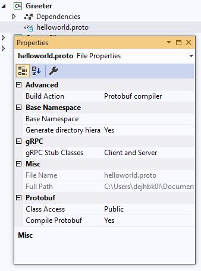
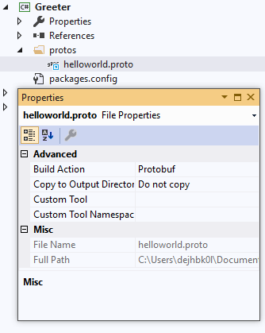

# Protocol Buffers/gRPC Codegen Integration Into .NET Build

The [Grpc.Tools](https://www.nuget.org/packages/Grpc.Tools) NuGet package provides C# tooling support for generating C# code from `.proto` files in `.csproj` projects:
* It contains protocol buffers compiler and gRPC plugin to generate C# code.
* It can be used in building both grpc-dotnet projects and legacy c-core C# projects.

Using `Grpc.Tools` in `.csproj` files is described below. Other packages providing the runtime libraries for gRPC are described elsewhere. 

## Getting Started

The package [Grpc.Tools](https://www.nuget.org/packages/Grpc.Tools) is used automatically to generate the C# code for protocol buffer messages and gRPC service stubs from
`.proto` files. These files:
* are generated on an as-needed basis each time the project is built.
* aren't added to the project or checked into source control.
* are a build artifact usually contained in the obj directory.

This package is optional. You may instead choose to generate the C# source files from
`.proto` files by running the `protoc` compiler manually or from a script.
However this package helps to simplify generating the C# source files by
integrating the code generation into the build process. It can be used when building both
the server and client projects, and by both c-core C# projects and grpc-dotnet projects:
* The `Grpc.AspNetCore` metapackage already includes a reference to `Grpc.Tools`. 
* gRPC for .NET client projects and projects using `Grpc.Core` need to reference `Grpc.Tools` explicity if you want code generation for those projects

`Grpc.Tools` is only used at build-time and has no runtime components.
It should be marked with `PrivateAssets="All"` to prevent it from being included at runtime, e.g.
```xml
<PackageReference Include="Grpc.Tools" Version="2.50.0">
  <IncludeAssets>runtime; build; native; contentfiles; analyzers; buildtransitive</IncludeAssets>
  <PrivateAssets>all</PrivateAssets>
</PackageReference>
```

Support is provided for the following platforms:
* Windows (x86, x64, and arm64 via using the x86 binaries)
* MacOS (x64 and arm64 via using the x64 binaries)
* Linux (x86, x64, and arm64)

You may still use the MSBuild integration provided by `Grpc.Tools` for other architectures provided you can supply the codegen binaries for that platform/architecture.
See [Using Grpc.Tools with unsupported architectures](#unsupported-arch) below.

## Adding `.proto` files to a project

To add `.proto` files to a project edit the project’s `.csproj` file and add an item group with a `<Protobuf>` element that refers to the `.proto` file, e.g.

```xml
<ItemGroup>
    <Protobuf Include="Protos\greet.proto" />
</ItemGroup>
```

Wildcards can be used to select several `.proto` files, e.g.

```xml
<ItemGroup>
    <Protobuf Include="**\*.proto" />
</ItemGroup>
```

By default, a `<Protobuf>` reference generates gRPC client and a service base class from the `service` definitions in the `.proto` files.
The `GrpcServices` attribute can be used to limit C# asset generation. See the reference section below for all
options. E.g. to only generate client code:

```xml
<ItemGroup>
    <Protobuf Include="Protos\greet.proto" GrpcServices="Client" />
</ItemGroup>
```

For `.proto` files that are outside of the project directory a link can be added so that the files are visible in Visual Studio. E.g.

```xml
<ItemGroup>
   <Protobuf Include="..\Proto\aggregate.proto" GrpcServices="Client" Link="Protos\aggregate.proto"/>
   <Protobuf Include="..\Proto\greet.proto" GrpcServices="None" Link="Protos\greet.proto"/>
   <Protobuf Include="..\Proto\count.proto" GrpcServices="None" Link="Protos\count.proto"/>
</ItemGroup>
```

For more examples see the example project files in GitHub: https://github.com/grpc/grpc-dotnet/tree/master/examples

# Reference

## Protobuf item metadata reference

The following metadata are recognized on the `<Protobuf>` items.

| Name           | Default   | Value                | Synopsis                         |
|----------------|-----------|----------------------|----------------------------------|
| Access         | `public`  | `public`, `internal`               | Generated class access           |
| AdditionalProtocArguments | | arbitrary cmdline arguments | Extra command line flags passed to `protoc` command. To specify multiple arguments use semi-colons (;) to separate them. See example below |
| ProtoCompile   | `true`    | `true`, `false`                    | If `false`, don't invoke `protoc` to generate code. |
| ProtoRoot      | See notes | A directory                        | Common root for set of files     |
| CompileOutputs | `true`    | `true`, `false`                    | If `false`, C# code will be generated, but it won't be included in the C# build. |
| OutputDir      | See notes | A directory                        | Directory for generated C# files with protobuf messages |
| OutputOptions  | | arbitrary options                  | Extra options passed to C# codegen as `--csharp_opt=opt1,opt2` |
| GrpcOutputDir  | See notes | A directory                        | Directory for generated gRPC stubs    |
| GrpcOutputOptions | | arbitrary options                  | Extra options passed to gRPC codegen as `--grpc_opt=opt1,opt2` |
| GrpcServices   | `Both`    | `None`, `Client`, `Server`, `Both` | Generated gRPC stubs             |
| AdditionalImportDirs | See notes | Directories                        | Specify additional directories in which to search for imports `.proto` files |

__Notes__

* __ProtoRoot__  
For files _inside_ the project directory or its subdirectories, `ProtoRoot` is set by default to the
project directory.

    For files _outside_ of the project directory, the value
is set to the file's containing directory name, individually per file. If you
include a subtree of `.proto` files that lies outside of the project directory, you
need to set `ProtoRoot`. There is an example of this below. The path in
this variable is relative to the project directory.

* __OutputDir__  
The default value is the value of the property
`Protobuf_OutputPath`. This property, in turn, unless you set it in your
project, will be set to the value of the standard MSBuild property
`IntermediateOutputPath`, which points to the location of compilation object
outputs, such as `"obj/Release/netstandard1.5/"`. The path in this property is
considered relative to the project directory.

* __GrpcOutputDir__  
Unless explicitly set, will follow `OutputDir` for any given file.

* __Access__  
Sets generated class access on _both_ generated message and gRPC stub classes.

* __AdditionalProtocArguments__ 
Pass additional commandline arguments to the `protoc` command being invoked.
Normally this option should not be used, but it exists for scenarios when you need to pass
otherwise unsupported (e.g. experimental) flags to protocol buffer compiler.

* __OutputOptions__
Pass additional C# code generation options to `protoc` in the form `--csharp_opt=opt1,opt2`. See [C#-specific options](https://protobuf.dev/reference/csharp/csharp-generated/#compiler_options) for possible values.

* __GrpcOutputOptions__ 
Pass additional options to the `grpc_csharp_plugin` in form of the `--grpc_opt` flag.
Normally this option should not be used as its values are already controlled by `Access`
and `GrpcServices` metadata, but it might be useful in situations where you want
to explicitly pass some otherwise unsupported (e.g. experimental) options to the
`grpc_csharp_plugin`.

* __AdditionalImportDirs__
Specify additional directories in which to search for imports in `.proto` files. The directories are searched in the order given. You may specify directories _outside_ of the 
project directory. The directories are passed to the `protoc` code generator via the `-I/--proto_path` option
together with `Protobuf_StandardImportsPath` and `ProtoRoot` directories.

__Specifying multiple values in properties__

Some properties allow you to specify multiple values in a list. The items in a list need to
be separated by semi-colons (;). This is the syntax that MsBuild uses for lists.

The properties that can have lists of items are: `OutputOptions`, `AdditionalProtocArguments`,
 `GrpcOutputOptions`, `AdditionalImportDirs`

Example: to specify two additional arguments: `--plugin=protoc-gen-myplugin=D:\myplugin.exe --myplugin_out=.`

```xml
  <ItemGroup>
    <Protobuf Include="proto_root/**/*.proto" ProtoRoot="proto_root"
              OutputDir="%(RelativeDir)" CompileOutputs="false"
              AdditionalProtocArguments="--plugin=protoc-gen-myplugin=D:\myplugin.exe;--myplugin_out=." />
  </ItemGroup>
```

## `grpc_csharp_plugin` command line options

Under the hood, the `Grpc.Tools` build integration invokes the `protoc` and `grpc_csharp_plugin` binaries
to perform code generation. Here is an overview of the available `grpc_csharp_plugin` options:

| Name            | Default   | Synopsis                                                 |
|---------------- |-----------|----------------------------------------------------------|
| no_client       | off       | Don't generate the client stub                           |
| no_server       | off       | Don't generate the server-side stub                      |
| internal_access | off       | Generate classes with "internal" visibility              |

Note that the protocol buffer compiler has a special commandline syntax for plugin options.
Example:
```
protoc --plugin=protoc-gen-grpc=grpc_csharp_plugin --csharp_out=OUT_DIR \
    --grpc_out=OUT_DIR --grpc_opt=lite_client,no_server \
    -I INCLUDE_DIR foo.proto
```
## Environment Variables

Environment variables can be set to change the behavior of `Grpc.Tools` - setting the CPU architecture or operating system, or using custom built protocol buffers compiler and gRPC plugin.

| Name                | Synopsis                                                                      |
|---------------------|-------------------------------------------------------------------------------|
|`PROTOBUF_TOOLS_OS`  | Operating system version of the tools to use: `linux`, `macosx`, or `windows` |
|`PROTOBUF_TOOLS_CPU` | CPU architecture version of the tools to use: `x86`, `x64`, or `arm64`        |
|`PROTOBUF_PROTOC`    | Full path to the protocol buffers compiler                                    |
|`GRPC_PROTOC_PLUGIN` | Full path to the grpc_csharp_plugin                                           |

For example, to use a custom built protoc compiler and grpc_csharp_plugin:
```bash
export PROTOBUF_PROTOC=$my_custom_build/protoc
export GRPC_PROTOC_PLUGIN=$my_custom_build/grpc_csharp_plugin
dotnet build myproject.csproj
```

## MSBuild Properties

You can set some Properties in your project file or on the MSBuild command line. The
following properties change the behavior of `Grpc.Tools`:

| Name                | Synopsis                                                                      |
|---------------------|-------------------------------------------------------------------------------|
| `Protobuf_ToolsOs`  | Same as `PROTOBUF_TOOLS_OS` environment variable                              |
| `Protobuf_ToolsCpu` | Same as `PROTOBUF_TOOLS_CPU` environment variable                             |
| `Protobuf_ProtocFullPath` | Same as `PROTOBUF_PROTOC` environment variable                          |
| `gRPC_PluginFullPath` | Same as `GRPC_PROTOC_PLUGIN` environment variable                           |
| `Protobuf_NoWarnMissingExpected` | Default: `false`. If `true` then no warnings are given if expected files not generated. See example below for an explanation. |
| `Protobuf_OutputPath`| Default: `IntermediateOutputPath` - ususally the `obj` directory. Sets the default value for `OutputDir` on `<Protobuf>` items.|
| `EnableDefaultProtobufItems` | Default: `false`. If `true` then `.proto` files under the project are automatically included without the need to specify any `<Protobuf>` items. |
| `Protobuf_StandardImportsPath` | The path for protobuf's [well known types](https://protobuf.dev/reference/protobuf/google.protobuf/) included in the NuGet package. It is automcatically passed to `protoc`  via the `-I/--proto_path` option. |

# Scenarios and Examples

For other examples see also the `.csproj` files in the examples in GitHub:
* [grpc-dotnet examples](https://github.com/grpc/grpc-dotnet/tree/master/examples)
* [`Grpc.Core` examples](https://github.com/grpc/grpc/tree/v1.46.x/examples/csharp)

Quick links to the examples below:

* [ProtoRoot - Common root for one or more `.proto` files](#ProtoRoot)
* [AdditionalImportDirs - Setting location of imported `.proto` files](#AdditionalImportDirs)
* [GrpcServices - Generating gRPC services and protocol buffers messages](#grpcservices)
* [Automatically including `.proto` files](#autoinclude)
* [Generate proto and gRPC C# sources from .proto files (no C# compile)](#nocompile)
* [Visual Studio: setting per-file `.proto` file options](#visualstudio)
* [Bypassing Grpc.Tools to run the protocol buffers compiler explicitly](#compiler)
* [Using Grpc.Tools with unsupported architectures](#unsupported-arch)

---
## <a name="ProtoRoot"></a>ProtoRoot - Common root for one or more `.proto` files

`ProtoRoot` specifies a common directory that is an ancestor for a set of `.proto` files.

It has two purposes:
* working out relative directories to preserve the structure when generating `.cs` files
* adding a directory to be searched for imported `.proto` files

These are explained in an example below.

For `.proto` files under the project directory `ProtoRoot` is by default set to `.`.
It can also be explicitly set.

For `.proto` files outside of the project the value is set to the file's containing directory name.
If you include a subtree of `.proto` files then you must set `ProtoRoot` to give the 
parent of the directory tree.

In either case if you are importing a `.proto` file from within another file then you should set
`ProtoRoot` so that the import paths can be found. (See also `AdditionalImportDirs` below.)

Generated files in the output directory will have the same directory structure as the
`.proto` files under `ProtoRoot`.

By default the output directory for generated files is `obj\CONFIGURATION\FRAMEWORK\` (e.g. `obj\Debug\net6.0\`) unless `OutputDir` or `GrpcOutputDir` are specified.
### Example use of `ProtoRoot`
Specifying:
```xml
<Protobuf Include="Protos\Services\**\*.proto"
          ProtoRoot="Protos" />
<Protobuf Include="Protos\Messages\**\*.proto"
          ProtoRoot="Protos"
          GrpcServices="None" />
<Protobuf Include="..\OutsideProjectProtos\**\*.proto"
          ProtoRoot="..\OutsideProjectProtos" />
```
for files:
```
	ProjectFolder\Protos\Services\v1\hello.proto
	ProjectFolder\Protos\Services\v2\hello.proto
	ProjectFolder\Protos\Messages\v1\message.proto
	..\OutsideProjectProtos\MyApi\alpha.proto
	..\OutsideProjectProtos\MyApi\beta.proto
```
will generate files:
```
  ProjectFolder\obj\Debug\net6.0\Services\v1\Hello.cs
  ProjectFolder\obj\Debug\net6.0\Services\v1\HelloGrpc.cs
  ProjectFolder\obj\Debug\net6.0\Services\v2\Hello.cs
  ProjectFolder\obj\Debug\net6.0\Services\v2\HelloGrpc.cs
  ProjectFolder\obj\Debug\net6.0\Messages\v1\Message.cs
  ProjectFolder\obj\Debug\net6.0\MyApi\Alpha.cs
  ProjectFolder\obj\Debug\net6.0\MyApi\AlphaGrpc.cs
  ProjectFolder\obj\Debug\net6.0\MyApi\Beta.cs
  ProjectFolder\obj\Debug\net6.0\MyApi\BetaGrpc.cs

```
Things to notes:
* the directory structures under `ProjectFolder\Protos\` and `..\OutsideProjectProtos\` are mirrored in the output directory.
* the import search paths passed to `protoc` via `-I/--proto_path` option will include
 `ProjectFolder\Protos` and `..\OutsideProjectProtos`
---
## <a name="AdditionalImportDirs"></a>AdditionalImportDirs - Setting location of imported `.proto` files

In addition to specifying `ProtoRoot` other import directories can be specified for
directories to search when importing `.proto` files by specifying `AdditionalImportDirs` 
and provide a list of directories. The directories are searched in the order given.

You would use this when you want to import `.proto` files that you don't need to 
separately compile as they are only used in import statements. E.g.:

```xml
  <Protobuf Include="protos/*.proto"
            ProtoRoot="protos"
            AdditionalImportDirs="/folder/protos/mytypes/;/another/folder/"
      ... />
```

Note: The path for protobuf's [well known types](https://protobuf.dev/reference/protobuf/google.protobuf/) is automatically included. E.g. the `import` below will work without having to explicity specifying the path in `AdditionalImportDirs`:
```protobuf
import "google/protobuf/wrappers.proto";
```
---
## <a name="grpcservices"></a>GrpcServices - Generating gRPC services and protocol buffers messages
The protocol buffers files (`.proto` files) define both the service interface and the
structure of the payload messages.

Two `.cs` file can be generated from a `.proto` file. For example, if the `.proto` file 
is `myfile.proto` then the two possible files are:
* `Myfile.cs` - contains the generated code for protocol buffers messages
* `MyfileGrpc.cs`  - contains the generated code for gRPC client and/or server

When a `.proto` file contains service definitions the protocol buffers compiler calls
the gRPC plugin to generate gRPC client and/or server stub code. Whether or not the `*Grpc.cs` file
is generated and what it contains is controlled by the `GrpcServices` metadata
on the `<Protobuf>` item.

* `GrpcServices="Both"` (the default) - `Myfile.cs` and `MyfileGrpc.cs` generated
* `GrpcServices="None"` - just `Myfile.cs` generated
* `GrpcServices="Client"` - `Myfile.cs` and `MyfileGrpc.cs` (just client code)
* `GrpcServices="Server"` - `Myfile.cs` and `MyfileGrpc.cs` (just server code)

However when a `.proto` **does not file contains any service definitions** but only contains
message definitions then an empty (zero length) `MyfileGrpc.cs` may still be created
by `Grpc.Tools` unless the `.proto` file is specified with `GrpcServices="None"` in the project file.

This is because `Grpc.Tools` has no way of knowing in advanced of running the protocol buffers
compiler whether a `.proto` file has a service clause. It creates the empty files as a marker
for incremental builds so that the `.proto` files are not unnecessarily recompiled. Empty files
are not a problem on a small project but you may wish to avoid them on a larger project.

Therefore it is better to explicitly mark files with the correct `GrpcServices` metadata if you can. For
example:

```xml
<ItemGroup>
  <Protobuf Include="**/*.proto" GrpcServices="None" />
  <Protobuf Update="**/hello/*.proto;**/bye/*.proto" GrpcServices="Both" />
</ItemGroup>
```
In the above example all `.proto` files are compiled with `GrpcServices="None"`, except for `.proto`
files in subdirectories on any tree level named `hello` and `bye`, which will take 
`GrpcServices="Both"`. Note the use of the `Update` attribute instead of `Include` - otherwise
the files would be added twice.

Another example would be the use of globbing if your service `.proto` files are named according
to a pattern, for example `*_services.proto`. In this case the `Update` attribute can be written
as `Update="**/*_service.proto"` to set the attribute `GrpcServices="Both"` only on these files.

### Seeing a warning about a missing expected file

You will see the warning message:
 ```
 Some expected protoc outputs were not generated
 ```
 if all these are true:
 * the location for the generated files is configured to a directory outside of the project, e.g. `OutputDir="..\outside-project\"`
 * `*Grpc.cs` files have not been created because the `.proto` file does not contain a
service definintion
* you have not specified `GrpcServices="None"`

This is because `Grpc.Tools` only creates empty `*Grpc.cs` files in directories
within the project (such as the intermediate `obj` directory). Empty files are not created
outside of the project directory so as not to pollute non-project directories.

This warning can be suppressed by setting the MSBuild property:
```xml
<PropertyGroup>
  <Protobuf_NoWarnMissingExpected>true</Protobuf_NoWarnMissingExpected>
</PropertyGroup>
```
however it is better to set `GrpcServices="None"` on the `.proto` files affected to avoid
unnecessary rebuilds. 


---
## <a name="autoinclude"></a>Automatically including `.proto` files

For SDK projects it is possible to automatically include `.proto` files found in the project
directory or sub-directories, without having to specify them with a `<Protobuf>` item.
To do this the property `EnableDefaultProtobufItems` has be set to `true` in the project file or on the MSBuild command line.

It is recommended that you do not rely on automatic inclusion of `.proto` files except for
the simplest of projects since it does not allow you to control other settings such as
`GrpcServices`.

By default `EnableDefaultProtobufItems` is not set and `<Protobuf>` items must be included 
in the project for the `.proto` files to be compiled.  

---

## <a name="nocompile"></a>Generate proto and gRPC C# sources from .proto files (no C# compile)

If you just want to generate the C# sources from `.proto` files without compiling the C# files
 (e.g. for use in other projects) then you can do something similar to this to a `.csproj` file:
 ```xml
<ItemGroup>
  <Protobuf Include="**/*.proto"
      OutputDir="%(RelativeDir)" CompileOutputs="false"  />
</ItemGroup>
```

* `Include` tells the build system to recursively examine project directory and its 
subdirectories (**) include all files matching the wildcard `*.proto`.
* `OutputDir="%(RelativeDir)"` makes the output directory for each `.cs` file to be 
same as the corresponding `.proto` directory.
* `CompileOutputs="false"` prevents compiling the generated files into an assembly.

Note that an empty assembly is still generated which can be ignored. 

NOTE: To start with an empty project to add your `.proto` files to you can do the following
at a command prompt:
```bash
dotnet new classlib
rm *.cs              # remove .cs files - for Windows the command is: del *.cs /y
dotnet add package Grpc.Tools
``` 

---
## <a name="visualstudio"></a>Visual Studio: setting per-file `.proto` file options 

In Visual Studio it is possible to set some frequently used per-file options on `.proto` files 
without editing the `.csproj` file directly. However editing the `.csproj` gives you more
flexibilty.

### "dotnet SDK" projects

For a "dotnet SDK" project, you have more control of some frequently used options.
**You may need to open and close Visual Studio** for this form to appear in the
properties window after adding a reference to `Grpc.Tools` package:



You can also change options of multiple files at once by selecting them in the
Project Explorer together.

### "classic" projects

For a "classic" project, you can only add `.proto` files with all options set to
default. Click on the "show all files" button, add files to project, then
change file type of the `.proto` files to "Protobuf" in the Properties window
drop-down. This menu item will appear after you import the `Grpc.Tools` package:



---
## <a name="compiler"></a>Bypassing Grpc.Tools to run the protocol buffers compiler explicitly

It is possible to bypass all the build logic in `Grpc.Tools` and run the protocol buffers compiler
explicitly in your project file, and just use the `Grpc.Tools` as a means of getting the compiler.
**This is not recommended** but there may be situations where you want to do this.

You can use the following Properties:
* `Protobuf_ProtocFullPath` points to the full path and filename of protoc executable, e.g.
  `"...\.nuget\packages\grpc.tools\2.51.0\build\native\bin\windows\protoc.exe"`

* `gRPC_PluginFullPath` points to the full path and filename of gRPC plugin, e.g.
  `"...\.nuget\packages\grpc.tools\2.51.0\build\native\bin\windows\grpc_csharp_plugin.exe"`

* `Protobuf_StandardImportsPath` points to the standard proto import directory, e.g.
  `"...\.nuget\packages\grpc.tools\2.51.0\build\native\include"`. This is
  the directory where a declaration such as `import "google/protobuf/wrappers.proto";`
  in a proto file would find its target.

then in your project file:

```xml
  <Target Name="MyProtoCompile">
    <PropertyGroup>
      <ProtoCCommand>$(Protobuf_ProtocFullPath) --plugin=protoc-gen-grpc=$(gRPC_PluginFullPath)  -I $(Protobuf_StandardImportsPath) ....rest of your command.... </ProtoCCommand>
    </PropertyGroup>
    <Message Importance="high" Text="$(ProtoCCommand)" />
    <Exec Command="$(ProtoCCommand)" />
  </Target>
```
Do not include any `<Protobuf>` items in the project file as that will invoke the `Grpc.Tools` build and your files will be compiled twice.

---

## <a name="unsupported-arch"></a>Using Grpc.Tools with unsupported architectures

You may still use the MSBuild integration provided by `Grpc.Tools` for architectures where
the binaries are not included in the `Grpc.Tools` NuGet package.

If you are able to build your own binaries for `protoc` and `grpc_csharp_plugin`, or
find pre-built binaries provided by the community, then you can define a couple of
environment variables to tell `Grpc.Tools` to use those binaries instead of the ones
provided in the NuGet package:
* `PROTOBUF_PROTOC`  - Full path to the protocol buffers compiler
* `GRPC_PROTOC_PLUGIN` - Full path to the `grpc_csharp_plugin`

Things to note:
*  You need `Grpc.Tools` version 2.50.0 or later for these environment variables to
be recognised.

* The binaries bundled in `Grpc.Tools` already ensure that the correct and mutually
compatible version of `protoc` and `grpc_csharp_plugin` will be chosen, but when
providing them yourself, you're in charge.

* If the versions of `protoc` and `grpc_csharp_plugin` you provide are mutually
incompatible then code generated may not work with your application (e.g. breaks
the build).

* Specifically, older version of plugins may generate incompatible code
or may not contain patches/fixes.

_An example for Alpine Linux_

For Alpine Linux (which uses the *musl* C standard library) there are community
provided packages for the protocol buffers compiler and gRPC plugins:
[https://pkgs.alpinelinux.org/packages?name=grpc-plugins](https://pkgs.alpinelinux.org/packages?name=grpc-plugins)

To use these:
```bash
# Build or install the binaries for your architecture.

# e.g. for Alpine Linux the grpc-plugins package can be used
#  See https://pkgs.alpinelinux.org/package/edge/community/x86_64/grpc-plugins
apk add grpc-plugins  # Alpine Linux specific package installer

# Set environment variables for the built/installed protoc
# and grpc_csharp_plugin binaries
export PROTOBUF_PROTOC=/usr/bin/protoc
export GRPC_PROTOC_PLUGIN=/usr/bin/grpc_csharp_plugin

# When the dotnet build runs the Grpc.Tools NuGet package will
# use the binaries pointed to by the environment variables
dotnet build
```

---

## See also

gRPC project documentation:
* [gRPC for .NET](https://github.com/grpc/grpc-dotnet)
* [gRPC C# (legacy implementation using gRPC Core library)](https://github.com/grpc/grpc/blob/master/src/csharp/README.md)
* [Grpc.Tools internals](Grpc.Tools/implementation_notes.md) - implementation notes for how `Grpc.Tools` works

Microsoft documentation:
* [Microsoft: Overview for gRPC on .NET](https://learn.microsoft.com/en-us/aspnet/core/grpc/)
* [Microsoft: C# Tooling support for .proto files](https://learn.microsoft.com/en-us/aspnet/core/grpc/basics#c-tooling-support-for-proto-files)
