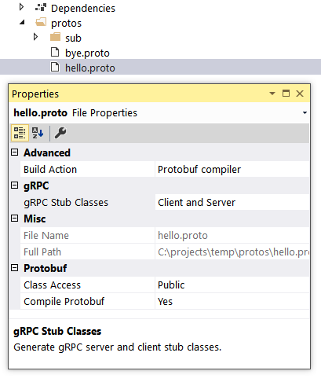
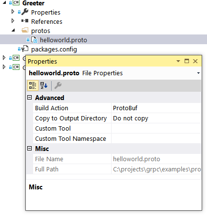

# Protocol Buffers/gRPC Codegen Integration Into .NET Build

The [Grpc.Tools](https://www.nuget.org/packages/Grpc.Tools) NuGet package provides C# tooling support for `.proto` files in `.csproj` projects:
* It contains protocol buffers compiler and gRPC plugin to generate C# code.
* It can be used in building both grpc-dotnet projects and legacy c-core C# projects.

Using `Grpc.Tools` in `.csproj` files is described below. Other packages providing the runtime libraries for gRPC are described elsewhere. These include:
* Legacy gRPC c-core implementation
  * `Grpc.Core` - contains a gRPC client and server and supports .NET Framework, .NET Core, and .NET 5 or later.
* gRPC-dotnet implementation
  * `Grpc.AspNetCore` - contains a gRPC server that is hosted in ASP.NET Core and requires .NET Core 3.x or .NET 5 or later.
  * `Grpc.Net.Client` - contains a gRPC client.

Other documentation giving an overview of gRPC for .NET, the tooling support, and a tutorial on how to create server and client projects in C# can be found here:
* [Overview for gRPC on .NET](https://learn.microsoft.com/en-us/aspnet/core/grpc/)
* [C# Tooling support for .proto files](https://learn.microsoft.com/en-us/aspnet/core/grpc/basics#c-tooling-support-for-proto-files)
* [Tutorial: Create a gRPC client and server in ASP.NET Core](https://learn.microsoft.com/en-us/aspnet/core/tutorials/grpc/grpc-start)

For information for the legacy gRPC C# implementation based on the native gRPC Core library (Grpc.Core package) see:
* https://github.com/grpc/grpc/blob/master/src/csharp/README.md
* https://github.com/grpc/grpc/tree/v1.46.x/src/csharp#how-to-use

## Getting Started

The package [Grpc.Tools](https://www.nuget.org/packages/Grpc.Tools) is used to generate the C# files from
`.proto` files. These files:
* are generated on an as-needed basis each time the project is built.
* aren't added to the project or checked into source control.
* are a build artefact usually contained in the obj directory.

This package is required when building both the server and client projects, and by both c-core C# projects and grpc-dotnet projects:
* The `Grpc.AspNetCore` metapackage already includes a reference to `Grpc.Tools`. 
* Client projects and projects using `Grpc.Core` need to directly reference `Grpc.Tool`s alongside the other packages required.

It isn't required at runtime, so the dependency should be marked with `PrivateAssets="All"`, e.g.
```xml
<PackageReference Include="Grpc.Tools" Version="2.50.0">
  <IncludeAssets>runtime; build; native; contentfiles; analyzers; buildtransitive</IncludeAssets>
  <PrivateAssets>all</PrivateAssets>
</PackageReference>
```

Support is provided for the following platforms:
* Windows (x86, x64, and arm64 via using the x86 binaries)
* MacOS (arm64)
* Linux (x86, x64, and arm64)

## Adding `.proto` files to a project

To add `.proto` files to a project edit the project’s `.csproj` file and add an item group with a `<Protobuf>` element that refers to the `.proto` file, e.g.

```xml
<ItemGroup>
    <Protobuf Include="Protos\greet.proto" />
</ItemGroup>
```

Wildcards can be used to select several `.proto` files, e.g.

```xml
<ItemGroup>
    <Protobuf Include="**\*.proto" />
</ItemGroup>
```

By default, a `<Protobuf>` reference generates a concrete client and a service base class. The reference element's `GrpcServices` attribute can be used to limit C# asset generation. See the reference section below for all options. E.g. to only generate client code:

```xml
<ItemGroup>
    <Protobuf Include="Protos\greet.proto" GrpcServices="Client" />
</ItemGroup>
```

For `.prot`o files that are outside of the project directory a link can be added so that the files are visible in Visual Studio. E.g.

```xml
<ItemGroup>
   <Protobuf Include="..\Proto\aggregate.proto" GrpcServices="Client" Link="Protos\aggregate.proto"/>
   <Protobuf Include="..\Proto\greet.proto" GrpcServices="None" Link="Protos\greet.proto"/>
   <Protobuf Include="..\Proto\count.proto" GrpcServices="None" Link="Protos\count.proto"/>
</ItemGroup>
```

See also the example project files in https://github.com/grpc/grpc-dotnet/tree/master/examples

# Reference

## Protobuf item metadata reference

The following metadata are recognized on the `<Protobuf>` items.

| Name           | Default   | Value                | Synopsis                         |
|----------------|-----------|----------------------|----------------------------------|
| Access         | `public`  | `public`, `internal`               | Generated class access           |
| AdditionalProtocArguments | | arbitrary cmdline arguments | Extra command line flags passed to `protoc` command. To specify multiple arguments use semi-colons (;) to separate them. See example below |
| ProtoCompile   | `true`    | `true`, `false`                    | Pass files to protoc?            |
| ProtoRoot      | See notes | A directory                        | Common root for set of files     |
| CompileOutputs | `true`    | `true`, `false`                    | C#-compile generated files?      |
| OutputDir      | See notes | A directory                        | Directory for generated C# files with protobuf messages |
| OutputOptions  | | arbitrary options                  | Extra options passed to C# codegen as `--csharp_opt=opt1,opt2` |
| GrpcOutputDir  | See notes | A directory                        | Directory for generated gRPC stubs    |
| GrpcOutputOptions | | arbitrary options                  | Extra options passed to gRPC codegen as `--grpc_opt=opt1,opt2` |
| GrpcServices   | `both`    | `none`, `client`, `server`, `both` | Generated gRPC stubs             |
| AdditionalImportDirs | See notes | Directories                        | Specify additional directories in which to search for imports `.proto` files |

__Notes__

* __ProtoRoot__  
For files _inside_ the project cone, `ProtoRoot` is set by default to the
project directory. For every file _outside_ of the project directory, the value
is set to this file's containing directory name, individually per file. If you
include a subtree of proto files that lies outside of the project directory, you
need to set `ProtoRoot`. There is an example in this below. The path in
this variable is relative to the project directory.

* __OutputDir__  
The default value for this metadatum is the value of the property
`Protobuf_OutputPath`. This property, in turn, unless you set it in your
project, will be set to the value of the standard MSBuild property
`IntermediateOutputPath`, which points to the location of compilation object
outputs, such as `"obj/Release/netstandard1.5/"`. The path in this property is
considered relative to the project directory.

* __GrpcOutputDir__  
Unless explicitly set, will follow `OutputDir` for any given file.

* __Access__  
Sets generated class access on _both_ generated message and gRPC stub classes.

* __AdditionalProtocArguments__ 
Pass additional commandline arguments to the `protoc` command being invoked.
Normally this option should not be used, but it exists for scenarios when you need to pass
otherwise unsupported (e.g. experimental) flags to protocol buffer compiler.

* __GrpcOutputOptions__ 
Pass additional options to the `grpc_csharp_plugin` in form of the `--grpc_opt` flag.
Normally this option should not be used as it's values are already controlled by `Access`
and `GrpcServices` metadata, but it might be useful in situations where you want
to explicitly pass some otherwise unsupported (e.g. experimental) options to the
`grpc_csharp_plugin`.

* __AdditionalImportDirs__
Specify additional directories in which to search for imports in `.proto files`. The directories are searched in the order given. You may specify directories _outside_ of the 
project directory. The directories are passed to the `protoc` code generator via the `-I/--proto_path` option
together with `Protobuf_StandardImportsPath` and `ProtoRoot` directories.

__Specifying multiple values in properties__

Some properties allow you to specify multiple values in a list. The items in a list need to
be separated by semi-colons (;). This is the syntax that MsBuild uses for lists.

The properties that can have lists of items are: `OutputOptions`, `AdditionalProtocArguments`,
 `GrpcOutputOptions`, `AdditionalImportDirs`

Example: to specify two additional arguments: `--plugin=protoc-gen-myplugin=D:\myplugin.exe --myplugin_out=.`

```xml
  <ItemGroup>
    <Protobuf Include="proto_root/**/*.proto" ProtoRoot="proto_root"
              OutputDir="%(RelativeDir)" CompileOutputs="false"
              AdditionalProtocArguments="--plugin=protoc-gen-myplugin=D:\myplugin.exe;--myplugin_out=." />
  </ItemGroup>
```

## `grpc_csharp_plugin` command line options

Under the hood, the `Grpc.Tools` build integration invokes the `protoc` and `grpc_csharp_plugin` binaries
to perform code generation. Here is an overview of the available `grpc_csharp_plugin` options:

| Name            | Default   | Synopsis                                                 |
|---------------- |-----------|----------------------------------------------------------|
| no_client       | off       | Don't generate the client stub                           |
| no_server       | off       | Don't generate the server-side stub                      |
| internal_access | off       | Generate classes with "internal" visibility              |

Note that the protocol buffer compiler has a special commandline syntax for plugin options.
Example:
```
protoc --plugin=protoc-gen-grpc=grpc_csharp_plugin --csharp_out=OUT_DIR \
    --grpc_out=OUT_DIR --grpc_opt=lite_client,no_server \
    -I INCLUDE_DIR foo.proto
```
## Environment Variables

Environment variables can be set to change the behavior of `Grpc.Tools` - setting the CPU architecture or operating system, or using custom built protocol buffers compiler and gRPC plugin.

| Name                | Synopsis                                                                      |
|---------------------|-------------------------------------------------------------------------------|
|`PROTOBUF_TOOLS_OS`  | Operating system version of the tools to use: `linux`, `macosx`, or `windows` |
|`PROTOBUF_TOOLS_CPU` | CPU architecture version of the tools to use: `x86`, `x64`, or `arm64`        |
|`PROTOBUF_PROTOC`    | Full path to the protocol buffers compiler                                    |
|`GRPC_PROTOC_PLUGIN` | Full path to the grpc_csharp_plugin                                           |

For example, to use a custom built protoc compiler and grpc_csharp_plugin:
```bash
export PROTOBUF_PROTOC=$my_custom_build/protoc
export GRPC_PROTOC_PLUGIN=$my_custom_build/grpc_csharp_plugin
dotnet build myproject.csproj
```

## MSBuild Properties

You can set some Properties in your project file or on the command line when doing a build. The
following properties change the behavior of `Grpc.Tools`:

| Name                | Synopsis                                                                      |
|---------------------|-------------------------------------------------------------------------------|
| `Protobuf_ToolsOs`  | Same as `PROTOBUF_TOOLS_OS` environment variable                              |
| `Protobuf_ToolsCpu` | Same as `PROTOBUF_TOOLS_CPU` environment variable                             |
| `Protobuf_ProtocFullPath` | Same as `PROTOBUF_PROTOC` environment variable                          |
| `gRPC_PluginFullPath` | Same as `GRPC_PROTOC_PLUGIN` environment variable                           |
| `Protobuf_NoWarnMissingExpected` | Default: `false`. If `true` then no warnings are given if expected files not generated. See example below for an explanation. |

# Scenarios and Examples

For other examples see also the `.csproj` files in the examples in GitHub:
* Grpc-dotnet examples: https://github.com/grpc/grpc-dotnet/tree/master/examples
* Grpc c-core C# examples: https://github.com/grpc/grpc/tree/v1.46.x/examples/csharp

Quick links to the examples below:

* [AdditionalImportDirs - Setting location of imported `.proto` files](#AdditionalImportDirs)
* [ProtoRoot - Avoiding duplicate generated file names](#ProtoRoot)
* [GrpcServices - Generating gRPC services and protocol buffers messages](#grpcservices)
* [Generate proto and gRPC C# sources from .proto files (no C# compile)](#nocompile)
* [Visual Studio: setting per-file `.proto` file options](#visualstudio)
* [Bypassing Grpc.Tools to run the protocol buffers compiler explicitly](#compiler)

---
## <a name="AdditionalImportDirs"></a>AdditionalImportDirs - Setting location of imported `.proto` files

If your `.proto` files import other files that are not co-located with the `.proto` file 
you can specify the directories to search for the
imported files by specifying `AdditionalImportDirs` and provide a list of directories.
The directories are searched in the order given. E.g.:

```xml
  <Protobuf Include="protos/*.proto" ProtoRoot="protos"
      AdditionalImportDirs="/folder/protos/myapis/;/another/folder/"
      ... />
```

Note - the paths for standard imports included in the `Grpc.Tools` package are automatically passed to the protocol buffers compiler and do not need to be explicitly set.
E.g. the directory `"...\.nuget\packages\grpc.tools\2.51.0\build\native\include"` is automatically included.  This is the directory where a declaration such as `import "google/protobuf/wrappers.proto";` in a proto file would be found.

---
## <a name="ProtoRoot"></a>ProtoRoot - Avoiding duplicate generated file names

`Grpc.Tools` tries to preserve the original directory structure relative to where the `.proto`
files are when creating the `.cs` files under the `obj` directory. It does this by using the
`ProtoRoot` metadata on the `<Protobuf>` items.

`ProtoRoot` specifies a common directory that is an ancestor of all `.proto` files, and the generated files under the `obj` directory will have the same directory structure. 

For `.proto` files under the project directory `ProtoRoot` is by default set to “.”. It can also be explicitly set. 

E.g.
Specifying `<Protobuf Include="**\*.proto" />` for files:
```
	ProjectFolder\Protos\v1\hello.proto
	ProjectFolder\Protos\v2\hello.proto
```
Will generate files:
```
  ProjectFolder\obj\Debug\net6.0\Protos\v1\Hello.cs
  ProjectFolder\obj\Debug\net6.0\Protos\v1\HelloGrpc.cs
  ProjectFolder\obj\Debug\net6.0\Protos\v2\Hello.cs
  ProjectFolder\obj\Debug\net6.0\Protos\v2\HelloGrpc.cs
```
But `<Protobuf Include="**\*.proto" ProtoRoot="Protos" />` will generate files:

```
  ProjectFolder\obj\Debug\net6.0\v1\Hello.cs
  ProjectFolder\obj\Debug\net6.0\v1\HelloGrpc.cs
  ProjectFolder\obj\Debug\net6.0\v2\Hello.cs
  ProjectFolder\obj\Debug\net6.0\v2\HelloGrpc.cs
```

Setting `ProtoRoot` is useful if you have `.proto` files from different directories,
e.g. some from inside the project and some external to the project, to make sure that structure
under the `obj` directory does not cause any name clashes.

---
## <a name="grpcservices"></a>GrpcServices - Generating gRPC services and protocol buffers messages
The protocol buffers files (`.proto` files) define both the service interface and the
structure of the payload messages.

Two `.cs` file can be generated from a `.proto` file. For example, if the `.proto` file 
is `myfile.proto` then the two possible files are:
* `Myfile.cs` - contains the generated code for protocol buffers messages
* `MyfileGrpc.cs`  - contains the generated code for gRPC client and/or server

When a `.proto` file contains service definitions the protocol buffers compiler calls
the gRPC plugin to generate gRPC client and/or server stub code. Whether or not the `.cs` file
is generated for the gRPC code and what it contains is controlled by the `GrpcServices` metadata
on the `<Protobuf>` item.

* `GrpcServices="both"` (the default) - `Myfile.cs` and `MyfileGrpc.cs` generated
* `GrpcServices="none"` - just `Myfile.cs` generated
* `GrpcServices="client"` - `Myfile.cs` and `MyfileGrpc.cs` (just client code)
* `GrpcServices="server"` - `Myfile.cs` and `MyfileGrpc.cs` (just server code)

However when a `.proto` **does not file contains any service definitions** but only contains
message definitions then an empty (zero length) `MyfileGrpc.cs` may still be created
by `Grpc.Tools` unless the `.proto` file is specified with `GrpcServices="none"` in the project file.

This is because `Grpc.Tools` has no way of knowing in advanced of running the protocol buffers
compiler whether a `.proto` file has a service clause. It creates the emtpy files as a marker
for incremental builds so that the `.proto` files are not unnecessarily recompiled. Empty files
are not a problem on a small project but you may wish to avoid them on a larger project.

Therefore it is better to explicitly mark files with the correct `GrpcServices` metadata if you can. For
example:

```xml
<ItemGroup>
  <Protobuf Include="**/*.proto" GrpcServices="None" />
  <Protobuf Update="**/hello/*.proto;**/bye/*.proto" GrpcServices="Both" />
</ItemGroup>
```
In the above example all `.proto` files are compiled with `GrpcServices="None"`, except for `.proto`
files in subdirectories on any tree level named `hello` and `bye`, which will take 
`GrpcServices="Both"`. Note the use of the `Update` attribute instead of `Include` - otherwise
the files will be added twice.

Another example would be the use of globbing if your service `.proto` files are named according
to a pattern, for example `*_services.proto`. In this case the `Update` attribute can be written
as `Update="**/*_service.proto"` to set the attribute `GrpcServices="Both"` only on these files.

### Seeing a warning about a missing expected file

If a `*Grpc.cs` file is not generated because the `.proto` file does not contain a service clause
(see above) then `Grpc.Tools` only creates empty files for files generated in the intermediate
`obj` directory. If the files are configured to be generated elsewhere then empty files are not
 created so as not to polute non-intermediate directories. In this case a warning is output:
 ```
 Some expected protoc outputs were not generated
 ```
The warning can be suppressed by setting the MSBuild property:
```xml
<PropertyGroup>
  <Protobuf_NoWarnMissingExpected>true</Protobuf_NoWarnMissingExpected>
</PropertyGroup>
```
but it is better to set `GrpcServices="None"` on the `.proto` files affected to avoid
unnecessary rebuilds. 

---
## <a name="nocompile"></a>Generate proto and gRPC C# sources from .proto files (no C# compile)

If you just want to generate the C# sources from `.proto` files without compiling the C# files
 (e.g. for use in other projects), then add this to a `.csproj` file:
 ```xml
<ItemGroup>
  <Protobuf Include="**/*.proto"
      OutputDir="%(RelativeDir)" CompileOutputs="false"  />
</ItemGroup>
```

* `Include` tells the build system to recursively examine project directory and its 
subdirectories (**) include all files matching the wildcard `*.proto`.
* `OutputDir="%(RelativeDir)"` makes the output directory for each `.cs` file to be 
same as the corresponding `.proto` directory.
* `CompileOutputs="false"` prevents compiling the generated files into an assembly.
Note that an empty assembly is still generated which can be ignored. 

NOTE: To start with an empty project to add your `.proto` files to you can do the following
at a command prompt:
```bash
dotnet new classlib
rm *.cs              # remove .cs files - for Windows the command is: del *.cs /y
dotnet add package Grpc.Tools
``` 

---
## <a name="visualstudio"></a>Visual Studio: setting per-file `.proto` file options 

In Visual Studio it is possible to set some frequently used per-file options on `.proto` files 
without editing the `.csproj` file directly. However editing the `.csproj` gives you more
flexibilty.

### "dotnet SDK" projects

For a "dotnet SDK" project, you have more control of some frequently used options.
**You may need to open and close Visual Studio** for this form to appear in the
properties window after adding a reference to `Grpc.Tools` package:



You can also change options of multiple files at once by selecting them in the
Project Explorer together.

### "classic" projects

For a "classic" project, you can only add `.proto` files with all options set to
default. Click on the "show all files" button, add files to project, then
change file type of the `.proto` files to "Protobuf" in the Properties window
drop-down. This menu item will appear after you import the `Grpc.Tools` package:



---
## <a href="compiler"></a>Bypassing Grpc.Tools to run the protocol buffers compiler explicitly

It is possible to bypass all the build logic in `Grpc.Tools` and run the protocol buffers compiler
explicitly in your project file, and just use the `Grpc.Tools` as a means of getting the compiler.
**This is not recommended** but there may be situations where you want to do this.

You can use the following Properties:
* `Protobuf_ProtocFullPath` points to the full path and filename of protoc executable, e.g.
  `"...\.nuget\packages\grpc.tools\2.51.0\build\native\bin\windows\protoc.exe"`

* `gRPC_PluginFullPath` points to the full path and filename of gRPC plugin, e.g.
  `"...\.nuget\packages\grpc.tools\2.51.0\build\native\bin\windows\grpc_csharp_plugin.exe"`

* `Protobuf_StandardImportsPath` points to the standard proto import directory, e.g.
  `"...\.nuget\packages\grpc.tools\2.51.0\build\native\include"`. This is
  the directory where a declaration such as `import "google/protobuf/wrappers.proto";`
  in a proto file would find its target.

then in your project file:

```xml
  <Target Name="MyProtoCompile">
    <PropertyGroup>
      <ProtoCCommand>$(Protobuf_ProtocFullPath) --plugin=protoc-gen-grpc=$(gRPC_PluginFullPath)  -I $(Protobuf_StandardImportsPath) ....rest of your command.... </ProtoCCommand>
    </PropertyGroup>
    <Message Importance="high" Text="$(ProtoCCommand)" />
    <Exec Command="$(ProtoCCommand)" />
  </Target>
```
Do not include any `<Protobuf>` items in the project file as that will invoke the `Grpc.Tools` build and your files will be compiled twice.

