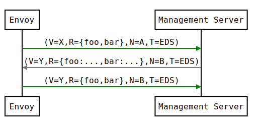

.. _xds_protocol:

xDS REST and gRPC protocol
==========================

Envoy discovers its various dynamic resources via the filesystem or by
querying one or more management servers. Collectively, these discovery
services and their corresponding APIs are referred to as *xDS*.
Resources are requested via *subscriptions*, by specifying a filesystem
path to watch, initiating gRPC streams, or polling a REST-JSON URL. The
latter two methods involve sending requests with a :ref:`DiscoveryRequest <envoy_api_msg_DiscoveryRequest>`
proto payload. Resources are delivered in a
:ref:`DiscoveryResponse <envoy_api_msg_DiscoveryResponse>`
proto payload in all methods. We discuss each type of subscription
below.

Resource Types
--------------

Every configuration resource in the xDS API has a type associated with it. Resource types follow a
:repo:`versioning scheme <api/API_VERSIONING.md>`. Resource types are versioned independent of the
transports described below.

The following v2 xDS resource types are supported:

-  :ref:`envoy.api.v2.Listener <envoy_api_msg_Listener>`
-  :ref:`envoy.api.v2.RouteConfiguration <envoy_api_msg_RouteConfiguration>`
-  :ref:`envoy.api.v2.ScopedRouteConfiguration <envoy_api_msg_ScopedRouteConfiguration>`
-  :ref:`envoy.api.v2.route.VirtualHost <envoy_api_msg_route.VirtualHost>`
-  :ref:`envoy.api.v2.Cluster <envoy_api_msg_Cluster>`
-  :ref:`envoy.api.v2.ClusterLoadAssignment <envoy_api_msg_ClusterLoadAssignment>`
-  :ref:`envoy.api.v2.Auth.Secret <envoy_api_msg_Auth.Secret>`
-  :ref:`envoy.service.discovery.v2.Runtime <envoy_api_msg_service.discovery.v2.Runtime>`

The following v3 xDS resource types are supported:

-  :ref:`envoy.config.listener.v3.Listener <envoy_v3_api_msg_config.listener.v3.Listener>`
-  :ref:`envoy.config.route.v3.RouteConfiguration <envoy_v3_api_msg_config.route.v3.RouteConfiguration>`
-  :ref:`envoy.config.route.v3.ScopedRouteConfiguration <envoy_v3_api_msg_config.route.v3.ScopedRouteConfiguration>`
-  :ref:`envoy.config.route.v3.VirtualHost <envoy_v3_api_msg_config.route.v3.VirtualHost>`
-  :ref:`envoy.config.cluster.v3.Cluster <envoy_v3_api_msg_config.cluster.v3.Cluster>`
-  :ref:`envoy.config.endpoint.v3.ClusterLoadAssignment <envoy_v3_api_msg_config.endpoint.v3.ClusterLoadAssignment>`
-  :ref:`envoy.extensions.transport_sockets.tls.v3.Secret <envoy_v3_api_msg_extensions.transport_sockets.tls.v3.Secret>`
-  :ref:`envoy.service.runtime.v3.Runtime <envoy_v3_api_msg_service.runtime.v3.Runtime>`

The concept of `type URLs <https://developers.google.com/protocol-buffers/docs/proto3#any>`_
appears below, and takes the form `type.googleapis.com/<resource type>` -- e.g.,
`type.googleapis.com/envoy.api.v2.Cluster` for a `Cluster` resource. In various requests from
Envoy and responses by the management server, the resource type URL is stated.

Filesystem subscriptions
------------------------

The simplest approach to delivering dynamic configuration is to place it
at a well known path specified in the :ref:`ConfigSource <envoy_api_msg_core.ConfigSource>`.
Envoy will use `inotify` (`kqueue` on macOS) to monitor the file for
changes and parse the
:ref:`DiscoveryResponse <envoy_api_msg_DiscoveryResponse>` proto in the file on update.
Binary protobufs, JSON, YAML and proto text are supported formats for
the
:ref:`DiscoveryResponse <envoy_api_msg_DiscoveryResponse>`.

There is no mechanism available for filesystem subscriptions to ACK/NACK
updates beyond stats counters and logs. The last valid configuration for
an xDS API will continue to apply if an configuration update rejection
occurs.

.. _xds_protocol_streaming_grpc_subscriptions:

Streaming gRPC subscriptions
----------------------------

API flow
~~~~~~~~

For typical HTTP routing scenarios, the core resource types for the client's configuration are
`Listener`, `RouteConfiguration`, `Cluster`, and `ClusterLoadAssignment`. Each `Listener` resource
may point to a `RouteConfiguration` resource, which may point to one or more `Cluster` resources,
and each `Cluster` resource may point to a `ClusterLoadAssignment` resource.

Envoy fetches all `Listener` and `Cluster` resources at startup. It then fetches whatever
`RouteConfiguration` and `ClusterLoadAssignment` resources that are required by the `Listener` and
`Cluster` resources. In effect, every `Listener` or `Cluster` resource is a root to part of Envoy's
configuration tree.

A non-proxy client such as gRPC might start by fetching only the specific `Listener` resources
that it is interested in. It then fetches the `RouteConfiguration` resources required by those
`Listener` resources, followed by whichever `Cluster` resources are required by those
`RouteConfiguration` resources, followed by the `ClusterLoadAssignment` resources required
by the `Cluster` resources. In effect, the original `Listener` resources are the roots to
the client's configuration tree.

Variants of the xDS Transport Protocol
~~~~~~~~~~~~~~~~~~~~~~~~~~~~~~~~~~~~~~

Four Variants
^^^^^^^^^^^^^

There are four variants of the xDS transport protocol used via streaming gRPC, which cover all
combinations of two dimensions.

The first dimension is State of the World (SotW) vs. incremental. The SotW approach was the
original mechanism used by xDS, in which the client must specify all resource names it is
interested in with each request (except when making a wildcard request in LDS/CDS), and the server
must return all resources the client has subscribed to in each request (in LDS/CDS). This means
that if the client is already subscribing to 99 resources and wants to add an additional one, it
must send a request with all 100 resource names, rather than just the one new one. And the server
must then respond by sending all 100 resources, even if the 99 that were already subscribed to have
not changed (in LDS/CDS). This mechanism can be a scalability limitation, which is why the
incremental protocol variant was introduced. The incremental approach allows both the client and
server to indicate only deltas relative to their previous state -- i.e., the client can say that
it wants to add or remove its subscription to a particular resource name without resending those
that have not changed, and the server can send updates only for those resources that have changed.
The incremental protocol also provides a mechanism for lazy loading of resources. For details on
the incremental protocol, see :ref:`Incremental xDS <xds_protocol_delta>` below.

The second dimension is using a separate gRPC stream for each resource type vs. aggregating all
resource types onto a single gRPC stream. The former approach was the original mechanism used by
xDS, and it offers an eventual consistency model. The latter approach was added for environments
in which explicit control of sequencing is required. For details, see :ref:`Eventual consistency
considerations <xds_protocol_eventual_consistency_considerations>` below.

So, the four variants of the xDS transport protocol are:

1. State of the World (Basic xDS): SotW, separate gRPC stream for each resource type
2. Incremental xDS: incremental, separate gRPC stream for each resource type
3. Aggregated Discovery Service (ADS): SotW, aggregate stream for all resource types
4. Incremental ADS: incremental, aggregate stream for all resource types

RPC Services and Methods for Each Variant
^^^^^^^^^^^^^^^^^^^^^^^^^^^^^^^^^^^^^^^^^

For the non-aggregated protocol variants, there is a separate RPC service for each resource type.
Each of these RPC services can provide a method for each of the SotW and Incremental protocol
variants. Here are the RPC services and methods for each resource type:

-  Listener: Listener Discovery Service (LDS)
   -  SotW: ListenerDiscoveryService.StreamListeners
   -  Incremental: ListenerDiscoveryService.DeltaListeners
-  RouteConfiguration: Route Discovery Service (RDS)
   -  SotW: RouteDiscoveryService.StreamRoutes
   -  Incremental: RouteDiscoveryService.DeltaRoutes
-  ScopedRouteConfiguration: Scoped Route Discovery Service (SRDS)
   -  SotW: ScopedRouteDiscoveryService.StreamScopedRoutes
   -  Incremental: ScopedRouteDiscoveryService.DeltaScopedRoutes
-  VirtualHost: Virtual Host Discovery Service (VHDS)
   -  SotW: N/A
   -  Incremental: VirtualHostDiscoveryService.DeltaVirtualHosts
-  Cluster: Cluster Discovery Service (CDS)
   -  SotW: ClusterDiscoveryService.StreamClusters
   -  Incremental: ClusterDiscoveryService.DeltaClusters
-  ClusterLoadAssignment: Endpoint Discovery Service (EDS)
   -  SotW: EndpointDiscoveryService.StreamEndpoints
   -  Incremental: EndpointDiscoveryService.DeltaEndpoints
-  Secret: Secret Discovery Service (SDS)
   -  SotW: SecretDiscoveryService.StreamSecrets
   -  Incremental: SecretDiscoveryService.DeltaSecrets
-  Runtime: Runtime Discovery Service (RTDS)
   -  SotW: RuntimeDiscoveryService.StreamRuntime
   -  Incremental: RuntimeDiscoveryService.DeltaRuntime

In the aggregated protocol variants, all resource types are multiplexed on a single gRPC stream,
where each resource type is treated as a separate logical stream within the aggregated stream.
In effect, it simply combines all of the above separate APIs into a single stream by treating
requests and responses for each resource type as a separate sub-stream on the single aggregated
stream. The RPC service and methods for the aggregated protocol variants are:

-  SotW: AggregatedDiscoveryService.StreamAggregatedResources
-  Incremental: AggregatedDiscoveryService.DeltaAggregatedResources

For all of the SotW methods, the request type is :ref:`DiscoveryRequest
<envoy_api_msg_DiscoveryRequest>` and the response type is :ref:`DiscoveryResponse
<envoy_api_msg_DiscoveryResponse>`.

For all of the incremental methods, the request type is :ref:`DeltaDiscoveryRequest
<envoy_api_msg_DeltaDiscoveryRequest>` and the response type is :ref:`DeltaDiscoveryResponse
<envoy_api_msg_DeltaDiscoveryResponse>`.

Configuring Which Variant to Use
^^^^^^^^^^^^^^^^^^^^^^^^^^^^^^^^

In the xDS API, the :ref:`ConfigSource <envoy_api_msg_core.ConfigSource>` message indicates how to
obtain resources of a particular type. If the :ref:`ConfigSource <envoy_api_msg_core.ConfigSource>`
contains a gRPC :ref:`ApiConfigSource <envoy_api_msg_core.ApiConfigSource>`, it points to an
upstream cluster for the management server; this will initiate an independent bidirectional gRPC
stream for each xDS resource type, potentially to distinct management servers. If the
:ref:`ConfigSource <envoy_api_msg_core.ConfigSource>` contains a :ref:`AggregatedConfigSource
<envoy_api_msg_core.AggregatedConfigSource>`, it tells the client to use :ref:`ADS
<xds_protocol_ads>`.

Currently, the client is expected to be given some local configuration that tells it how to obtain
the :ref:`Listener <envoy_api_msg_Listener>` and :ref:`Cluster <envoy_api_msg_Cluster>` resources.
:ref:`Listener <envoy_api_msg_Listener>` resources may include a
:ref:`ConfigSource <envoy_api_msg_core.ConfigSource>` that indicates how the
:ref:`RouteConfiguration <envoy_api_msg_RouteConfiguration>` resources are obtained, and
:ref:`Cluster <envoy_api_msg_Cluster>` resources may include a
:ref:`ConfigSource <envoy_api_msg_core.ConfigSource>` that indicates how the
:ref:`ClusterLoadAssignment <envoy_api_msg_ClusterLoadAssignment>` resources are obtained.

Client Configuration
""""""""""""""""""""

In Envoy, the bootstrap file contains two :ref:`ConfigSource <envoy_api_msg_core.ConfigSource>`
messages, one indicating how :ref:`Listener <envoy_api_msg_Listener>` resources are obtained and
another indicating how :ref:`Cluster <envoy_api_msg_Cluster>` resources are obtained. It also
contains a separate :ref:`ApiConfigSource <envoy_api_msg_core.ApiConfigSource>` message indicating
how to contact the ADS server, which will be used whenever a :ref:`ConfigSource
<envoy_api_msg_core.ConfigSource>` message (either in the bootstrap file or in a :ref:`Listener
<envoy_api_msg_Listener>` or :ref:`Cluster <envoy_api_msg_Cluster>` resource obtained from a
management server) contains an :ref:`AggregatedConfigSource
<envoy_api_msg_core.AggregatedConfigSource>` message.

In a gRPC client that uses xDS, only ADS is supported, and the bootstrap file contains the name of
the ADS server, which will be used for all resources. The :ref:`ConfigSource
<envoy_api_msg_core.ConfigSource>` messages in the :ref:`Listener <envoy_api_msg_Listener>` and
:ref:`Cluster <envoy_api_msg_Cluster>` resources must contain :ref:`AggregatedConfigSource
<envoy_api_msg_core.AggregatedConfigSource>` messages.

The xDS transport Protocol
~~~~~~~~~~~~~~~~~~~~~~~~~~

Transport API version
^^^^^^^^^^^^^^^^^^^^^

In addition the resource type version described above, the xDS wire protocol has a
transport version associated with it. This provides type versioning for messages such as
:ref:`DiscoveryRequest <envoy_api_msg_DiscoveryRequest>` and :ref:`DiscoveryResponse
<envoy_api_msg_DiscoveryResponse>`. It is also encoded in the gRPC method name, so a server
can determine which version a client is speaking based on which method it calls.

Basic Protocol Overview
^^^^^^^^^^^^^^^^^^^^^^^

Each xDS stream begins with a :ref:`DiscoveryRequest <envoy_api_msg_DiscoveryRequest>` from the
client, which specifies the list of resources to subscribe to, the type URL corresponding to the
subscribed resources, the node identifier, and an optional resource type instance version
indicating the most recent version of the resource type that the client has already seen (see
:ref:`ACK/NACK and resource type instance version <xds_ack_nack>` for details).

The server will then send a :ref:`DiscoveryResponse <envoy_api_msg_DiscoveryResponse>` containing
any resources that the client has subscribed to that have changed since the last resource type
instance version that the client indicated it has seen. The server may send additional responses
at any time when the subscribed resources change.

Whenever the client receives a new response, it will send another request indicating whether or
not the resources in the response were valid (see
:ref:`ACK/NACK and resource type instance version <xds_ack_nack>` for details).

All server responses will contain a :ref:`nonce<envoy_api_field_DiscoveryResponse.nonce>`, and
all subsequent requests from the client must set the
:ref:`response_nonce <envoy_api_field_DiscoveryRequest.response_nonce>` field to the most recent
nonce received from the server on that stream. This allows servers to determine which response a
given request is associated with, which avoids various race conditions in the SotW protocol
variants. Note that the nonce is valid only in the context of an individual xDS stream; it does
not survive stream restarts.

Only the first request on a stream is guaranteed to carry the node identifier.
The subsequent discovery requests on the same stream may carry an empty node
identifier. This holds true regardless of the acceptance of the discovery
responses on the same stream. The node identifier should always be identical if
present more than once on the stream. It is sufficient to only check the first
message for the node identifier as a result.

.. _xds_ack_nack:

ACK/NACK and resource type instance version
^^^^^^^^^^^^^^^^^^^^^^^^^^^^^^^^^^^^^^^^^^^

Every xDS resource type has a version string that indicates the version for that resource type.
Whenever one resource of that type changes, the version is changed.

In a response sent by the xDS server, the
:ref:`version_info<envoy_api_field_DiscoveryResponse.version_info>` field indicates the current
version for that resource type. The client then sends another request to the server with the
:ref:`version_info<envoy_api_field_DiscoveryRequest.version_info>` field indicating the most
recent valid version seen by the client. This provides a way for the server to determine when
it sends a version that the client considers invalid.

(In the :ref:`incremental protocol variants <xds_protocol_delta>`, the resource type instance
version is sent by the server in the
:ref:`system_version_info<envoy_api_field_DeltaDiscoveryResponse.system_version_info>` field.
However, this information is not actually used by the client to communicate which resources are
valid, because the incremental API variants have a separate mechanism for that.)

The resource type instance version is separate for each resource type. When using the aggregated
protocol variants, each resource type has its own version even though all resource types are being
sent on the same stream.

The resource type instance version is also separate for each xDS server (where an xDS server is
identified by a unique :ref:`ConfigSource <envoy_api_msg_core.ConfigSource>`). When obtaining
resources of a given type from multiple xDS servers, each xDS server will have a different notion
of version.

Note that the version for a resource type is not a property of an individual xDS stream but rather
a property of the resources themselves. If the stream becomes broken and the client creates a new
stream, the client's initial request on the new stream should indicate the most recent version
seen by the client on the previous stream. Servers may decide to optimize by not resending
resources that the client had already seen on the previous stream, but only if they know that the
client is not subscribing to a new resource that it was not previously subscribed to. For example,
it is generally safe for servers to do this optimization for wildcard LDS and CDS requests, and it
is safe to do in environments where the clients will always subscribe to exactly the same set of
resources.

An example EDS request might be:

.. code:: yaml

    version_info:
    node: { id: envoy }
    resource_names:
    - foo
    - bar
    type_url: type.googleapis.com/envoy.api.v2.ClusterLoadAssignment
    response_nonce:

The management server may reply either immediately or when the requested
resources are available with a :ref:`DiscoveryResponse <envoy_api_msg_DiscoveryResponse>`, e.g.:

.. code:: yaml

    version_info: X
    resources:
    - foo ClusterLoadAssignment proto encoding
    - bar ClusterLoadAssignment proto encoding
    type_url: type.googleapis.com/envoy.api.v2.ClusterLoadAssignment
    nonce: A

After processing the :ref:`DiscoveryResponse <envoy_api_msg_DiscoveryResponse>`, Envoy will send a new
request on the stream, specifying the last version successfully applied
and the nonce provided by the management server. The version provides Envoy and the
management server a shared notion of the currently applied configuration,
as well as a mechanism to ACK/NACK configuration updates.

ACK
^^^

If the update was successfully applied, the
:ref:`version_info <envoy_api_field_DiscoveryRequest.version_info>` will be **X**, as indicated
in the sequence diagram:

.. figure:: diagrams/simple-ack.svg
   :alt: Version update after ACK

NACK
^^^^

If Envoy had instead rejected configuration
update **X**, it would reply with :ref:`error_detail <envoy_api_field_DiscoveryRequest.error_detail>`
populated and its previous version, which in this case was the empty
initial version. The :ref:`error_detail <envoy_api_field_DiscoveryRequest.error_detail>` has
more details around the exact error message populated in the message field:

In the sequence diagrams, the following format is used to abbreviate messages:

- *DiscoveryRequest*: (V=version_info,R=resource_names,N=response_nonce,T=type_url)
- *DiscoveryResponse*: (V=version_info,R=resources,N=nonce,T=type_url)

After a NACK, an API update may succeed at a new version **Y**:

.. figure:: diagrams/later-ack.svg
   :alt: ACK after NACK

The preferred mechanism for a server to detect a NACK is to look for the presence of the
:ref:`error_detail <envoy_api_field_DiscoveryRequest.error_detail>` field in the request sent by
the client. Some older servers may instead detect a NACK by looking at both the version and the
nonce in the request: if the version in the request is not equal to the one sent by the server with
that nonce, then the client has rejected the most recent version. However, this approach does not
work for APIs other than LDS and CDS for clients that may dynamically change the set of resources
that they are subscribing to, unless the server has somehow arranged to increment the resource
type instance version every time any one client subscribes to a new resource. Specifically,
consider the following example:
- C: sends resource_names=[A]
- S: sends resources=[A], version=1, nonce=1
- C: sends resource_names=[A], version=1, nonce=1 (this is an ACK)
- C: sends resource_names=[A, B], version=1, nonce=1 (client is adding subscription to B)
- S: sends resources=[B], version=1, nonce=2 (server sends B but system version does not change because server has not gotten a new config)
- C: sends resource_names=[A, B], version=1, nonce=2, error_detail="B is invalid" (client intended to NACK B, server needs to look at error_detail to detect NACK instead of using version and nonce)

ACK and NACK semantics summary
^^^^^^^^^^^^^^^^^^^^^^^^^^^^^^

- The xDS client should ACK or NACK every :ref:`DiscoveryResponse <envoy_api_msg_DiscoveryResponse>`
  received from the management server. The :ref:`response_nonce
  <envoy_api_field_DiscoveryRequest.response_nonce>` field tells the server which of its responses
  the ACK or NACK is associated with.
- ACK signifies successful configuration update and contains the
  :ref:`version_info <envoy_api_field_DiscoveryResponse.version_info>` from the
  :ref:`DiscoveryResponse <envoy_api_msg_DiscoveryResponse>`.
- NACK signifies unsuccessful configuration and is indicated by the presence of the
  :ref:`error_detail <envoy_api_field_DiscoveryRequest.error_detail>` field. The :ref:`version_info
  <envoy_api_field_DiscoveryResponse.version_info>` indicates the most recent version that the
  client is using, although that may not be an older version in the case where the client has
  subscribed to a new resource from an existing version and that new resource is invalid (see
  example above).

.. _xds_protocol_resource_update:

When to send an update
^^^^^^^^^^^^^^^^^^^^^^

The management server should only send updates to the Envoy client when
the resources in the :ref:`DiscoveryResponse <envoy_api_msg_DiscoveryResponse>` have changed. Envoy replies
to any :ref:`DiscoveryResponse <envoy_api_msg_DiscoveryResponse>` with a :ref:`DiscoveryRequest <envoy_api_msg_DiscoveryRequest>` containing the
ACK/NACK immediately after it has been either accepted or rejected. If
the management server provides the same set of resources rather than
waiting for a change to occur, it will cause needless work on both the client and the management
server, which could have a severe performance impact.

Within a stream, new :ref:`DiscoveryRequests <envoy_api_msg_DiscoveryRequest>` supersede any prior
:ref:`DiscoveryRequests <envoy_api_msg_DiscoveryRequest>` having the same resource type. This means that
the management server only needs to respond to the latest
:ref:`DiscoveryRequest <envoy_api_msg_DiscoveryRequest>` on each stream for any given resource type.

.. _xds_protocol_resource_hints:

How the client specifies what resources to return
^^^^^^^^^^^^^^^^^^^^^^^^^^^^^^^^^^^^^^^^^^^^^^^^^

xDS requests allow the client to specify a set of resource names as a hint to the server about
which resources the client is interested in. In the SotW protocol variants, this is done via the
:ref:`resource_names <envoy_api_field_DiscoveryRequest.resource_names>` specified in the
:ref:`DiscoveryRequest <envoy_api_msg_DiscoveryRequest>`; in the incremental protocol variants,
this is done via the :ref:`resource_names_subscribe
<envoy_api_field_DeltaDiscoveryRequest.resource_names_subscribe>` and
:ref:`resource_names_unsubscribe
<envoy_api_field_DeltaDiscoveryRequest.resource_names_unsubscribe>` fields in the
:ref:`DeltaDiscoveryRequest <envoy_api_msg_DeltaDiscoveryRequest>`.

Normally (see below for exceptions), requests must specify the set of resource names that the
client is interested in. The management server must supply the requested resources if they exist.
The client will silently ignore any supplied resources that were not explicitly requested. When
the client sends a new request that changes the set of resources being requested, the server must
resend any newly requested resources, even if it previously sent those resources without having
been asked for them and the resources have not changed since that time. If the list of resource
names becomes empty, that means that the client is no longer interested in any resources of the
specified type.

For :ref:`Listener <envoy_api_msg_Listener>` and :ref:`Cluster <envoy_api_msg_Cluster>` resource
types, there is also a "wildcard" mode, which is triggered when the initial request on the stream
for that resource type contains no resource names. In this case, the server should use
site-specific business logic to determine the full set of resources that the client is interested
in, typically based on the client's :ref:`node <envoy_api_msg_Core.Node>` identification. Note
that once a stream has entered wildcard mode for a given resource type, there is no way to change
the stream out of wildcard mode; resource names specified in any subsequent request on the stream
will be ignored.

Client Behavior
"""""""""""""""

Envoy will always use wildcard mode for :ref:`Listener <envoy_api_msg_Listener>` and
:ref:`Cluster <envoy_api_msg_Cluster>` resources. However, other xDS clients (such as gRPC clients
that use xDS) may specify explicit resource names for these resource types, for example if they
only have a singleton listener and already know its name from some out-of-band configuration.

Grouping Resources into Responses
^^^^^^^^^^^^^^^^^^^^^^^^^^^^^^^^^

In the incremental protocol variants, the server sends each resource in its own response. This
means that if the server has previously sent 100 resources and only one of them has changed, it
may send a response containing only the changed resource; it does not need to resend the 99
resources that have not changed, and the client must not delete the unchanged resources.

In the SotW protocol variants, all resource types except for :ref:`Listener
<envoy_api_msg_Listener>` and :ref:`Cluster <envoy_api_msg_Cluster>` are grouped into responses
in the same way as in the incremental protocol variants. However,
:ref:`Listener <envoy_api_msg_Listener>` and :ref:`Cluster <envoy_api_msg_Cluster>` resource types
are handled differently: the server must include the complete state of the world, meaning that all
resources of the relevant type that are needed by the client must be included, even if they did
not change since the last response. This means that if the server has previously sent 100
resources and only one of them has changed, it must resend all 100 of them, even the 99 that were
not modified.

Note that all of the protocol variants operate on units of whole named resources. There is
no mechanism for providing incremental updates of repeated fields within a named resource.
Most notably, there is currently no mechanism for incrementally updating individual
endpoints within an EDS response.

Duplicate Resource Names
^^^^^^^^^^^^^^^^^^^^^^^^

It is an error for a server to send a single response that contains the same resource name
twice. Clients should NACK responses that contain multiple instances of the same resource name.

Deleting Resources
^^^^^^^^^^^^^^^^^^

In the incremental proocol variants, the server signals the client that a resource should be
deleted via the :ref:`removed_resources <envoy_api_field_DeltaDiscoveryResponse.removed_resources>`
field of the response. This tells the client to remove the resource from its local cache.

In the SotW protocol variants, the criteria for deleting resources is more complex. For
:ref:`Listener <envoy_api_msg_Listener>` and :ref:`Cluster <envoy_api_msg_Cluster>` resource types,
if a previously seen resource is not present in a new response, that indicates that the resource
has been removed, and the client must delete it; a response containing no resources means to delete
all resources of that type. However, for other resource types, the API provides no mechanism for
the server to tell the client that resources have been deleted; instead, deletions are indicated
implicitly by parent resources being changed to no longer refer to a child resource. For example,
when the client receives an LDS update removing a :ref:`Listener <envoy_api_msg_Listener>`
that was previously pointing to :ref:`RouteConfiguration <envoy_api_msg_RouteConfiguration>` A,
if no other :ref:`Listener <envoy_api_msg_Listener>` is pointing to :ref:`RouteConfiguration
<envoy_api_msg_RouteConfiguration>` A, then the client may delete A. For those resource types,
an empty :ref:`DiscoveryResponse <envoy_api_msg_DiscoveryResponse>` is effectively a no-op
from the client's perspective.

.. _xds_protocol_resource_not_existed:

Knowing When a Requested Resource Does Not Exist
^^^^^^^^^^^^^^^^^^^^^^^^^^^^^^^^^^^^^^^^^^^^^^^^

The SotW protocol variants do not provide any explicit mechanism to determine when a requested
resource does not exist.

Responses for :ref:`Listener <envoy_api_msg_Listener>` and :ref:`Cluster <envoy_api_msg_Cluster>`
resource types must include all resources requested by the client. However, it may not be possible
for the client to know that a resource does not exist based solely on its absence in a response,
because the delivery of the updates is eventually consistent: if the client initially sends a
request for resource A, then sends a request for resources A and B, and then sees a response
containing only resource A, the client cannot conclude that resource B does not exist, because
the response may have been sent on the basis of the first request, before the server saw the
second request.

For other resource types, because each resource can be sent in its own response, there is no way
to know from the next response whether the newly requested resource exists, because the next
response could be an unrelated update for another resource that had already been subscribed to
previously.

As a result, clients are expected to use a timeout (recommended duration is 15 seconds) after
sending a request for a new resource, after which they will consider the requested resource to
not exist if they have not received the resource. In Envoy, this is done for
:ref:`RouteConfiguration <envoy_api_msg_RouteConfiguration>` and :ref:`ClusterLoadAssignment
<envoy_api_msg_ClusterLoadAssignment>` resources during :ref:`resource warming
<xds_protocol_resource_warming>`.

Note that this timeout is not strictly necessary when using wildcard mode for :ref:`Listener
<envoy_api_msg_Listener>` and :ref:`Cluster <envoy_api_msg_Cluster>` resource types, because
in that case every response will contain all existing resources that are relevant to the
client, so the client can know that a resource does not exist by its absence in the next
response it sees. However, using a timeout is still recommended in this case, since it protects
against the case where the management server fails to send a response in a timely manner.

Note that even if a requested resource does not exist at the moment when the client requests it,
that resource could be created at any time. Management servers must remember the set of resources
being requested by the client, and if one of those resources springs into existence later, the
server must send an update to the client informing it of the new resource. Clients that initially
see a resource that does not exist must be prepared for the resource to be created at any time.

Unsubscribing From Resources
^^^^^^^^^^^^^^^^^^^^^^^^^^^^

In the incremental protocol variants, resources can be unsubscribed to via the
:ref:`resource_names_unsubscribe
<envoy_api_field_DeltaDiscoveryRequest.resource_names_unsubscribe>` field.

In the SotW protocol variants, each request must contain the full list of resource names being
subscribed to in the :ref:`resource_names <envoy_api_field_DiscoveryRequest.resource_names>` field,
so unsubscribing to a set of resources is done by sending a new request containing all resource
names that are still being subscribed to but not containing the resource names being unsubscribed
to. For example, if the client had previously been subscribed to resources A and B but wishes to
unsubscribe from B, it must send a new request containing only resource A.

Note that for :ref:`Listener <envoy_api_msg_Listener>` and :ref:`Cluster <envoy_api_msg_Cluster>`
resource types where the stream is in "wildcard" mode (see :ref:`How the client specifies what
resources to return <xds_protocol_resource_hints>` for details), the set of resources being
subscribed to is determined by the server instead of the client, so there is no mechanism
for the client to unsubscribe from resources.

Requesting Multiple Resources on a Single Stream
^^^^^^^^^^^^^^^^^^^^^^^^^^^^^^^^^^^^^^^^^^^^^^^^

For EDS/RDS, Envoy may either generate a distinct stream for each
resource of a given type (e.g. if each :ref:`ConfigSource <envoy_api_msg_core.ConfigSource>` has its own
distinct upstream cluster for a management server), or may combine
together multiple resource requests for a given resource type when they
are destined for the same management server. While this is left to
implementation specifics, management servers should be capable of
handling one or more :ref:`resource_names <envoy_api_field_DiscoveryRequest.resource_names>` for a given resource type in
each request. Both sequence diagrams below are valid for fetching two
EDS resources `{foo, bar}`:

|Multiple EDS requests on the same stream| |Multiple EDS requests on
distinct streams|

Resource updates
^^^^^^^^^^^^^^^^

As discussed above, Envoy may update the list of :ref:`resource_names <envoy_api_field_DiscoveryRequest.resource_names>` it
presents to the management server in each :ref:`DiscoveryRequest <envoy_api_msg_DiscoveryRequest>` that
ACK/NACKs a specific :ref:`DiscoveryResponse <envoy_api_msg_DiscoveryResponse>`. In addition, Envoy may later
issue additional :ref:`DiscoveryRequests <envoy_api_msg_DiscoveryRequest>` at a given :ref:`version_info <envoy_api_field_DiscoveryRequest.version_info>` to
update the management server with new resource hints. For example, if
Envoy is at EDS version **X** and knows only about cluster ``foo``, but
then receives a CDS update and learns about ``bar`` in addition, it may
issue an additional :ref:`DiscoveryRequest <envoy_api_msg_DiscoveryRequest>` for **X** with `{foo,bar}` as
`resource_names`.

.. figure:: diagrams/cds-eds-resources.svg
   :alt: CDS response leads to EDS resource hint update

There is a race condition that may arise here; if after a resource hint
update is issued by Envoy at **X**, but before the management server
processes the update it replies with a new version **Y**, the resource
hint update may be interpreted as a rejection of **Y** by presenting an
**X** :ref:`version_info <envoy_api_field_DiscoveryResponse.version_info>`. To avoid this, the management server provides a
``nonce`` that Envoy uses to indicate the specific :ref:`DiscoveryResponse <envoy_api_msg_DiscoveryResponse>`
each :ref:`DiscoveryRequest <envoy_api_msg_DiscoveryRequest>` corresponds to:

The management server should not send a :ref:`DiscoveryResponse <envoy_api_msg_DiscoveryResponse>` for any
:ref:`DiscoveryRequest <envoy_api_msg_DiscoveryRequest>` that has a stale nonce. A nonce becomes stale
following a newer nonce being presented to Envoy in a
:ref:`DiscoveryResponse <envoy_api_msg_DiscoveryResponse>`. A management server does not need to send an
update until it determines a new version is available. Earlier requests
at a version then also become stale. It may process multiple
:ref:`DiscoveryRequests <envoy_api_msg_DiscoveryRequest>` at a version until a new version is ready.

.. figure:: diagrams/stale-requests.svg
   :alt: Requests become stale

An implication of the above resource update sequencing is that Envoy
does not expect a :ref:`DiscoveryResponse <envoy_api_msg_DiscoveryResponse>` for every :ref:`DiscoveryRequests <envoy_api_msg_DiscoveryRequest>`
it issues.

.. _xds_protocol_resource_warming:

Resource warming
~~~~~~~~~~~~~~~~

:ref:`Clusters <arch_overview_cluster_warming>` and
:ref:`Listeners <config_listeners_lds>`
go through warming before they can serve requests. This process
happens both during :ref:`Envoy initialization <arch_overview_initialization>`
and when the `Cluster` or `Listener` is updated. Warming of
`Cluster` is completed only when a `ClusterLoadAssignment` response
is supplied by management server. Similarly, warming of `Listener` is
completed only when a `RouteConfiguration` is supplied by management
server if the listener refers to an RDS configuration. Management server
is expected to provide the EDS/RDS updates during warming. If management
server does not provide EDS/RDS responses, Envoy will not initialize
itself during the initialization phase and the updates sent via CDS/LDS
will not take effect until EDS/RDS responses are supplied.

.. _xds_protocol_eventual_consistency_considerations:

Eventual consistency considerations
^^^^^^^^^^^^^^^^^^^^^^^^^^^^^^^^^^^

Since Envoy's xDS APIs are eventually consistent, traffic may drop
briefly during updates. For example, if only cluster **X** is known via
CDS/EDS, a `RouteConfiguration` references cluster **X** and is then
adjusted to cluster **Y** just before the CDS/EDS update providing
**Y**, traffic will be blackholed until **Y** is known about by the
Envoy instance.

For some applications, a temporary drop of traffic is acceptable,
retries at the client or by other Envoy sidecars will hide this drop.
For other scenarios where drop can't be tolerated, traffic drop could
have been avoided by providing a CDS/EDS update with both **X** and
**Y**, then the RDS update repointing from **X** to **Y** and then a
CDS/EDS update dropping **X**.

In general, to avoid traffic drop, sequencing of updates should follow a
make before break model, wherein:

- CDS updates (if any) must always be pushed first.
- EDS updates (if any) must arrive after CDS updates for the respective clusters.
- LDS updates must arrive after corresponding CDS/EDS updates.
- RDS updates related to the newly added listeners must arrive after CDS/EDS/LDS updates.
- VHDS updates (if any) related to the newly added RouteConfigurations must arrive after RDS updates.
- Stale CDS clusters and related EDS endpoints (ones no longer being referenced) can then be removed.

xDS updates can be pushed independently if no new
clusters/routes/listeners are added or if it's acceptable to temporarily
drop traffic during updates. Note that in case of LDS updates, the
listeners will be warmed before they receive traffic, i.e. the dependent
routes are fetched through RDS if configured. Clusters are warmed when
adding/removing/updating clusters. On the other hand, routes are not
warmed, i.e., the management plane must ensure that clusters referenced
by a route are in place, before pushing the updates for a route.

.. _xds_protocol_TTL:

TTL
~~~

In the event that the management server becomes unreachable, the last known configuration received
by Envoy will persist until the connection is reestablished. For some services, this may not be
desirable. For example, in the case of a fault injection service, a management server crash at the
wrong time may leave Envoy in an undesirable state. The TTL setting allows Envoy to remove a set of
resources after a specified period of time if contact with the management server is lost. This can
be used, for example, to terminate a fault injection test when the management server can no longer
be reached.

For clients that support the *xds.config.supports-resource-ttl* client feature, A TTL field may
be specified on each :ref:`Resource <envoy_api_msg_Resource>`. Each resource will have its own TTL
expiry time, at which point the resource will be expired. Each xDS type may have different ways of
handling such an expiry.

To update the TTL associated with a *Resource*, the management server resends the resource with a
new TTL. To remove the TTL, the management server resends the resource with the TTL field unset.

To allow for lightweight TTL updates ("heartbeats"), a response can be sent that provides a
:ref:`Resource <envoy_api_msg_Resource>` with the :ref:`resource <envoy_api_field_Resource.resource>`
unset and version matching the most recently sent version can be used to update the TTL. These
resources will not be treated as resource updates, but only as TTL updates.

SotW TTL
^^^^^^^^

In order to use TTL with SotW xDS, the relevant resources must be wrapped in a
:ref:`Resource <envoy_api_msg_Resource>`. This allows setting the same TTL field that is used for
Delta xDS with SotW, without changing the SotW API. Heartbeats are supported for SotW as well:
any resource within the response that look like a heartbeat resource will only be used to update the TTL.

This feature is gated by the *xds.config.supports-resource-in-sotw* client feature.

.. _xds_protocol_ads:

Aggregated Discovery Service
~~~~~~~~~~~~~~~~~~~~~~~~~~~~

It's challenging to provide the above guarantees on sequencing to avoid
traffic drop when management servers are distributed. ADS allow a single
management server, via a single gRPC stream, to deliver all API updates.
This provides the ability to carefully sequence updates to avoid traffic
drop. With ADS, a single stream is used with multiple independent
:ref:`DiscoveryRequest <envoy_api_msg_DiscoveryRequest>`/:ref:`DiscoveryResponse <envoy_api_msg_DiscoveryResponse>` sequences multiplexed via the
type URL. For any given type URL, the above sequencing of
:ref:`DiscoveryRequest <envoy_api_msg_DiscoveryRequest>` and :ref:`DiscoveryResponse <envoy_api_msg_DiscoveryResponse>` messages applies. An
example update sequence might look like:

.. figure:: diagrams/ads.svg
   :alt: EDS/CDS multiplexed on an ADS stream

A single ADS stream is available per Envoy instance.

An example minimal ``bootstrap.yaml`` fragment for ADS configuration is:

.. code:: yaml

    node:
      id: <node identifier>
    dynamic_resources:
      cds_config: {ads: {}}
      lds_config: {ads: {}}
      ads_config:
        api_type: GRPC
        grpc_services:
          envoy_grpc:
            cluster_name: ads_cluster
    static_resources:
      clusters:
      - name: ads_cluster
        connect_timeout: { seconds: 5 }
        type: STATIC
        hosts:
        - socket_address:
            address: <ADS management server IP address>
            port_value: <ADS management server port>
        lb_policy: ROUND_ROBIN
        # It is recommended to configure either HTTP/2 or TCP keepalives in order to detect
        # connection issues, and allow Envoy to reconnect. TCP keepalive is less expensive, but
        # may be inadequate if there is a TCP proxy between Envoy and the management server.
        # HTTP/2 keepalive is slightly more expensive, but may detect issues through more types
        # of intermediate proxies.
        http2_protocol_options:
          connection_keepalive:
            interval: 30s
            timeout: 5s
        upstream_connection_options:
          tcp_keepalive:
            ...
    admin:
      ...

.. _xds_protocol_delta:

Incremental xDS
~~~~~~~~~~~~~~~

Incremental xDS is a separate xDS endpoint that:

-  Allows the protocol to communicate on the wire in terms of
   resource/resource name deltas ("Delta xDS"). This supports the goal
   of scalability of xDS resources. Rather than deliver all 100k
   clusters when a single cluster is modified, the management server
   only needs to deliver the single cluster that changed.
-  Allows the Envoy to on-demand / lazily request additional resources.
   For example, requesting a cluster only when a request for that
   cluster arrives.

An Incremental xDS session is always in the context of a gRPC
bidirectional stream. This allows the xDS server to keep track of the
state of xDS clients connected to it. There is no REST version of
Incremental xDS yet.

In the delta xDS wire protocol, the nonce field is required and used to
pair a :ref:`DeltaDiscoveryResponse <envoy_api_msg_DeltaDiscoveryResponse>`
to a :ref:`DeltaDiscoveryRequest <envoy_api_msg_DeltaDiscoveryRequest>`
ACK or NACK. Optionally, a response message level :ref:`system_version_info <envoy_api_field_DeltaDiscoveryResponse.system_version_info>`
is present for debugging purposes only.

:ref:`DeltaDiscoveryRequest <envoy_api_msg_DeltaDiscoveryRequest>` can be sent in the following situations:

- Initial message in a xDS bidirectional gRPC stream.
- As an ACK or NACK response to a previous :ref:`DeltaDiscoveryResponse <envoy_api_msg_DeltaDiscoveryResponse>`. In this case the :ref:`response_nonce <envoy_api_field_DiscoveryRequest.response_nonce>` is set to the nonce value in the Response. ACK or NACK is determined by the absence or presence of :ref:`error_detail <envoy_api_field_DiscoveryRequest.error_detail>`.
- Spontaneous :ref:`DeltaDiscoveryRequests <envoy_api_msg_DeltaDiscoveryRequest>` from the client. This can be done to dynamically add or remove elements from the tracked :ref:`resource_names <envoy_api_field_DiscoveryRequest.resource_names>` set. In this case :ref:`response_nonce <envoy_api_field_DiscoveryRequest.response_nonce>` must be omitted.

In this first example the client connects and receives a first update
that it ACKs. The second update fails and the client NACKs the update.
Later the xDS client spontaneously requests the "wc" resource.

.. figure:: diagrams/incremental.svg
   :alt: Incremental session example

On reconnect the Incremental xDS client may tell the server of its known
resources to avoid resending them over the network. Because no state is
assumed to be preserved from the previous stream, the reconnecting
client must provide the server with all resource names it is interested
in.

.. figure:: diagrams/incremental-reconnect.svg
   :alt: Incremental reconnect example

Resource names
^^^^^^^^^^^^^^

Resources are identified by a resource name or an alias. Aliases of a
resource, if present, can be identified by the alias field in the
resource of a :ref:`DeltaDiscoveryResponse <envoy_api_msg_DeltaDiscoveryResponse>`. The resource name will be
returned in the name field in the resource of a
:ref:`DeltaDiscoveryResponse <envoy_api_msg_DeltaDiscoveryResponse>`.

.. _xds_protocol_delta_subscribe:

Subscribing to Resources
^^^^^^^^^^^^^^^^^^^^^^^^

The client can send either an alias or the name of a resource in the
:ref:`resource_names_subscribe <envoy_api_field_DeltaDiscoveryRequest.resource_names_subscribe>` field of a :ref:`DeltaDiscoveryRequest <envoy_api_msg_DeltaDiscoveryRequest>` in
order to subscribe to a resource. Both the names and aliases of
resources should be checked in order to determine whether the entity in
question has been subscribed to.

A :ref:`resource_names_subscribe <envoy_api_field_DeltaDiscoveryRequest.resource_names_subscribe>` field may contain resource names that the
server believes the client is already subscribed to, and furthermore has
the most recent versions of. However, the server *must* still provide
those resources in the response; due to implementation details hidden
from the server, the client may have "forgotten" those resources despite
apparently remaining subscribed.

.. _xds_protocol_unsubscribe:

Unsubscribing from Resources
^^^^^^^^^^^^^^^^^^^^^^^^^^^^

When a client loses interest in some resources, it will indicate that
with the :ref:`resource_names_unsubscribe <envoy_api_field_DeltaDiscoveryRequest.resource_names_unsubscribe>` field of a
:ref:`DeltaDiscoveryRequest <envoy_api_msg_DeltaDiscoveryRequest>`. As with :ref:`resource_names_subscribe <envoy_api_field_DeltaDiscoveryRequest.resource_names_subscribe>`, these
may be resource names or aliases.

A :ref:`resource_names_unsubscribe <envoy_api_field_DeltaDiscoveryRequest.resource_names_unsubscribe>` field may contain superfluous resource
names, which the server thought the client was already not subscribed
to. The server must cleanly process such a request; it can simply ignore
these phantom unsubscriptions.

Knowing When a Requested Resource Does Not Exist
^^^^^^^^^^^^^^^^^^^^^^^^^^^^^^^^^^^^^^^^^^^^^^^^

When a resource subscribed to by a client does not exist, the server will send a :ref:`Resource
<envoy_api_msg_Resource>` whose :ref:`name <envoy_api_field_Resource.name>` field matches the
name that the client subscribed to and whose :ref:`resource <envoy_api_field_Resource.resource>`
field is unset. This allows the client to quickly determine when a resource does not exist without
waiting for a timeout, as would be done in the SotW protocol variants. However, clients are still
encouraged to use a timeout to protect against the case where the management server fails to send
a response in a timely manner.

REST-JSON polling subscriptions
-------------------------------

Synchronous (long) polling via REST endpoints is also available for the
xDS singleton APIs. The above sequencing of messages is similar, except
no persistent stream is maintained to the management server. It is
expected that there is only a single outstanding request at any point in
time, and as a result the response nonce is optional in REST-JSON. The
`JSON canonical transform of
proto3 <https://developers.google.com/protocol-buffers/docs/proto3#json>`__
is used to encode :ref:`DiscoveryRequest <envoy_api_msg_DiscoveryRequest>` and :ref:`DiscoveryResponse <envoy_api_msg_DiscoveryResponse>`
messages. ADS is not available for REST-JSON polling.

When the poll period is set to a small value, with the intention of long
polling, then there is also a requirement to avoid sending a
:ref:`DiscoveryResponse <envoy_api_msg_DiscoveryResponse>` unless a change to the underlying resources has
occurred via a :ref:`resource update <xds_protocol_resource_update>`.

.. |Multiple EDS requests on distinct streams| image:: diagrams/eds-distinct-stream.svg
